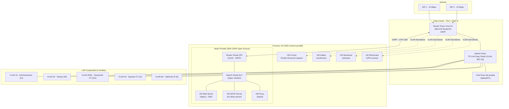

# 00 — Arquitectura General de la Solución

## 1. Decisiones de diseño y por qué

### 1.1 Entorno físico: laptop + SSD externo portátil (no un mini PC dedicado)

Decisión final del equipo: en vez de comprar un mini PC dedicado, Proxmox VE se instala en un **SSD externo** que se puede mover entre laptops. Samuel usa su laptop (Intel i5 6ta gen, 8GB RAM) para desarrollo y pruebas durante todo el semestre; el día de la presentación se usa una segunda laptop de 16GB RAM (acceso solo unas horas antes) booteando desde el mismo SSD externo — todo el ambiente ya viene construido y con autostart, no se reconstruye nada bajo presión de tiempo. Detalle completo de esta estrategia (incluyendo el ajuste de tipo de CPU para portabilidad entre hardware distinto) en [05-Terraform-Ansible-IaC.md](05-Terraform-Ansible-IaC.md) sección 8.

Requisitos mínimos que ambas laptops ya cumplen:

- CPU: soporte de virtualización (VT-x) — el i5 de 6ta gen de Samuel lo tiene, verificar que esté activado en BIOS.
- RAM: 8GB alcanza para la Fase 4 completa (VR1 + Web + DHCP + Proxy) si se administra qué VMs quedan encendidas en cada momento; con 16GB (laptop de la demo) hay margen para tener más VMs simultáneas sin pensarlo.
- Disco: SSD externo 256–500GB (ver [08-Equipo-Fisico-Presupuesto.md](08-Equipo-Fisico-Presupuesto.md)) — el componente que más impacta el rendimiento con varias VMs corriendo a la vez.
- Adaptador USB-Ethernet de respaldo, para no depender del driver de red integrado de una laptop prestada.

Como ahora el equipo son 5 personas y el hardware físico solo lo tiene Samuel, el resto colabora de forma remota (VPN de desarrollo tipo Tailscale) — ver [11-Equipo-y-Responsabilidades.md](11-Equipo-y-Responsabilidades.md).

### 1.2 Por qué Proxmox VE (y no OpenStack)
El enunciado pide una solución **100% Open Source** para "Switches, Routers y Servidores virtuales" (SDN). Las dos alternativas reales son:

| Opción | Pros | Contras | ¿Recomendada? |
|---|---|---|---|
| **OpenStack** | "El" estándar de nube privada, Neutron es SDN real | Necesita 32+ GB RAM y varios discos para ser estable, semanas de curva de aprendizaje, sobra para 3 VMs | No, con laptops de 8-16GB de RAM es sobre-ingeniería |
| **Proxmox VE + Open vSwitch + VyOS** | Ligero (corre en 16 GB RAM), 100% open source, API REST completa, cada pieza (switch/router/VM) es explícita y fácil de demostrar al catedrático | Menos "buzzword" que OpenStack | **Sí** — es lo que se usa en este documento |

Proxmox VE no es "la SDN" en sí — es el hipervisor. La SDN real la forman:
- **Open vSwitch (SV1)**: switch virtual open source, soporta VLAN tagging, trunking, y es controlable por API/CLI (`ovs-vsctl`), cumple el rol de switch programable.
- **VyOS (VR1)**: sistema operativo de router 100% open source (fork de Vyatta), soporta enrutamiento dinámico (OSPF/BGP), firewall, NAT, y se configura vía CLI declarativo o API — cumple el rol de router programable.

Esto satisface literalmente el requisito ("SDN con mínimo un switch virtual y un router virtual, no GNS3, no VMware, 100% Open Source") sin necesitar un clúster OpenStack completo.

### 1.3 Por qué Terraform + Ansible (y no solo uno de los dos)
- **Terraform** = declara "qué debe existir" (VMs, discos, NICs, bridges OVS, VLANs en Proxmox). Idempotente, con estado, permite `plan` antes de `apply` (perfecto para no romper nada la noche antes de la entrega).
- **Ansible** = configura "qué debe correr dentro" de cada VM (paquetes, archivos de configuración de Postfix, Squid, isc-dhcp-server, reglas de VyOS). Terraform no es bueno para esto; Ansible sí.
- Juntos eliminan casi el 100% de la configuración manual: correr `terraform apply && ansible-playbook site.yml` reconstruye todo el laboratorio desde cero en minutos — muy valioso si algo se rompe la noche antes de defender el proyecto.

### 1.4 Por qué Core físico MikroTik (y no GNS3)
El enunciado permite GNS3 solo si "no cuenta con" equipo físico. Vos preferís comprar equipo real y barato — esto además es mejor para la demo (un catedrático valora más ver tráfico real entre un router físico y la nube privada que una simulación). MikroTik RouterOS es la opción de mejor relación costo/funcionalidad en Guatemala: soporta OSPF, VLANs 802.1Q, firewall stateful, y cuesta una fracción de un Cisco equivalente. Detalle de compra en [08-Equipo-Fisico-Presupuesto.md](08-Equipo-Fisico-Presupuesto.md).

## 2. Diagrama general de la solución

## 3. Segmentación de red — justificación

El enunciado pide separar ingeniería de administración, por criterio propio. La justificación técnica:

1. **Superficie de ataque**: Desarrollo I/T (110 usuarios, la más grande) suele tener herramientas con más privilegios (acceso a repos, bases de datos, entornos de prueba). Si un equipo de ese segmento se compromete, un VLAN separado evita que el atacante salte directo a Administración (nómina, finanzas) o a Servidores.
2. **Perfil de tráfico distinto**: Desarrollo genera tráfico este-oeste alto (builds, CI, transferencias grandes); Administración/Ventas generan tráfico más liviano hacia servidores de aplicación. Separar VLANs permite aplicar políticas de QoS y ACLs distintas sin que un segmento afecte al otro.
3. **Cumplimiento**: al manejar "recursos monetarios" (dato explícito del enunciado), Administración y Servidores deben tener controles de acceso más estrictos (auditoría, MFA) — más fácil de aplicar por VLAN/subred que por equipo individual.
4. **Contención de broadcast**: con 184 endpoints el dominio de broadcast único ya es indeseable (buena práctica: no pasar de unos cientos de hosts por dominio de broadcast) — separar por VLAN reduce el radio de impacto de un broadcast storm o de malware con propagación L2.
5. **VoIP en VLAN dedicada**: la telefonía IP necesita prioridad de QoS (jitter/latencia) — mezclarla con tráfico de datos degrada la calidad de llamada. Se aísla en su propia VLAN con marcado DSCP.

Detalle completo de VLANs y subredes en [07-Direccionamiento-IP-VLANs.md](07-Direccionamiento-IP-VLANs.md).

## 4. Principio rector: "una fuente de verdad"

Todo el proyecto se diseña alrededor de un único archivo `network-inventory.yaml` (ver [05-Terraform-Ansible-IaC.md](05-Terraform-Ansible-IaC.md)) que describe VLANs, subredes, VMs y servicios. A partir de ahí:

- Terraform genera la infraestructura.
- Ansible genera la configuración de cada servicio.
- Claude Code genera y mantiene los diagramas Mermaid y las tablas de este README a partir del mismo YAML, así nunca quedan desincronizados.

Esto es lo que permite "automatizar con IA al máximo": en vez de escribir 184 líneas de configuración DHCP a mano, se le pide a la IA que genere el archivo desde la tabla de VLANs — vos revisás y aplicás.
