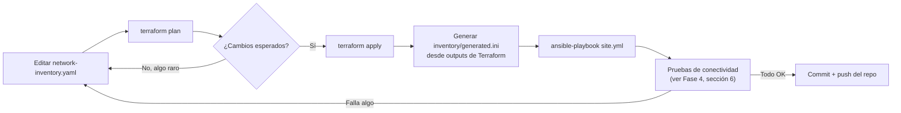

# 05 — Infraestructura como Código: Terraform + Ansible

> **Estado real de implementación**: el repositorio de código vive en [`infra/`](../../infra/) (hermano de esta carpeta de documentación). Los roles de **Fase 2** (`mailserver`) y **Fase 3** (`vpn`, `intranet`, `monitoring`, `zabbix_agent`) ya están escritos y listos para desplegar, junto con un rol `common` compartido (Docker + hardening base). Solo falta **Fase 4** (Terraform de Sergio + roles de Ansible para webserver/dhcp/proxy/vyos_router). Ver [infra/README.md](../../infra/README.md) para el estado detallado por fase.

## 1. Por qué esta combinación (recordatorio)

- **Terraform** provisiona (VMs, discos, redes/bridges en Proxmox) — declara el "qué".
- **Ansible** configura (paquetes, archivos de config dentro de cada VM) — declara el "cómo".
- Ambos leen del mismo **inventario único** (`network-inventory.yaml`), para que nunca haya que actualizar dos lugares a mano.

## 2. Estructura del repositorio propuesta

```
infra/
├── network-inventory.yaml          # FUENTE DE VERDAD: VLANs, subredes, VMs, servicios
├── terraform/
│   ├── main.tf                     # módulo raíz, referencia a los submódulos
│   ├── providers.tf                # provider bpg/proxmox + backend de estado
│   ├── variables.tf
│   ├── terraform.tfvars            # credenciales/host de Proxmox (NO se commitea, va en .gitignore)
│   ├── modules/
│   │   ├── sdn/                    # SV1 (bridge OVS) + VR1 (VyOS)
│   │   ├── compute/                # VMs: web, dhcp, proxy, mail, monitor, intranet, vpn
│   │   └── network-vlans/          # definición de VLANs en Proxmox SDN/bridges
│   └── outputs.tf                  # IPs asignadas, para pasarlas a Ansible
├── ansible/
│   ├── inventory/
│   │   └── generated.ini           # generado automáticamente desde outputs de Terraform
│   ├── site.yml                    # playbook maestro
│   ├── group_vars/
│   │   └── all.yml                 # generado desde network-inventory.yaml
│   └── roles/
│       ├── common/                 # hardening base, NTP, usuarios, SSH keys
│       ├── vyos_router/            # OSPF + firewall de VR1
│       ├── webserver/              # Nginx
│       ├── dhcp/                   # isc-dhcp-server multi-subnet
│       ├── proxy/                  # Squid + ACLs por VLAN
│       ├── mailserver/             # Postfix + Dovecot + rspamd (Fase 2)
│       ├── monitoring/             # Zabbix server + agentes
│       ├── intranet/               # Nextcloud (Fase 3)
│       └── vpn/                    # WireGuard (Fase 3)
├── mikrotik/
│   └── r1-core.rsc                 # config de R1 como script versionado (RouterOS)
└── docs/
    └── (este directorio de MDs — se puede symlink o copiar aquí)
```

## 3. El archivo maestro: `network-inventory.yaml`

Ejemplo simplificado (el real vive completo y generado en el repo, contenido derivado 1:1 de la tabla de [07-Direccionamiento-IP-VLANs.md](07-Direccionamiento-IP-VLANs.md)):

```yaml
company: "Virtual Solutions"
vlans:
  - id: 10
    name: admin
    subnet: 172.16.0.192/27
    gateway: 172.16.0.193
    dhcp_range: [172.16.0.199, 172.16.0.222]
    users: 14
  - id: 20
    name: ventas
    subnet: 172.16.0.0/26
    gateway: 172.16.0.1
    dhcp_range: [172.16.0.11, 172.16.0.62]
    users: 30
  - id: 70
    name: dmz
    subnet: 172.16.1.96/29
    gateway: 172.16.1.97
    dhcp_range: null   # IPs estáticas
  - id: 80
    name: cloud-mgmt
    subnet: 172.16.1.104/29
    gateway: 172.16.1.105

vms:
  - name: vm-web
    role: webserver
    vlan: dmz
    ip: 172.16.1.98
    vcpu: 1
    ram_mb: 1024
    disk_gb: 8
  - name: vm-dhcp
    role: dhcp
    vlan: servers
    ip: 172.16.1.2
    vcpu: 1
    ram_mb: 1024
    disk_gb: 8
  - name: vm-proxy
    role: proxy
    vlan: servers
    ip: 172.16.1.3
    vcpu: 2
    ram_mb: 2048
    disk_gb: 16

sdn:
  sv1:
    type: openvswitch
  vr1:
    type: vyos
    routing_protocol: ospf
    ospf_area: 0.0.0.0
    link_to_core:
      subnet: 172.16.1.120/30
      cable: "UTP Cat6"

core_router:
  name: R1
  vendor: mikrotik
  routing_protocol: ospf
```

## 4. Terraform — ejemplo del módulo `compute` (provider Proxmox)

Se usa el provider **`bpg/proxmox`** (activamente mantenido, soporta cloud-init, SDN de Proxmox, contenedores LXC y VMs QEMU).

```hcl
# terraform/providers.tf
terraform {
  required_providers {
    proxmox = {
      source  = "bpg/proxmox"
      version = "~> 0.66"
    }
  }
}

provider "proxmox" {
  endpoint  = var.proxmox_api_url
  api_token = var.proxmox_api_token
  insecure  = false
}
```

```hcl
# terraform/modules/compute/main.tf
resource "proxmox_virtual_environment_vm" "vm" {
  for_each  = var.vms
  name      = each.key
  node_name = var.proxmox_node

  clone {
    vm_id = var.debian12_template_id
  }

  cpu {
    cores = each.value.vcpu
  }
  memory {
    dedicated = each.value.ram_mb
  }

  network_device {
    bridge  = "sv1"          # bridge OVS creado por el módulo sdn
    vlan_id = each.value.vlan_id
  }

  initialization {
    ip_config {
      ipv4 {
        address = "${each.value.ip}/24"
        gateway = each.value.gateway
      }
    }
    user_account {
      username = "ansible"
      keys     = [var.ssh_public_key]
    }
  }
}
```

Esto reemplaza por completo el proceso manual de "crear VM en la consola de Proxmox, click, click, click" por `terraform plan && terraform apply` — reproducible y versionado en git.

## 5. Ansible — ejemplo del rol `dhcp`

```yaml
# ansible/roles/dhcp/tasks/main.yml
- name: Instalar isc-dhcp-server
  apt:
    name: isc-dhcp-server
    state: present

- name: Generar dhcpd.conf desde el inventario
  template:
    src: dhcpd.conf.j2
    dest: /etc/dhcp/dhcpd.conf
  notify: restart dhcpd
```

```jinja
{# ansible/roles/dhcp/templates/dhcpd.conf.j2 #}

subnet {{ vlan.subnet | ansible.utils.ipaddr('network') }} netmask {{ vlan.subnet | ansible.utils.ipaddr('netmask') }} {
  range {{ vlan.dhcp_range[0] }} {{ vlan.dhcp_range[1] }};
  option routers {{ vlan.gateway }};
  option domain-name-servers 172.16.1.2, 1.1.1.1;
}

```

Con esta plantilla, **agregar una VLAN nueva** significa agregar 5 líneas al `network-inventory.yaml` y correr `ansible-playbook site.yml` — cero edición manual de `dhcpd.conf`.

## 6. Flujo de trabajo día a día



## 7. Gestión de estado y secretos

- Estado de Terraform: **local** (`terraform.tfstate`), agregado al `.gitignore` junto con `terraform.tfvars` (contiene el token de la API de Proxmox) — con 5 personas tocando el repo, **nunca** debe subirse el estado ni las credenciales a git.
- Backend remoto (ej. Terraform Cloud gratuito) opcional si el equipo quiere evitar conflictos de estado al aplicar cambios desde varias laptops — recomendado dado que ahora son 5 personas y no 1.
- Credenciales de Proxmox: token de API con permisos acotados (no usar el usuario `root@pam`), generado desde Datacenter → Permissions → API Tokens. Se genera **un token por persona** (Samuel, Sergio, etc.) en vez de compartir uno solo, para poder revocar acceso individual si hace falta.

## 8. Portabilidad: Proxmox en SSD externo (laptop de desarrollo ≠ laptop de la demo)

Escenario real del equipo: Samuel desarrolla y prueba todo el semestre en su laptop de 8GB RAM, pero el día de la presentación va a usar una laptop prestada de 16GB RAM a la que solo tiene acceso **horas antes**. La solución no es "scriptear todo para que corra rápido esas horas" — es **no depender de esas horas en absoluto**.

### 8.1 La idea

Proxmox VE se instala en un **SSD externo** (no un pendrive — un SSD real en un case/enclosure USB 3.0 o USB-C/NVMe), no en el disco interno de ninguna laptop.

- Durante el semestre: ese SSD externo se conecta a la laptop de 8GB, que bootea desde ahí (USB boot en el BIOS/UEFI). Todo el desarrollo, `terraform apply`, `ansible-playbook`, pruebas — corre contra ese disco.
- El día de la demo: se desconecta el SSD de la laptop de 8GB, se conecta a la laptop prestada de 16GB, se bootea desde USB, y **Proxmox junto con todas las VMs (configuradas con autostart) levantan solas** — no hay que correr Terraform ni Ansible bajo presión de tiempo, el ambiente ya existe.

Terraform/Ansible siguen siendo el corazón del proyecto (así es como se construyó todo, y el respaldo si algo se rompe), pero **no son una dependencia crítica del día de la demo** — esa es la diferencia clave.

### 8.2 Ajustes necesarios para que funcione en hardware distinto

1. **Tipo de CPU genérico en cada VM**: en Proxmox, configurar el tipo de CPU como `kvm64` o `x86-64-v2`, **no** `host`. Con `host`, una VM queda atada a las instrucciones específicas del procesador donde se creó y puede no arrancar en un procesador distinto (el de la laptop prestada). Se pierde algo de rendimiento, se gana portabilidad total — para un laboratorio de esta escala no se nota.
2. **Adaptador USB-Ethernet de respaldo** (~Q80–150): Proxmox no trae buen soporte de WiFi (es software de servidor) y no hay garantía de que el driver de red integrado de la laptop prestada sea compatible. Un adaptador USB-Ethernet genérico (chipset Realtek) asegura conectividad pase lo que pase.
3. **Probar el boot en una máquina distinta al menos una vez** antes del día real, si es posible — para descubrir cualquier problema de drivers/BIOS con tiempo de sobra, no en el momento.
4. **Autostart activado** en cada VM (`Options → Start at boot` en Proxmox) para que no haya que prender nada manualmente al bootear.

### 8.3 Colaboración remota del equipo (5 personas, 1 solo hardware físico)

Como el hardware fisico vive en casa de Samuel, el resto del equipo (Sergio, Melany, Luis, Jeferson) necesita poder probar su parte sin estar ahí físicamente:

- Instalar **Tailscale** (gratis, basado en WireGuard) en el Proxmox de Samuel — crea una red privada entre las 5 laptops sin abrir puertos en el router de la casa.
- Con eso: Sergio corre `terraform apply` remoto, Samuel/Jeferson corren Ansible, Luis entra por SSH/Winbox al MikroTik — todo sin estar presente físicamente.
- Esta VPN de colaboración es una herramienta de trabajo del equipo, **no** es lo mismo que el WireGuard que se implementa como parte del proyecto en la Fase 3 (ese es para los empleados de Virtual Solutions) — no confundir ambos en la documentación de entrega.

Ver también [11-Equipo-y-Responsabilidades.md](11-Equipo-y-Responsabilidades.md) para la división de trabajo completa y el plan de respaldo si el hardware de Samuel falla.
