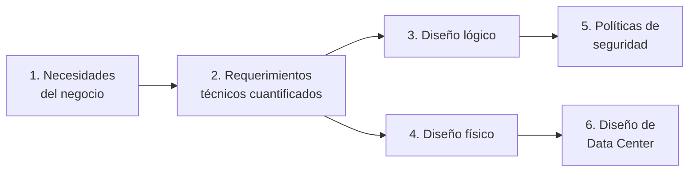

# Fase 1 — Análisis y Diseño de la Red Corporativa (2 pts)

## Resumen ejecutivo

Esta carpeta cubre los 6 entregables que exige la Fase 1 del proyecto, **1 documento por punto** para que el equipo pueda repartírselos y para que cada uno sea fácil de encontrar y revisar por separado:

| # | Punto exigido por el enunciado | Documento |
|---|---|---|
| 1 | Análisis de las necesidades tecnológicas | [01-Analisis-Necesidades-Tecnologicas.md](01-Analisis-Necesidades-Tecnologicas.md) |
| 2 | Análisis de requerimientos, costos, tráfico de red, cultura organizacional | [02-Requerimientos-Costos-Trafico-Cultura.md](02-Requerimientos-Costos-Trafico-Cultura.md) |
| 3 | Diseño lógico de la red corporativa | [03-Diseno-Logico.md](03-Diseno-Logico.md) |
| 4 | Diseño físico (planta, cuarto de equipos, estaciones, cableado, UPS) + materiales/marcas/modelos/presupuesto | [04-Diseno-Fisico.md](04-Diseno-Fisico.md) |
| 5 | Diseño de Políticas de Seguridad, lógicas y físicas | [05-Politicas-Seguridad.md](05-Politicas-Seguridad.md) |
| 6 | Diseño de Data Center (según estándares) | [06-Data-Center-Tier4.md](06-Data-Center-Tier4.md) |

Es un conjunto de documentos de **ingeniería conceptual**: cada decisión (segmentación, dimensionamiento de cableado, capacidad de UPS, cada política) se fundamenta con una memoria de cálculo, un estándar técnico citado, o una trazabilidad explícita hasta una necesidad de negocio — no con estimaciones arbitrarias. Es la metodología que se espera de un diseño de red corporativa real, no de un ejercicio de clase.

## Metodología general seguida

Este orden (negocio → requerimiento → diseño → controles) es intencional: un diseño de red que no parte de entender el negocio termina sobre-dimensionado o, peor, insuficiente donde realmente importa. Cada documento de esta carpeta referencia explícitamente de qué punto anterior se deriva, para que la trazabilidad completa (por qué existe cada decisión) quede visible sin tener que reconstruirla de memoria.

## Cómo usar esta carpeta como equipo

- Cada documento (01 a 06) puede leerse, revisarse y presentarse de forma independiente.
- Las referencias cruzadas entre documentos (ej. "ver 03-Diseno-Logico.md §6") son enlaces reales — funcionan igual en GitHub, en un editor Markdown local, o al exportarlos a Word.
- El reparto de trabajo y las decisiones detrás de cada uno están en [Responsables/Melany.md](../Responsables/Melany.md) y en la matriz RACI de [11-Equipo-y-Responsabilidades.md](../00-Documentacion-General/11-Equipo-y-Responsabilidades.md).

## Conclusiones y alcance de la propuesta

El diseño presentado en esta fase resuelve los 6 puntos exigidos con el mismo estándar de rigor que se aplicaría en una consultoría de redes real: cada decisión de dimensionamiento (tráfico, cableado, energía, enfriamiento) parte de una memoria de cálculo explícita, y cada elección de arquitectura (segmentación, modelo jerárquico, protocolo de enrutamiento) está fundamentada contra un estándar o principio de diseño citado, no contra preferencia arbitraria. Las fases siguientes (2, 3 y 4) implementan sobre esta misma base de diseño sin necesidad de redefinirla — el direccionamiento, la segmentación y el modelo jerárquico definidos aquí son la fuente de verdad que usan Terraform, Ansible y la configuración de los equipos físicos en el resto del proyecto.
