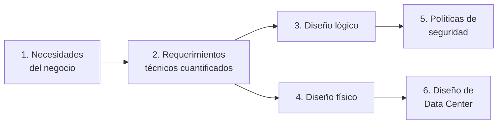

# Fase 1 — Análisis y Diseño de la Red Corporativa (2 pts)

## Resumen ejecutivo

Esta carpeta cubre los 6 entregables que exige la Fase 1 del proyecto, **1 documento por punto** para que el equipo pueda repartírselos y para que cada uno sea fácil de encontrar y revisar por separado:

| # | Punto exigido por el enunciado | Documento |
|---|---|---|
| 1 | Análisis de las necesidades tecnológicas | [01-Analisis-Necesidades-Tecnologicas.md](01-Analisis-Necesidades-Tecnologicas.md) |
| 2 | Análisis de requerimientos, costos, tráfico de red, cultura organizacional | [02-Requerimientos-Costos-Trafico-Cultura.md](02-Requerimientos-Costos-Trafico-Cultura.md) |
| 3 | Diseño lógico de la red corporativa | [03-Diseno-Logico.md](03-Diseno-Logico.md) |
| 4 | Diseño físico (planta, cuarto de equipos, estaciones, cableado, UPS) + materiales/marcas/modelos/presupuesto | [04-Diseno-Fisico.md](04-Diseno-Fisico.md) |
| 5 | Diseño de Políticas de Seguridad, lógicas y físicas | [05-Politicas-Seguridad.md](05-Politicas-Seguridad.md) |
| 6 | Diseño de Data Center (según estándares) | [06-Data-Center-Tier4.md](06-Data-Center-Tier4.md) |
| — | *(complementario, no exigido explícitamente)* Arquitectura final consolidada y equivalencia dispositivo por dispositivo con el laboratorio de Fase 4 | [07-Arquitectura-Final-Equivalencia-Laboratorio.md](07-Arquitectura-Final-Equivalencia-Laboratorio.md) |

Es un conjunto de documentos de **ingeniería conceptual**: cada decisión (segmentación, dimensionamiento de cableado, capacidad de UPS, cada política) se fundamenta con una memoria de cálculo, un estándar técnico citado, o una trazabilidad explícita hasta una necesidad de negocio — no con estimaciones arbitrarias. Es la metodología que se espera de un diseño de red corporativa real, no de un ejercicio de clase.

## Léase antes que todo lo demás: diseño de producción vs. laboratorio — cómo se relacionan

Esta fase describe la red de **producción**: la que Virtual Solutions construiría de verdad para sus 184 usuarios en 4 pisos, con presupuesto real (**~Q186,391**, precios verificados en vivo en tienda — ver [04-Diseno-Fisico.md](04-Diseno-Fisico.md) §8 y [08-Equipo-Fisico-Presupuesto.md](../00-Documentacion-General/08-Equipo-Fisico-Presupuesto.md) §4). La Fase 4 implementa un **laboratorio**: hardware físico real pero mínimo (~Q1,560–2,040) + la Nube Privada (SDN), que es un requisito aparte del enunciado.

**No hay que reconciliar los dos presupuestos — responden preguntas distintas**: Fase 1 responde *"¿cuánto costaría construir esto de verdad?"*; Fase 4 responde *"demostrá que el mecanismo funciona, con el mínimo de hardware real más la Nube Privada obligatoria"*. Son dos entregables completos y válidos por separado, no una misma cosa a dos escalas que deba cuadrar.

El malentendido más común es pensar que los switches de piso de esta fase "se virtualizan" en el laboratorio. **No es así — nunca se virtualizan, en ningún lado**. Resumen (tabla completa dispositivo por dispositivo, con marca/modelo/precio real de cada equipo de producción, en [07-Arquitectura-Final-Equivalencia-Laboratorio.md](07-Arquitectura-Final-Equivalencia-Laboratorio.md)):

| Elemento del diseño | En producción (esta fase) | En el laboratorio (Fase 4) |
|---|---|---|
| Router Core (R1) | 2 routers redundantes, presupuestados | 1 router físico real, comprado — mismo concepto, escala mínima |
| Switch de distribución (Piso 2/MDF) | 2 switches redundantes, presupuestados | Es el mismo switch físico único que se compra para la demo |
| Switches de acceso (Pisos 1, 2, 3, 4) | 10 switches 48p PoE+ (2-2-3-3 por piso), dimensionados por puerto y presupuestados | **No se compran ni se virtualizan — no existen en el laboratorio** |
| Teléfonos IP | 6 teléfonos físicos, repartidos en los 4 pisos | No se compran para el laboratorio (fuera del mínimo de Fase 4) |
| Cableado estructurado, racks de piso | Presupuestado completo (60 cajas, 16 patch panels, etc.) | Solo 3-4 patch cords sueltos |
| UPS, generador, Data Center Tier 4 completo | Presupuestado (ver [06-Data-Center-Tier4.md](06-Data-Center-Tier4.md)) | 1 UPS pequeño simbólico, sin generador |
| **SV1 + VR1 + VMs de servicio (Nube Privada)** | **No existe en este diseño** — no es parte de la LAN física del edificio, es un requisito separado del enunciado | **Esto sí es 100% virtual**, corre en Proxmox — la única parte de todo el proyecto que se virtualiza de verdad |

La Nube Privada (SDN) no es "la versión virtual de la red del edificio" — es un componente aparte que el enunciado pide explícitamente, y que se conecta al Core físico. La red del edificio (switches de piso, cableado) simplemente no tiene versión virtual: en el laboratorio se prueba el mecanismo (VLAN + trunk + DHCP) con 1 switch real y 2 hosts, no una réplica de los switches del edificio.

## Metodología general seguida

Este orden (negocio → requerimiento → diseño → controles) es intencional: un diseño de red que no parte de entender el negocio termina sobre-dimensionado o, peor, insuficiente donde realmente importa. Cada documento de esta carpeta referencia explícitamente de qué punto anterior se deriva, para que la trazabilidad completa (por qué existe cada decisión) quede visible sin tener que reconstruirla de memoria.

## Cómo usar esta carpeta como equipo

- Cada documento (01 a 06, más el complementario 07) puede leerse, revisarse y presentarse de forma independiente.
- Las referencias cruzadas entre documentos (ej. "ver 03-Diseno-Logico.md §6") son enlaces reales — funcionan igual en GitHub, en un editor Markdown local, o al exportarlos a Word.
- El reparto de trabajo y las decisiones detrás de cada uno están en [Responsables/Melany.md](../Responsables/Melany.md) y en la matriz RACI de [11-Equipo-y-Responsabilidades.md](../00-Documentacion-General/11-Equipo-y-Responsabilidades.md).

## Conclusiones y alcance de la propuesta

El diseño presentado en esta fase resuelve los 6 puntos exigidos con el mismo estándar de rigor que se aplicaría en una consultoría de redes real: cada decisión de dimensionamiento (tráfico, cableado, energía, enfriamiento) parte de una memoria de cálculo explícita, y cada elección de arquitectura (segmentación, modelo jerárquico, protocolo de enrutamiento) está fundamentada contra un estándar o principio de diseño citado, no contra preferencia arbitraria. Las fases siguientes (2, 3 y 4) implementan sobre esta misma base de diseño sin necesidad de redefinirla — el direccionamiento, la segmentación y el modelo jerárquico definidos aquí son la fuente de verdad que usan Terraform, Ansible y la configuración de los equipos físicos en el resto del proyecto.
