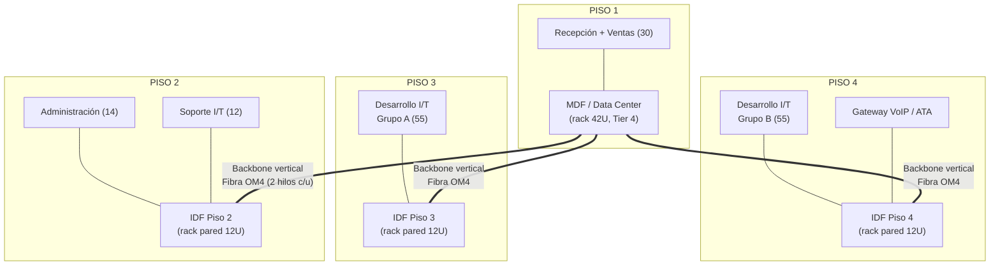

# Fase 1 — Análisis y Diseño de la Red Corporativa (2 pts)

Entregables del enunciado cubiertos aquí: (1) análisis de necesidades tecnológicas, (2) análisis de requerimientos/costos/tráfico/cultura organizacional, (3) diseño lógico, (4) diseño físico + materiales/presupuesto, (5) políticas de seguridad, (6) diseño de Data Center.

## 1. Análisis de necesidades tecnológicas

| Necesidad del negocio | Traducción técnica |
|---|---|
| Ahorrar costo de líneas telefónicas | VoIP interno (Asterisk/FreePBX) sobre VLAN dedicada con QoS |
| Redundancia de Internet | 2 enlaces 10 Mbps, 2 ISP, failover/balanceo en R1 (PCC o recursive routing en MikroTik) |
| Alta disponibilidad financiera | Data Center Tier 4 (ver [10-Data-Center-Tier4.md](10-Data-Center-Tier4.md)) |
| Seguridad de datos entre áreas | Segmentación VLAN + ACLs inter-VLAN (ver [07](../00-Documentacion-General/07-Direccionamiento-IP-VLANs.md)) |
| Trabajo remoto / equipos virtuales | VPN WireGuard + Nextcloud + Jitsi/BigBlueButton |
| Reducir intervención manual | Terraform + Ansible + IA (ver [06](../00-Documentacion-General/06-Automatizacion-con-IA.md)) |

## 2. Análisis de requerimientos, costos, tráfico y cultura organizacional

### 2.1 Requerimientos por área

| Área | Usuarios | Perfil de uso | Ancho de banda estimado/usuario | Total estimado |
|---|---|---|---|---|
| Administración | 14 | Ofimática, ERP, correo | 0.5 Mbps | 7 Mbps |
| Ventas | 30 | CRM, videollamadas con clientes | 1 Mbps | 30 Mbps |
| Desarrollo I/T | 110 | Git, CI/CD, entornos de prueba, descargas grandes | 1.5 Mbps | 165 Mbps |
| Soporte I/T | 12 | Acceso remoto a equipos, tickets | 1 Mbps | 12 Mbps |
| Telefonía IP | 6 líneas concurrentes | VoIP (G.711 ~87 Kbps/llamada) | 0.1 Mbps | 0.6 Mbps |

**Nota importante:** la demanda interna calculada (~215 Mbps en hora pico) **supera ampliamente** los 2×10 Mbps de Internet contratados. Esto es esperado — la mayoría del tráfico (Git interno, CI/CD, archivos, VoIP interno) es **tráfico LAN/este-oeste**, no debe salir a Internet. Los 20 Mbps de WAN son solo para tráfico hacia el exterior (correo externo, navegación, videoconferencias con clientes). Recomendación entregada al cliente: los 20 Mbps actuales alcanzan para navegación + correo + videollamadas moderadas de Ventas, pero si planean crecer en videoconferencia externa (BigBlueButton con clientes) se recomienda evaluar subir a 2×20 Mbps en 12–18 meses.

### 2.2 Cultura organizacional (impacto en el diseño)

- Empresa de **desarrollo de software** (110 de 184 usuarios son I/T) → cultura técnica, tolerante a herramientas self-hosted open source (encaja con el requisito de "solo open source").
- Fomento explícito del **trabajo remoto** → la VPN y la intranet no son "nice to have", son core del diseño, no un anexo.
- Manejo de **recursos monetarios** → controles de seguridad más estrictos en Administración/Finanzas que en el resto (VLAN separada, MFA sugerido a futuro, logging centralizado).

### 2.3 Costos (resumen — detalle línea por línea en [08-Equipo-Fisico-Presupuesto.md](../00-Documentacion-General/08-Equipo-Fisico-Presupuesto.md))

| Rubro | Costo aproximado |
|---|---|
| Equipo de red físico (Core + switch + cableado) | ~Q3,500 – Q4,500 |
| Servidor/mini PC dedicado (si no se tiene) | ~Q3,000 – Q6,000 |
| Software | Q0 (100% open source) |
| Mano de obra (autoimplementado) | Q0 |
| **Total aproximado del laboratorio** | **~Q6,500 – Q10,500** |

Este es el costo del **laboratorio de demostración** (1 router, 1 switch, VMs). El costo de un rollout real a 184 usuarios en 4 pisos (switches de piso, puntos de red, UPS de edificio, generador, etc.) se detalla también en el documento 08 como "Fase de producción" separada, para que quede claro qué es demo académica vs. qué sería el proyecto real de la empresa.

## 3. Diseño lógico de la red

Ver diagrama completo en [00-Arquitectura-General.md](../00-Documentacion-General/00-Arquitectura-General.md) sección 2, y tabla de VLANs/subredes en [07-Direccionamiento-IP-VLANs.md](../00-Documentacion-General/07-Direccionamiento-IP-VLANs.md).

Resumen de la topología lógica:

- **Core (L3)**: Router físico R1 (MikroTik) — enrutamiento entre todas las VLANs, salida a Internet (2 ISP), OSPF hacia VR1.
- **Distribución (L2/L3)**: Switch físico administrable con VLANs 802.1Q troncalizadas hacia switches de piso (diseño de producción) o directo a host de prueba (demo).
- **Acceso**: switches de piso (en el diseño de producción) — 1 por planta, uplink trunk hacia el switch de distribución.
- **Nube Privada (SDN)**: VR1 (router virtual) enruta entre la subred de gestión de la nube y el Core vía OSPF; SV1 (switch virtual) conecta las VMs de servicio.
- **DMZ**: VLAN separada para todo lo que recibe conexiones desde Internet (Web Server, relay de correo).

## 4. Diseño físico

### 4.1 Distribución por planta (edificio de 4 niveles)

| Piso | Área | Usuarios | Nota de cableado |
|---|---|---|---|
| 1 | Recepción + **Cuarto de Telecomunicaciones Principal (MDF) / Data Center** + Ventas | 30 | El MDF/Data Center vive aquí para minimizar longitud de backbone vertical |
| 2 | Administración + Soporte I/T | 14 + 12 = 26 | IDF de piso 2 |
| 3 | Desarrollo I/T (grupo A) | 55 | IDF de piso 3 |
| 4 | Desarrollo I/T (grupo B) + Telefonía IP (gateway/ATA) | 55 + 6 | IDF de piso 4 |

Desarrollo I/T (110) se divide en 2 IDFs de 55 para no superar la regla práctica de 90–100 m de cableado horizontal por norma **TIA/EIA-568** y para no saturar un solo rack de piso.

### Diagrama de planta por piso (bloques, no a escala)

### 4.2 Cableado estructurado (norma TIA/EIA-568-C y ANSI/TIA-942 para el DC)

- **Backbone vertical** (MDF ↔ IDFs): fibra óptica multimodo OM4, mínimo 2 hilos por IDF (redundancia), corridas por ducto vertical dedicado.
- **Cableado horizontal** (IDF ↔ estación de trabajo): UTP Cat 6 (mínimo exigido por el enunciado para R1↔VR1; se estandariza Cat 6 en todo el horizontal para soportar 1 Gbps y futuro PoE para teléfonos IP), longitud máxima 90 m + 10 m de patch cords (regla del 100 m total).
- **Etiquetado**: esquema `[Piso][IDF][Panel]-[Puerto]`, ej. `P3-IDF-A12` — obligatorio para poder auditar según norma.
- **Canalización**: canaleta/bandeja perforada en cielo falso + faceplates dobles por puesto (1 dato + 1 VoIP, o 1 puerto con switch PoE pass-through en el teléfono).
- **Rack de piso (IDF)**: gabinete de pared 12U, con patch panel Cat 6 24p, organizador de cables, switch de piso PoE+ (para alimentar teléfonos IP), regleta con UPS pequeño local.
- **Cuarto de equipos (MDF/Data Center)**: rack de piso 42U estándar 19", ver detalle completo en [10-Data-Center-Tier4.md](10-Data-Center-Tier4.md).

### Elevación del rack — MDF / Data Center (42U, de arriba hacia abajo)

| U (posición) | Equipo |
|---|---|
| 42–40 | Panel pasacables + ventilación |
| 39–37 | Patch panel Cat 6 24p (uplinks a IDFs vía backbone de fibra, mediante ODF) |
| 36 | Organizador horizontal de cables |
| 35–33 | Router Core R1 (MikroTik) + Switch físico de distribución |
| 32–30 | Servidor (laptop/PC con SSD externo portátil — Proxmox VE: Nube Privada) |
| 29–20 | Reservado — crecimiento de servidores físicos (hasta completar los 12 de "Servidores Físicos/Virtuales") |
| 19–10 | Equipo de telefonía IP (PBX/gateway) y switch PoE+ dedicado a VoIP |
| 9–4 | PDUs redundantes (rama A / rama B) |
| 3–1 | UPS de rack (o base del rack si el UPS central es de piso, fuera del rack) |

Esta elevación es referencial para el diseño de producción — para el laboratorio de demo (Fase 4) solo se ocupan físicamente las posiciones de R1, el switch y la conexión hacia el servidor portátil.

### 4.3 Estaciones de trabajo

Cada puesto: 2 salidas RJ45 Cat 6 (datos + voz/reserva), certificadas con tester (Fluke o equivalente) al terminar la instalación, con reporte de certificación entregado como parte del proyecto real (no aplica para el laboratorio de demo).

### 4.4 Sistema de UPS

- **UPS central del Data Center**: on-line doble conversión, dimensionado para toda la carga IT + 30% de margen (detalle de cálculo de carga en documento 10).
- **UPS de piso (IDF)**: line-interactive pequeño (~1000VA) para sostener el switch de piso durante transferencia a planta eléctrica.
- **Planta eléctrica (generador)**: requerida por el Tier 4 — ver documento 10.

### 4.5 Listado de materiales (resumen — precios en documento 08)

| Categoría | Ítem | Cantidad estimada (producción) |
|---|---|---|
| Cableado horizontal | UTP Cat 6 (caja 305m) | ~6 cajas |
| Cableado backbone | Fibra OM4 multimodo | 3 corridas (MDF→cada IDF) |
| Conectores | RJ45 Cat 6 + faceplates dobles | ~370 (2 por puesto × 184) |
| Patch panels | 24 puertos Cat 6 | 4 (uno por piso) |
| Switches de piso | PoE+ 24-48p administrable | 3 (pisos 2, 3, 4) |
| Racks IDF | Gabinete pared 12U | 3 |
| UPS de piso | Line-interactive 1000VA | 3 |
| Certificadora de cableado | Alquiler/servicio | 1 servicio |

## 5. Políticas de seguridad (resumen)

Ver documento completo: [09-Politicas-Seguridad.md](09-Politicas-Seguridad.md). Resumen: control de acceso físico por niveles al Data Center, políticas de contraseñas y VLAN por rol, firewall stateful en el borde y entre VLANs sensibles, principio de menor privilegio para accesos a Servidores/Administración.

## 6. Diseño de Data Center

Ver documento completo: [10-Data-Center-Tier4.md](10-Data-Center-Tier4.md). Resumen: Tier 4 según Uptime Institute / ANSI-TIA-942, 2N en energía y enfriamiento, piso elevado, extinción limpia (agente gaseoso), control de acceso biométrico, tierra física dedicada.
