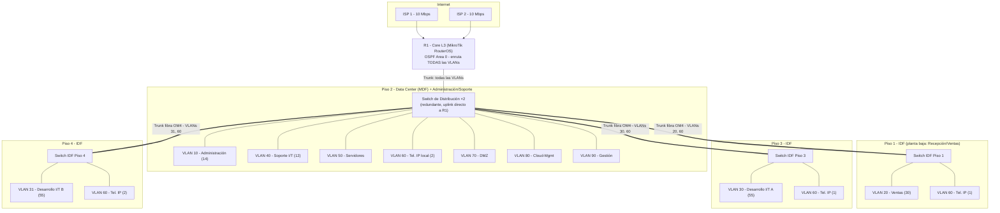

# Punto 3 — Diseño Lógico de la Red Corporativa

## 1. Modelo de diseño: jerárquico de 3 capas (Core – Distribución – Acceso)

Se adopta el **modelo jerárquico de 3 capas** (Core / Distribution / Access), el marco de referencia estándar de la industria para redes empresariales de este tamaño (popularizado por Cisco, pero es un principio de diseño agnóstico de fabricante):

| Capa | Función | Elemento en este diseño |
|---|---|---|
| **Core** | Enrutamiento de alta velocidad entre todas las VLANs, punto de salida a WAN | R1 (MikroTik RouterOS), Capa 3 |
| **Distribución** | Agregación de los switches de acceso, frontera de políticas (ACLs, QoS) | Switch de distribución (Data Center, **Piso 2** — no planta baja, ver [04-Diseno-Fisico.md](04-Diseno-Fisico.md) §1) |
| **Acceso** | Conexión directa del usuario final a la red | 3 switches IDF (Piso 1, 3, 4) |

**Por qué 3 capas y no un diseño colapsado (2 capas)**: un diseño colapsado (core+distribución en un solo dispositivo) es apropiado para redes pequeñas de 1 solo piso o edificio sin necesidad de agregación intermedia. Con 184 usuarios repartidos en 4 niveles y necesidad de política de firewall diferenciada por VLAN, separar la función de distribución permite que cada switch de piso solo transporte las VLANs que le corresponden (reduce dominio de broadcast por segmento) sin sobrecargar al Core con la administración de cada puerto de acceso individual.

## 2. Diagrama de diseño lógico completo

Este es el diagrama que responde "¿qué switches lleva la red y qué VLAN corre por cada uno?" — el diseño lógico completo de los 184 usuarios en los 4 pisos, no el de la demo de laboratorio (esa es aparte, en Fase 4 — solo prueba conectividad con 2 hosts, no es el diseño de producción).

**Cómo leer este diagrama**: la red completa lleva **4 dominios de switching** en producción — 1 de distribución en el Data Center (**Piso 2**, no planta baja, por prevención de inundación, conectado directo a R1, implementado en par redundante — ver [04-Diseno-Fisico.md](04-Diseno-Fisico.md) §1.1.1) y 3 de piso/IDF (Piso 1, 3 y 4), cada uno troncalizado por fibra hacia el de distribución. El switch de distribución también sirve directo a Administración y Soporte I/T (VLANs 10 y 40) por estar físicamente en el mismo piso que ellos — no necesitan un IDF propio. La **VLAN 60 (Telefonía IP) se troncaliza hacia los 4 pisos**, no solo hacia uno — los 6 teléfonos piloto se reparten donde el negocio los necesita (detalle completo en [04-Diseno-Fisico.md](04-Diseno-Fisico.md) §1.3), aunque el PBX centralizado vive en el Data Center. Direccionamiento completo de cada VLAN en [07-Direccionamiento-IP-VLANs.md](../00-Documentacion-General/07-Direccionamiento-IP-VLANs.md).

**Nota sobre "4 switches" vs "12 switches"**: este diagrama muestra 4 **dominios lógicos** de switching (1 por piso) — es la vista de diseño lógico. Físicamente, por conteo real de puntos de red (2 drops por puesto), cada dominio de piso se implementa como un **stack de 2 o 3 unidades** de 48 puertos (2 en Piso 1, 2 en Piso 2, 3 en Piso 3, 3 en Piso 4), y el dominio de distribución se implementa como un **par redundante** de 2 switches (2N, ver [04-Diseno-Fisico.md](04-Diseno-Fisico.md) §1.1.1) — total **12 switches físicos**, detallados con modelo/precio real en [04-Diseno-Fisico.md](04-Diseno-Fisico.md) §1.1-1.2. No es una inconsistencia: un stack o un par redundante se administra y aparece ante la red como un solo switch lógico, que es justo lo que representa este diagrama.

Nota de alcance: el diseño de 4 dominios (12 switches físicos: 10 de acceso + 2 de distribución redundante) es el **diseño de producción completo** (lo que Virtual Solutions instalaría de verdad); el laboratorio de demo de la Fase 4 usa 1 solo switch físico con 2 puertos de acceso para probar el concepto sin comprar el equipo completo — la lógica de VLAN/trunk es idéntica, solo cambia la escala (ver equivalencia completa en [07-Arquitectura-Final-Equivalencia-Laboratorio.md](07-Arquitectura-Final-Equivalencia-Laboratorio.md)).

## 3. Segmentación VLAN — justificación técnica

Ver el desarrollo completo de los 5 argumentos (superficie de ataque, perfil de tráfico, cumplimiento, contención de broadcast, QoS de VoIP) en [00-Arquitectura-General.md](../00-Documentacion-General/00-Arquitectura-General.md) §3. Resumen aplicado a este documento: cada VLAN de la tabla en §2 corresponde a un dominio de broadcast y una política de firewall independientes — es el mecanismo técnico que materializa la segmentación exigida por el enunciado ("todo el personal de ingeniería está en una LAN, mientras que el personal Administrativo está en otra LAN").

## 4. Calidad de servicio (QoS) — esquema de marcado DSCP

Con base en la clasificación de tráfico de [02-Requerimientos-Costos-Trafico-Cultura.md](02-Requerimientos-Costos-Trafico-Cultura.md) §2.1, se define el siguiente esquema de marcado **DSCP (Differentiated Services Code Point)** para que R1 y los switches puedan priorizar tráfico de forma consistente en toda la red:

| Clase de tráfico | VLAN típica | Marcado DSCP | Nombre estándar |
|---|---|---|---|
| Voz (VoIP) | 60 | EF (46) | Expedited Forwarding — prioridad máxima, mínima latencia/jitter |
| Señalización de VoIP | 60 | CS3 (24) | Class Selector 3 |
| Interactivo (SSH/RDP de gestión) | 90 (Gestión) | AF31 (26) | Assured Forwarding, alta prioridad |
| Transaccional (correo, apps de negocio) | 10, 20, 50 | AF21 (18) | Assured Forwarding, prioridad media |
| Masivo (Git, CI/CD, respaldos) | 30, 31 | AF11 (10) o CS1 (8) | Prioridad baja garantizada — no se descarta, pero cede paso a las clases superiores |
| Mejor esfuerzo (navegación general) | Todas (vía Proxy) | Default (0) | Sin garantía |

El marcado se aplica en el punto de entrada más cercano al origen (en R1 para tráfico que cruza VLANs, o en el propio switch de acceso si soporta clasificación por puerto) y se respeta en toda la ruta hasta el destino — es lo que permite que, ante congestión momentánea del enlace WAN, una llamada VoIP no se degrade por una transferencia grande de Desarrollo compitiendo por el mismo ancho de banda saliente.

## 5. Enrutamiento y control de bucles de Capa 2

- **Enrutamiento dinámico OSPF** (RFC 2328, área única 0.0.0.0) entre R1 y VR1 — sin rutas estáticas (restricción explícita del enunciado, ver [Fase4-Nube-Privada-SDN.md](../Fase-4-Nube-Privada-SDN/04-Fase4-Nube-Privada-SDN.md)). Área única porque la topología (2 routers) no justifica la complejidad de múltiples áreas OSPF — el diseño multi-área solo aporta valor cuando hay decenas de routers y se necesita resumir rutas entre regiones, que no es el caso aquí.
- **Topología de Capa 2 libre de bucles por diseño**: la topología distribución→IDF es un árbol (cada IDF cuelga de un único enlace hacia el switch de distribución), por lo que **no se requiere Spanning Tree Protocol** para prevenir bucles en la configuración base — no hay una segunda ruta física que pueda crear un loop.
- **Nota de diseño para evolución futura**: si en una fase posterior se agregan **enlaces redundantes** entre cada IDF y el switch de distribución (recomendable a mediano plazo para eliminar el punto único de falla que hoy representa cada switch de piso), **se vuelve obligatorio activar RSTP (Rapid Spanning Tree, IEEE 802.1w) o MSTP** en todos los switches para prevenir bucles de broadcast — se deja documentado aquí precisamente para que quien amplíe la red en el futuro no lo pase por alto.

## 6. Direccionamiento IP y cumplimiento normativo

- Todo el direccionamiento usa espacio privado **RFC 1918** (`10.10.0.0/16`), NAT en R1 hacia las 2 salidas de Internet.
- Segmentación por VLAN conforme **IEEE 802.1Q** (trunking estándar, no propietario — portable entre fabricantes, relevante porque el diseño mezcla MikroTik con el switch Easy Smart de otra marca).
- Ver tabla maestra completa de VLANs, subredes, gateways y rangos DHCP en [07-Direccionamiento-IP-VLANs.md](../00-Documentacion-General/07-Direccionamiento-IP-VLANs.md), incluyendo la nota de optimización con VLSM para quien quiera profundizar más allá del esquema `/24` uniforme elegido como base — la elección de `/24` uniforme (en vez de VLSM ajustado a cada VLAN) es deliberada: prioriza simplicidad operativa y margen de crecimiento (§1.4 de [01-Analisis-Necesidades-Tecnologicas.md](01-Analisis-Necesidades-Tecnologicas.md)) sobre eficiencia de espacio de direcciones, que no es un recurso escaso en un bloque privado `/16`.

## 7. Alta disponibilidad de capa 3
- WAN: 2 ISP con failover automático en R1 (ver [Fase3-LAN-WAN-VPN-Seguridad.md](../Fase-3-LAN-WAN-VPN-Seguridad/03-Fase3-LAN-WAN-VPN-Seguridad.md) §1.2).
- Core↔Nube Privada: OSPF converge dinámicamente ante falla del enlace R1↔VR1 sin intervención manual.
- **Punto único de falla — reconocido, y ya cerrado en Core y Distribución**: una revisión anterior de este diseño dejaba tanto a R1 como al switch de distribución como dispositivos únicos, documentados como limitación aceptada. Se corrigió: el **diseño de producción implementa R1 en par redundante (VRRP/CARP)** y **switch de distribución en par redundante** (ver [04-Diseno-Fisico.md](04-Diseno-Fisico.md) §1.1.1 y §1.2, presupuestado en [08-Equipo-Fisico-Presupuesto.md](../00-Documentacion-General/08-Equipo-Fisico-Presupuesto.md) §4) — es la brecha que un Data Center que se declara conforme a Tier IV no puede dejar abierta, porque una falla de cualquiera de esos dos equipos tumbaría el acceso a los 4 pisos completos sin importar cuán redundante sea la energía. **Queda un punto único de falla reconocido y aceptado por diseño**: cada switch de **acceso** de piso (10 unidades) es individual, no duplicado — decisión deliberada, no un descuido: duplicar cada switch de piso multiplicaría el costo de acceso sin beneficio proporcional, ya que una falla ahí afecta solo a ese piso/zona de cableado durante el tiempo de reemplazo, no a toda la red — es la misma lógica que aplican instalaciones Tier IV certificadas reales, donde la redundancia estricta se exige a las capas que pueden tumbar toda la operación (Core, Distribución, energía, enfriamiento), no a cada punto de acceso individual. Mejora futura documentada: enlaces dobles IDF↔distribución con RSTP/MSTP (punto 5) si en algún momento se justifica duplicar también el acceso.
