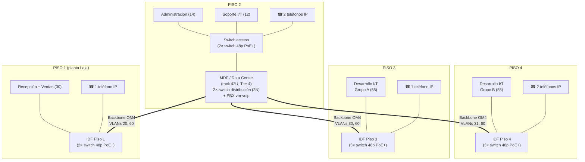

# Punto 4 — Diseño Físico de la Red Corporativa

## 1. Distribución por planta (edificio de 4 niveles)

| Piso | Área | Usuarios | Puestos de red (2 drops c/u) | Nota de cableado |
|---|---|---|---|---|
| 1 | Recepción + Ventas | 30 | 60 | IDF de piso 1 (ya no aloja el MDF — ver justificación abajo) |
| 2 | **MDF/Data Center** + Administración + Soporte I/T | 14 + 12 = 26 | 52 | El MDF/Data Center vive aquí — ver justificación abajo |
| 3 | Desarrollo I/T (grupo A) | 55 | 110 | IDF de piso 3 |
| 4 | Desarrollo I/T (grupo B) | 55 | 110 | IDF de piso 4 |
| | | **184** | **332** | + margen (ver §6) |

**Nota sobre Telefonía IP (6 teléfonos piloto)**: no está atada a un solo piso — ver §1.2 más abajo. El **gateway/PBX centralizado** (Asterisk + FreePBX, `vm-voip`) vive en el Data Center (Piso 2), y los teléfonos físicos se reparten entre los 4 pisos según dónde realmente se necesitan.

**Por qué el MDF/Data Center está en el Piso 2 y no en el Piso 1**: se descartó deliberadamente la planta baja por riesgo de inundación — es una práctica de sitio estándar en el diseño de Data Centers (Uptime Institute / BICSI 002 desaconsejan planta baja y sótano precisamente por exposición a inundación, además de mayor exposición a acceso vehicular/entregas y menor profundidad de seguridad física). El Piso 2 es el primer nivel elevado del edificio, reduciendo ese riesgo sin llevar el equipo pesado (rack 42U, UPS, futura planta eléctrica) más arriba de lo necesario. Como beneficio adicional, coincide con dónde está **Soporte I/T** — son quienes administran el Data Center día a día, así que tenerlos en el mismo piso reduce el tiempo de respuesta ante cualquier incidente físico (un cambio de patch cord, un reinicio manual, etc.) sin necesidad de subir/bajar pisos.

Desarrollo I/T (110) se divide en 2 IDFs de 55 para no superar la regla práctica de 90–100 m de cableado horizontal por norma **TIA/EIA-568** y para no saturar un solo rack de piso ni concentrar 110 puntos de falla física en un único gabinete.

### 1.1 Dimensionamiento de switches de acceso

La cantidad de switches de acceso se determina considerando la cantidad de puntos de red (drops) requeridos en cada nivel — **2 drops por puesto de trabajo** (dato + voz/reserva, ver §4.2), de manera que cada puesto pueda tener conexiones independientes para computadora, teléfono IP u otro dispositivo de red sin competir por el mismo puerto físico. Para la capa de acceso se usan switches administrables de **48 puertos Gigabit Ethernet**, con soporte VLAN IEEE 802.1Q y enlaces troncales hacia el switch de distribución — el mismo estándar en los 4 pisos, para que cualquier switch de repuesto sirva para cualquier IDF.

| Nivel | Área | Usuarios | Puntos de red | Switches de acceso |
|---|---|---|---|---|
| Piso 1 | Ventas | 30 | 60 | 2 switches de 48 puertos |
| Piso 2 | Administración + Soporte I/T | 26 | 52 | 2 switches de 48 puertos |
| Piso 3 | Desarrollo I/T — Grupo A | 55 | 110 | 3 switches de 48 puertos |
| Piso 4 | Desarrollo I/T — Grupo B | 55 | 110 | 3 switches de 48 puertos |
| **Total** | — | **166\*** | **332** | **10 switches de acceso** |

\*La cantidad mostrada corresponde a los usuarios atendidos directamente por estos switches según las áreas representadas. Los demás dispositivos y servicios de infraestructura (Servidores, Data Center) se consideran de forma independiente.

La capacidad instalada (10 × 48 = 480 puertos) es superior a los 332 puntos de red requeridos hoy, a propósito: deja puertos disponibles para crecimiento, incorporación de nuevos dispositivos (más teléfonos IP conforme el piloto de VoIP escale, puntos de acceso WiFi, impresoras de red) y futuras ampliaciones sin tener que abrir el rack y agregar hardware de inmediato.

Los switches de acceso de los pisos 1, 3 y 4 se ubican dentro de sus respectivos IDF y se comunican con el switch principal de distribución en el MDF/Data Center del Piso 2 mediante el backbone de fibra óptica multimodo OM4. En el Piso 2, los 2 switches de acceso (Administración y Soporte I/T) están asociados directamente al MDF, ya que el Data Center y el punto principal de distribución se encuentran en ese mismo nivel — no necesitan un tramo de backbone propio, se conectan por cobre/fibra corta directo al rack del Data Center. Los enlaces entre los switches de acceso y la capa de distribución se configuran como **enlaces trunk IEEE 802.1Q**, transportando las VLAN correspondientes a cada nivel (ver [03-Diseno-Logico.md](03-Diseno-Logico.md) §2).

### 1.1.1 Switch de distribución — redundante (2N), aparte de los 10 de acceso

El switch de distribución **no está incluido en el conteo de 10** — es un equipo de rol distinto, ubicado en el MDF/Data Center (Piso 2), cuya función es agregar el uplink hacia R1 y los 3 troncales de fibra hacia los pisos 1, 3 y 4, además de los enlaces hacia los 2 switches de acceso locales de Piso 2 (Administración y Soporte I/T). Mezclar esta función con la de acceso de usuarios generaría un punto de falla que tumbaría simultáneamente la distribución de toda la red y el acceso de dos departamentos — se separa a propósito en un equipo aparte, con puertos SFP+ que los switches de acceso no necesitan.

**Se implementan 2 switches de distribución, no 1 — cierre de un punto único de falla reconocido**: en una revisión anterior de este diseño, tanto R1 como el switch de distribución estaban documentados como puntos únicos de falla no resueltos (ver historial en [03-Diseno-Logico.md](03-Diseno-Logico.md) §7). R1 ya se resolvió con un par redundante (ver §1.2 y la memoria de cálculo de energía en [06-Data-Center-Tier4.md](06-Data-Center-Tier4.md) §3.1, que ya presupone 2 routers Core). El switch de distribución quedaba pendiente — y es exactamente el tipo de brecha que un Data Center que se declara conforme a **Tier IV** (tolerancia a fallas en *cualquier* componente, no solo en energía/enfriamiento — ver [06-Data-Center-Tier4.md](06-Data-Center-Tier4.md) §1.1) no puede dejar abierta: un Data Center con UPS y CRAC 2N pero con un solo switch de distribución sigue teniendo un punto único de falla que puede tumbar el acceso a los 4 pisos completos. Se corrige aquí agregando un segundo switch de distribución idéntico, en configuración activo-activo o activo-pasivo (MLAG/bonding entre ambos hacia R1 y hacia cada IDF), cerrando la brecha de red que quedaba fuera del alcance de la redundancia eléctrica/de enfriamiento.

**Total de switches en el diseño de producción: 10 de acceso + 2 de distribución = 12**, más el par redundante de routers Core (R1×2, capa aparte, no contados como "switches").

### 1.2 Marcas/modelos reales y comparación de precio — switches y router Core

**Precios verificados en vivo en tiendas con presencia en Guatemala (Pacifiko.com, importador "Tienda Mundial" con envío desde Miami, 6-14 días hábiles) — no estimaciones de catálogo internacional sin ajustar.** Una revisión anterior de este documento citaba precios de MikroTik tomados de reviews/Amazon en USD sin el margen de importación real a Guatemala; se corrige aquí con el precio de venta real, en Quetzales, confirmado en tienda:

| Rol | Opción recomendada (MikroTik) | Precio real confirmado | Opción alterna (Cisco) | Precio aprox. |
|---|---|---|---|---|
| Switch 48p PoE+ (acceso, ×10) | **MikroTik CRS354-48P-4S+2Q+RM** — 48× PoE+ (750W), 4×10G SFP+, 2×40G QSFP+ | **Q9,444/u** ([Pacifiko.com](https://www.pacifiko.com/compras-en-linea/mikrotik-crs354-48p-4s-2q-rm-switch-has-48-x-1g-rj45-ports-and-4-x-10g-sfp-ports-2-x-40g-qsfp-ports-for-extremely-fast-fiber-connections-or-linking-with-other-40-gbps-devices), verificado en vivo agosto 2026) | **Cisco Business CBS350-48P-4G** — 48× PoE+ (370W), 4×1G SFP | Sin precio GT vigente confirmado — el único distribuidor identificado (Guatemala Digital) lo tiene descontinuado/sin stock desde 09/2023; cotizar directo con partner Cisco local. Referencia de lista internacional (no GT): orden de US$1,200–1,600 |
| Switch distribución (×2, redundante — ver §1.1.1) | **MikroTik CRS326-24S+2Q+RM** — 24× SFP, 2×40G QSFP+ (agregación pura, sin PoE — el distribución no alimenta endpoints, solo agrega fibra/uplinks) | **Q5,714/u** ([Pacifiko.com](https://www.pacifiko.com/mikrotik), verificado en vivo agosto 2026) | **Cisco Meraki MS350-24X** — 24p multigigabit + 4×10G SFP+, gestión en la nube | **Q172,000 – Q180,000 el par** (cotización real aportada por el equipo — ver comparación completa abajo) |
| Router Core (R1, redundante ×2, producción) | **MikroTik CCR2004-16G-2S+** — 16× Gigabit, 2×10G SFP+, gama Cloud Core apropiada para un rollout real (no el hEX RB750Gr3 de gama SOHO que se usa solo en el laboratorio de Fase 4) | **Q4,484 – Q4,779/u** (~Q4,600, [Pacifiko.com](https://www.pacifiko.com/mikrotik), verificado en vivo) | **Cisco Meraki MS425-32** (usado como núcleo L3 en la cotización de referencia) | **Q252,000 – Q260,000 el par** (cotización real aportada por el equipo — ver comparación completa abajo) |

**Comparación real de mercado — cotización completa aportada por el equipo (proyecto de referencia con Cisco Meraki, Data Center en Piso 2)**:

| Capa de red | Modelo Meraki | Cantidad | GBM | IT Solutions Guatemala |
|---|---|---|---|---|
| Núcleo (Core) | Cisco Meraki MS425-32 | 2 | Q252,000 | Q260,000 |
| Distribución | Cisco Meraki MS350-24X | 2 | Q172,000 | Q180,000 |
| Acceso | Cisco Meraki MS120-24P | 10 | Q290,000 | Q320,000 |
| **Total** | | | **Q714,000** | **Q760,000** |

**Por qué esta cotización real (Q714,000–760,000) no invalida el presupuesto MikroTik de este proyecto (ver §8 y [08-Equipo-Fisico-Presupuesto.md](../00-Documentacion-General/08-Equipo-Fisico-Presupuesto.md) §4)** — son dos decisiones de arquitectura distintas, no un mismo diseño con precios distintos:

1. **Redundancia de capa**: la cotización de referencia asume **2N en las 3 capas** (2 núcleo + 2 distribución + 10 acceso, con la lectura de que "10" en Acceso ya cuenta ambas unidades por punto si se reparte 2N por zona). Este diseño implementa **2N en Core y Distribución** (ya corregido en esta misma revisión — ver §1.1.1) **pero acceso simple por piso** (10 switches, uno por zona de cableado, sin duplicar cada uno) — es la práctica estándar incluso en instalaciones Tier IV certificadas: la redundancia estricta se exige al Data Center y a la capa que puede tumbar *toda* la red (Core/Distribución), no a cada switch de piso, donde una falla afecta solo a ese piso durante el tiempo de reemplazo (impacto acotado, no catastrófico).
2. **Modelo de licenciamiento**: Meraki no es "más switch" por el mismo dinero — es hardware que **requiere licencia de suscripción anual obligatoria** para operar (gestión 100% en la nube de Cisco; sin licencia vigente, el equipo deja de administrarse). Es un modelo pensado para cadenas con decenas de sucursales que necesitan panel único remoto, no la arquitectura más eficiente en costo para una sola sede de 184 personas.
3. **Ambas cifras son reales y defendibles** — la de este proyecto (MikroTik, ~Q186,000 en switches+router+cableado, ver §8) y la cotización Meraki (Q714,000–760,000, solo switches) — la diferencia no es que una esté "mal calculada", es que representan tiers de mercado distintos (SMB vs. enterprise-managed-cloud) para el mismo requisito funcional.

**Recomendación — MikroTik, decisión evaluada explícitamente contra Cisco antes de confirmarse, no una elección por defecto**: el equipo comparó las tres opciones de marca con precios reales antes de decidir, en vez de asumir que "más barato = correcto". La comparación real de switches+router, apples-to-apples, es:

| Opción | Alcance comparado (switches de acceso + distribución + router Core) | Costo real |
|---|---|---|
| **MikroTik (elegido)** | 10 acceso + 2 distribución (2N) + 2 router Core (VRRP) | **Q115,128** |
| Cisco Meraki (cotización real del equipo) | 10 acceso + 2 distribución + 2 núcleo (arquitectura equivalente) | **Q714,000 – Q760,000** |

La brecha real es **~6.2× a 6.6×** (no una cifra menor "porque Meraki incluye más redundancia" — ambas filas ya comparan switches+router redundantes en Core/Distribución). Las razones de esa brecha, verificadas, no supuestas:

1. **Licenciamiento, no capacidad de hardware**: Meraki exige suscripción anual obligatoria para que el equipo siga administrable — es un modelo de negocio (ingreso recurrente para Cisco), no una diferencia de silicio. MikroTik RouterOS/SwOS no tiene ese costo oculto.
2. **RouterOS es software de nivel profesional real, no una versión reducida**: soporta OSPF (RFC 2328), BGP, VRRP para alta disponibilidad, firewall stateful, VLAN 802.1Q, QoS/DSCP — el mismo conjunto de protocolos que corre en el IOS de Cisco. MikroTik es la base de red de ISPs reales en Latinoamérica y de despliegues empresariales en decenas de países — no es una marca "de hobby", es una marca que prioriza el costo por puerto/por Gbps sobre el ecosistema de gestión en la nube.
3. **Mismo ecosistema en todo el diseño**: R1, distribución y acceso corren RouterOS/SwOS — una sola curva de aprendizaje, una sola consola de administración, sin mezclar fabricantes.

**Cisco Business (CBS350) y Cisco ISR** quedan documentados como alternativa de marca reconocida si la empresa prioriza soporte internacional de marca única sobre el costo — son técnicamente capaces para esta escala — aunque su disponibilidad local vigente debe confirmarse antes de comprar (ver nota de descontinuación arriba, el único distribuidor identificado lo tiene sin stock desde 2023). **Cisco Meraki y Catalyst Enterprise** se descartan como elección primaria: la cotización real de Q714,000–760,000 obtenida por el equipo confirma que es **~6.2-6.6× el costo equivalente de red completa (switches+router redundantes) de este diseño**, más un modelo de licenciamiento recurrente que este proyecto no necesita para cumplir sus requisitos funcionales — un costo no proporcional al tamaño de Virtual Solutions (184 usuarios, 1 sola sede). Quedan documentados aquí con precio real como la opción "todo-Cisco-enterprise" válida si la empresa prioriza soporte de marca única sobre costo — no se descartan por ser "peores", se descartan por ser desproporcionados para esta escala específica.

### 1.3 Segmentación de Telefonía IP (VLAN 60) a través de los 4 pisos

Los 6 teléfonos IP piloto **no se concentran en un solo piso** — se reparten donde el negocio realmente los necesita, y la VLAN 60 se troncaliza hacia **los 4 switches de piso** (no solo hacia uno), para que agregar un teléfono nuevo en cualquier planta a futuro no requiera cambiar la configuración de trunk:

| Piso | Teléfonos IP (piloto) | Uso |
|---|---|---|
| 1 | 1 | Recepción — primer punto de contacto telefónico de la empresa |
| 2 | 2 | Administración (1) + Soporte I/T (1) |
| 3 | 1 | Desarrollo I/T Grupo A — línea compartida/lead técnico |
| 4 | 2 | Desarrollo I/T Grupo B (1) + sala de reuniones (1) |

El **PBX (Asterisk + FreePBX, `vm-voip`)** y el gateway/ATA que conecta hacia la PSTN (si se requiere salida a líneas externas, no solo extensiones internas) viven **centralizados en el Data Center (Piso 2)** junto con el resto de servidores — no hay hardware de telefonía físico en los pisos 1, 3 o 4, solo los teléfonos IP mismos conectados por PoE al switch de su piso. Esto es la práctica estándar de cualquier despliegue VoIP empresarial: la inteligencia de la llamada (PBX) está centralizada, los endpoints (teléfonos) están distribuidos.

## 2. Diagrama de planta por piso (bloques, no a escala)

Nota de lectura: el MDF ya no está en planta baja — subió al Piso 2 por prevención de inundación (ver justificación en §1). El backbone hacia el Piso 1 ahora **baja** en vez de solo subir, pero la distancia vertical es la misma (1 entrepiso), así que el presupuesto de atenuación de fibra (§4.1) no cambia. La VLAN 60 (Telefonía IP) va troncalizada hacia **los 4 pisos**, no solo hacia uno — el PBX centralizado (`vm-voip`) vive en el Data Center junto al switch de distribución (ver §1.2).

## 3. Cuartos de telecomunicaciones (TR) — dimensionamiento conforme TIA-569-D

TIA-569-D exige que todo cuarto de telecomunicaciones (TR/IDF) se dimensione en función de la cantidad de puestos que atiende, no de un tamaño arbitrario fijo. Regla general de la norma: mínimo **1.85 m² (≈ 20 ft²) para hasta 100 m² de área servida**, escalando aproximadamente **1 m² adicional por cada 500 m² de piso servido adicional**.

| IDF | Puestos servidos | Área aproximada del piso servida | Dimensión mínima recomendada |
|---|---|---|---|
| Piso 1 | 60 drops | ~200–250 m² (estimado — Recepción ocupa parte del área sin puestos de red) | ≈ 2.0–2.5 m² — rack de pared 12U cabe cómodo |
| Piso 3 | 110 drops | ~300–350 m² (estimado, mayor densidad de puestos) | ≈ 2.5–3.0 m² |
| Piso 4 | 110 drops | ~300–350 m² (estimado) | ≈ 2.5–3.0 m² |

El Piso 2 no aparece en esta tabla como IDF porque ahí ya no hay un cuarto de telecomunicaciones aparte — es directamente el **MDF/Data Center**, dimensionado con los criterios de [06-Data-Center-Tier4.md](06-Data-Center-Tier4.md) (más exigentes que un TR estándar: piso elevado, 2N, extinción, etc.), no con la regla básica de TIA-569-D.

Las áreas de piso son estimadas (no se provee plano arquitectónico en el enunciado) — se confirmarían con el plano real en la ingeniería de detalle, pero el criterio de dimensionamiento (norma, no un número inventado) es lo que importa documentar aquí.

**Requisitos ambientales del TR** (TIA-569-D): iluminación mínima 540 lux a 1 m del piso, temperatura 18–27 °C durante operación (equipo activo genera calor incluso en un rack pequeño), acceso restringido, puerta con ancho mínimo de 0.91 m para permitir el ingreso de un rack completo.

## 4. Cableado estructurado (norma TIA/EIA-568-C y ANSI/TIA-942 para el DC)

### 4.1 Backbone vertical (MDF ↔ IDFs)
Fibra óptica multimodo **OM4**, mínimo 2 hilos por IDF (redundancia y margen de crecimiento a 40/100 Gbps si en el futuro se requiere), corridas por ducto vertical dedicado, distinto del ducto de energía eléctrica. Presupuesto de atenuación de referencia para OM4 a 10GBASE-SR (la velocidad objetivo del backbone): pérdida máxima admitida ≈ 2.6 dB para un enlace de hasta 300 m — una corrida vertical de 3-4 pisos (≤ 50 m reales) queda muy por debajo del límite, con margen amplio para conectores y empalmes.

### 4.2 Cableado horizontal (IDF ↔ estación de trabajo)
UTP **Cat 6**, longitud máxima 90 m de enlace permanente + 10 m acumulados de patch cords en ambos extremos (regla del canal de 100 m total de TIA-568-C). Se estandariza Cat 6 (no Cat 5e) en todo el horizontal para soportar 1 Gbps con margen y PoE+ para los teléfonos IP.

**Tipo de cable según instalación**: cable rated **CMR (riser)** para las corridas verticales dentro de ducto dedicado, y **CMP (plenum)** en cualquier tramo que corra por espacio de retorno de aire del HVAC (cielo falso usado como plenum) — la norma NFPA 70 (NEC) exige plenum-rated en esos tramos por el riesgo de propagación de humo tóxico en caso de incendio; usar CMR donde se exige CMP es una falla de cumplimiento común que se previene documentándolo aquí explícitamente.

### 4.3 Parámetros de certificación exigidos al terminar la instalación
Conforme TIA-568-C.2, verificados con certificadora tipo Fluke Networks DSX-8000 o equivalente:

| Parámetro | Qué mide | Por qué importa |
|---|---|---|
| NEXT (Next-End Crosstalk) | Interferencia entre pares en el mismo extremo | Un NEXT fuera de rango causa errores de transmisión bidireccional |
| Insertion Loss (atenuación) | Pérdida de señal a lo largo del cable | Determina el alcance real utilizable del enlace |
| Return Loss | Señal reflejada por discontinuidades de impedancia | Indica conectores mal terminados o cable dañado |
| Propagation Delay / Delay Skew | Diferencia de tiempo de llegada entre pares | Crítico para Gigabit+ (usa los 4 pares simultáneamente) — un skew alto degrada el enlace aunque los demás parámetros pasen |

Un enlace que no certifique estos 4 parámetros dentro de los límites Cat 6 no se acepta como entregado, sin excepción — es la única forma objetiva de saber que una instalación de cientos de puntos quedó bien hecha, en vez de confiar en "conecta y parece que funciona".

### 4.4 Canalización y fill ratio (TIA-569-D)
Bandeja perforada en cielo falso para las corridas principales + canaleta de pared hasta cada faceplate, con separación física mínima respecto a canalización eléctrica (evitar interferencia electromagnética/EMI sobre el par trenzado). Para tubería conduit donde aplique (bajadas verticales cortas, cruces de losa): **regla de llenado máximo del 40%** del área transversal del conduit (estándar de la industria eléctrica/datos para permitir instalación sin daño al cable y disipación térmica) — se dimensiona el diámetro del conduit en función de la cantidad de cables que realmente pasarán por ahí, no al mínimo posible.

### 4.5 Etiquetado
Esquema `[Piso][IDF][Panel]-[Puerto]`, ej. `P3-IDF-A12`, conforme **TIA-606-B**, obligatorio en ambos extremos de cada cable y en el propio patch panel/faceplate — sin esto, cualquier troubleshooting futuro requiere re-trazar cable físicamente, lo que en una instalación de 400+ puntos es inviable en la práctica.

### 4.6 Configuración de cada puesto
Faceplate doble, 2 salidas RJ45 Cat 6 (1 dato + 1 voz/reserva), cableado en esquema **T568B** (el más común en instalaciones nuevas en Latinoamérica, aunque cualquiera de los dos esquemas T568A/B es válido siempre que sea consistente en todo el proyecto).

### 4.7 Racks de piso (IDF)
Gabinete de pared 12U, con patch panel(es) Cat 6 24 puertos (cantidad según carga de cada piso, ver §6), organizador de cables horizontal, switch de piso PoE+ (alimenta los teléfonos IP sin cableado eléctrico adicional), regleta con UPS pequeño local (ver §5).

### 4.8 Cuarto de equipos (MDF/Data Center)
Rack de piso 42U estándar 19", ver elevación completa abajo y detalle de estándares (Tier 4, energía, enfriamiento, extinción) en [06-Data-Center-Tier4.md](06-Data-Center-Tier4.md).

## 5. Elevación del rack — MDF / Data Center (42U, de arriba hacia abajo)

| U (posición) | Equipo |
|---|---|
| 42–40 | Panel pasacables + ventilación |
| 39–37 | Patch panels Cat 6 24p / ODF de fibra (terminación del backbone hacia los 3 IDFs) |
| 36 | Organizador horizontal de cables |
| 35–33 | Router Core R1 (MikroTik) + Switch físico de distribución |
| 32–30 | Servidor (laptop/PC con SSD externo portátil — Proxmox VE: Nube Privada) |
| 29–20 | Reservado — crecimiento de servidores físicos (hasta completar los 12 de "Servidores Físicos/Virtuales") |
| 19–10 | Equipo de telefonía IP (PBX/gateway) y switch PoE+ dedicado a VoIP |
| 9–4 | PDUs redundantes (rama A / rama B) |
| 3–1 | UPS de rack (o base del rack si el UPS central es de piso, fuera del rack) |

Esta elevación es referencial para el diseño de producción — para el laboratorio de demo (Fase 4) solo se ocupan físicamente las posiciones de R1, el switch y la conexión hacia el servidor portátil.

## 6. Estaciones de trabajo
Cada puesto: 2 salidas RJ45 Cat 6 (datos + voz/reserva) en faceplate doble, certificadas con tester (Fluke DSX-8000 o equivalente) al terminar la instalación conforme los 4 parámetros descritos en §4.3, con reporte de certificación por punto entregado como parte del proyecto real (no aplica para el laboratorio de demo, que no involucra cableado estructurado a esta escala). Altura recomendada del faceplate: 30 cm sobre el nivel de piso terminado (o integrado en el mobiliario/canaleta de escritorio, según el diseño de interiores final).

## 7. Sistema de UPS
- **UPS central del Data Center**: on-line doble conversión, 2N (dos unidades independientes), dimensionado según memoria de cálculo completa en [06-Data-Center-Tier4.md](06-Data-Center-Tier4.md) §3.
- **UPS de piso (IDF)**: line-interactive pequeño (~1000VA) por gabinete, para sostener el switch de piso durante los 10-15 segundos que toma la transferencia automática a planta eléctrica.
- **Planta eléctrica (generador)**: requerida por el Tier 4 — ver [06-Data-Center-Tier4.md](06-Data-Center-Tier4.md) §3.4.

## 8. Listado de materiales — memoria de cálculo y BOM (Bill of Materials)

**Metodología de cálculo del cableado horizontal** (para que el número de cajas de cable no sea una estimación arbitraria):

1. Puestos de red (puestos de trabajo reales, no el total de "usuarios/equipos de servicio"): **166** — los 184 endpoints declarados incluyen 12 servidores (que se cablean directo al rack del Data Center, no vía un faceplate de escritorio) y 6 teléfonos IP (que comparten el 2do drop del puesto donde están ubicados, no abren un puesto nuevo); de ahí que el conteo real de puestos con faceplate propio sea 30 (Piso1) + 26 (Piso2) + 55 (Piso3) + 55 (Piso4) = **166**, el mismo número que ya usa la dimensión de switches en §1.1.
2. 166 puestos × 2 salidas (dato + voz/reserva) = **332 drops**, + margen del 10% para áreas comunes, salas de reunión, impresoras de red y puntos de acceso WiFi futuros ≈ **366 drops**.
3. Longitud promedio de corrida estimada por drop: **45 m** (supuesto de planeación razonable para un edificio de esta huella, muy por debajo del máximo de 90 m que permite la norma — se verificaría con el plano arquitectónico real en la ingeniería de detalle).
4. Metros totales: 366 × 45 m ≈ 16,470 m, + 10% de desperdicio/holguras de servicio en cada terminación ≈ **18,117 m**.
5. Cable Cat 6 se compra en cajas estándar de 305 m (1,000 ft): 18,117 ÷ 305 ≈ **60 cajas**.

| Categoría | Ítem | Cantidad (memoria de cálculo) |
|---|---|---|
| Cableado horizontal | UTP Cat 6, caja 305 m | **60 cajas** |
| Cableado backbone | Fibra OM4 multimodo, carrete 500 m (cubre 3 corridas × 2 hilos con margen) | 1 carrete |
| Conectores de puesto | Keystone jack Cat 6 | **366** (1 por drop) |
| Faceplates | Faceplate doble (2 puertos) | **183** (166 puestos + margen áreas comunes) |
| Patch panels | 24 puertos Cat 6 — repartidos: 3 en IDF Piso1 (Ventas), 3 en MDF/Piso2 (Admin+Soporte), 5 en IDF Piso3, 5 en IDF Piso4 | **16** |
| Switches de acceso 48p PoE+ | MikroTik CRS354-48P-4S+2Q+RM (o equiv.) — ver §1.1 para el detalle por piso | **10** (2 Piso1, 2 Piso2-local, 3 Piso3, 3 Piso4) |
| Switch de distribución (redundante, 2N — ver §1.1.1) | MikroTik CRS326-24S+2Q+RM — ver §1.2 | **2** (MDF/Piso 2) |
| Racks IDF | Gabinete de pared 12U | 3 |
| Rack MDF/Data Center | Gabinete de piso 42U | 1 |
| UPS de piso | Line-interactive 1000VA | 3 |
| Certificación de cableado | Servicio de certificación (366 puntos) | 1 servicio |

**Validación cruzada**: esta metodología (166 puestos, no 184 endpoints) coincide de forma independiente con la memoria de cálculo del Punto 4 elaborada por Luis (366 drops, 60 cajas) — dos cálculos hechos por separado llegando al mismo número es la mejor confirmación posible de que la metodología es correcta. La versión anterior de este documento usaba 184×2+10%≈405 drops/66 cajas, contando erróneamente servidores y teléfonos como puestos adicionales; se corrige aquí para que el BOM sea consistente con el dimensionamiento de switches de §1.1, que siempre usó 166.

Precios unitarios, marcas/modelos sugeridos y presupuesto total línea por línea en [08-Equipo-Fisico-Presupuesto.md](../00-Documentacion-General/08-Equipo-Fisico-Presupuesto.md) §4 — ahí se mantiene la fuente única de precios para no duplicar (y desincronizar) números entre documentos.
