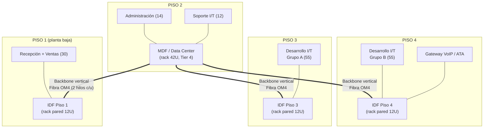

# Punto 4 — Diseño Físico de la Red Corporativa

## 1. Distribución por planta (edificio de 4 niveles)

| Piso | Área | Usuarios | Puestos de red (2 drops c/u) | Nota de cableado |
|---|---|---|---|---|
| 1 | Recepción + Ventas | 30 | 60 | IDF de piso 1 (ya no aloja el MDF — ver justificación abajo) |
| 2 | **MDF/Data Center** + Administración + Soporte I/T | 14 + 12 = 26 | 52 | El MDF/Data Center vive aquí — ver justificación abajo |
| 3 | Desarrollo I/T (grupo A) | 55 | 110 | IDF de piso 3 |
| 4 | Desarrollo I/T (grupo B) + Telefonía IP (gateway/ATA) | 55 + 6 | 110 | IDF de piso 4 |
| | | **184** | **332** | + margen (ver §6) |

**Por qué el MDF/Data Center está en el Piso 2 y no en el Piso 1**: se descartó deliberadamente la planta baja por riesgo de inundación — es una práctica de sitio estándar en el diseño de Data Centers (Uptime Institute / BICSI 002 desaconsejan planta baja y sótano precisamente por exposición a inundación, además de mayor exposición a acceso vehicular/entregas y menor profundidad de seguridad física). El Piso 2 es el primer nivel elevado del edificio, reduciendo ese riesgo sin llevar el equipo pesado (rack 42U, UPS, futura planta eléctrica) más arriba de lo necesario. Como beneficio adicional, coincide con dónde está **Soporte I/T** — son quienes administran el Data Center día a día, así que tenerlos en el mismo piso reduce el tiempo de respuesta ante cualquier incidente físico (un cambio de patch cord, un reinicio manual, etc.) sin necesidad de subir/bajar pisos.

Desarrollo I/T (110) se divide en 2 IDFs de 55 para no superar la regla práctica de 90–100 m de cableado horizontal por norma **TIA/EIA-568** y para no saturar un solo rack de piso ni concentrar 110 puntos de falla física en un único gabinete.

## 2. Diagrama de planta por piso (bloques, no a escala)

Nota de lectura: el MDF ya no está en planta baja — subió al Piso 2 por prevención de inundación (ver justificación en §1). El backbone hacia el Piso 1 ahora **baja** en vez de solo subir, pero la distancia vertical es la misma (1 entrepiso), así que el presupuesto de atenuación de fibra (§4.1) no cambia.

## 3. Cuartos de telecomunicaciones (TR) — dimensionamiento conforme TIA-569-D

TIA-569-D exige que todo cuarto de telecomunicaciones (TR/IDF) se dimensione en función de la cantidad de puestos que atiende, no de un tamaño arbitrario fijo. Regla general de la norma: mínimo **1.85 m² (≈ 20 ft²) para hasta 100 m² de área servida**, escalando aproximadamente **1 m² adicional por cada 500 m² de piso servido adicional**.

| IDF | Puestos servidos | Área aproximada del piso servida | Dimensión mínima recomendada |
|---|---|---|---|
| Piso 1 | 60 drops | ~200–250 m² (estimado — Recepción ocupa parte del área sin puestos de red) | ≈ 2.0–2.5 m² — rack de pared 12U cabe cómodo |
| Piso 3 | 110 drops | ~300–350 m² (estimado, mayor densidad de puestos) | ≈ 2.5–3.0 m² |
| Piso 4 | 110 drops | ~300–350 m² (estimado) | ≈ 2.5–3.0 m² |

El Piso 2 no aparece en esta tabla como IDF porque ahí ya no hay un cuarto de telecomunicaciones aparte — es directamente el **MDF/Data Center**, dimensionado con los criterios de [06-Data-Center-Tier4.md](06-Data-Center-Tier4.md) (más exigentes que un TR estándar: piso elevado, 2N, extinción, etc.), no con la regla básica de TIA-569-D.

Las áreas de piso son estimadas (no se provee plano arquitectónico en el enunciado) — se confirmarían con el plano real en la ingeniería de detalle, pero el criterio de dimensionamiento (norma, no un número inventado) es lo que importa documentar aquí.

**Requisitos ambientales del TR** (TIA-569-D): iluminación mínima 540 lux a 1 m del piso, temperatura 18–27 °C durante operación (equipo activo genera calor incluso en un rack pequeño), acceso restringido, puerta con ancho mínimo de 0.91 m para permitir el ingreso de un rack completo.

## 4. Cableado estructurado (norma TIA/EIA-568-C y ANSI/TIA-942 para el DC)

### 4.1 Backbone vertical (MDF ↔ IDFs)
Fibra óptica multimodo **OM4**, mínimo 2 hilos por IDF (redundancia y margen de crecimiento a 40/100 Gbps si en el futuro se requiere), corridas por ducto vertical dedicado, distinto del ducto de energía eléctrica. Presupuesto de atenuación de referencia para OM4 a 10GBASE-SR (la velocidad objetivo del backbone): pérdida máxima admitida ≈ 2.6 dB para un enlace de hasta 300 m — una corrida vertical de 3-4 pisos (≤ 50 m reales) queda muy por debajo del límite, con margen amplio para conectores y empalmes.

### 4.2 Cableado horizontal (IDF ↔ estación de trabajo)
UTP **Cat 6**, longitud máxima 90 m de enlace permanente + 10 m acumulados de patch cords en ambos extremos (regla del canal de 100 m total de TIA-568-C). Se estandariza Cat 6 (no Cat 5e) en todo el horizontal para soportar 1 Gbps con margen y PoE+ para los teléfonos IP.

**Tipo de cable según instalación**: cable rated **CMR (riser)** para las corridas verticales dentro de ducto dedicado, y **CMP (plenum)** en cualquier tramo que corra por espacio de retorno de aire del HVAC (cielo falso usado como plenum) — la norma NFPA 70 (NEC) exige plenum-rated en esos tramos por el riesgo de propagación de humo tóxico en caso de incendio; usar CMR donde se exige CMP es una falla de cumplimiento común que se previene documentándolo aquí explícitamente.

### 4.3 Parámetros de certificación exigidos al terminar la instalación
Conforme TIA-568-C.2, verificados con certificadora tipo Fluke Networks DSX-8000 o equivalente:

| Parámetro | Qué mide | Por qué importa |
|---|---|---|
| NEXT (Next-End Crosstalk) | Interferencia entre pares en el mismo extremo | Un NEXT fuera de rango causa errores de transmisión bidireccional |
| Insertion Loss (atenuación) | Pérdida de señal a lo largo del cable | Determina el alcance real utilizable del enlace |
| Return Loss | Señal reflejada por discontinuidades de impedancia | Indica conectores mal terminados o cable dañado |
| Propagation Delay / Delay Skew | Diferencia de tiempo de llegada entre pares | Crítico para Gigabit+ (usa los 4 pares simultáneamente) — un skew alto degrada el enlace aunque los demás parámetros pasen |

Un enlace que no certifique estos 4 parámetros dentro de los límites Cat 6 no se acepta como entregado, sin excepción — es la única forma objetiva de saber que una instalación de cientos de puntos quedó bien hecha, en vez de confiar en "conecta y parece que funciona".

### 4.4 Canalización y fill ratio (TIA-569-D)
Bandeja perforada en cielo falso para las corridas principales + canaleta de pared hasta cada faceplate, con separación física mínima respecto a canalización eléctrica (evitar interferencia electromagnética/EMI sobre el par trenzado). Para tubería conduit donde aplique (bajadas verticales cortas, cruces de losa): **regla de llenado máximo del 40%** del área transversal del conduit (estándar de la industria eléctrica/datos para permitir instalación sin daño al cable y disipación térmica) — se dimensiona el diámetro del conduit en función de la cantidad de cables que realmente pasarán por ahí, no al mínimo posible.

### 4.5 Etiquetado
Esquema `[Piso][IDF][Panel]-[Puerto]`, ej. `P3-IDF-A12`, conforme **TIA-606-B**, obligatorio en ambos extremos de cada cable y en el propio patch panel/faceplate — sin esto, cualquier troubleshooting futuro requiere re-trazar cable físicamente, lo que en una instalación de 400+ puntos es inviable en la práctica.

### 4.6 Configuración de cada puesto
Faceplate doble, 2 salidas RJ45 Cat 6 (1 dato + 1 voz/reserva), cableado en esquema **T568B** (el más común en instalaciones nuevas en Latinoamérica, aunque cualquiera de los dos esquemas T568A/B es válido siempre que sea consistente en todo el proyecto).

### 4.7 Racks de piso (IDF)
Gabinete de pared 12U, con patch panel(es) Cat 6 24 puertos (cantidad según carga de cada piso, ver §6), organizador de cables horizontal, switch de piso PoE+ (alimenta los teléfonos IP sin cableado eléctrico adicional), regleta con UPS pequeño local (ver §5).

### 4.8 Cuarto de equipos (MDF/Data Center)
Rack de piso 42U estándar 19", ver elevación completa abajo y detalle de estándares (Tier 4, energía, enfriamiento, extinción) en [06-Data-Center-Tier4.md](06-Data-Center-Tier4.md).

## 5. Elevación del rack — MDF / Data Center (42U, de arriba hacia abajo)

| U (posición) | Equipo |
|---|---|
| 42–40 | Panel pasacables + ventilación |
| 39–37 | Patch panels Cat 6 24p / ODF de fibra (terminación del backbone hacia los 3 IDFs) |
| 36 | Organizador horizontal de cables |
| 35–33 | Router Core R1 (MikroTik) + Switch físico de distribución |
| 32–30 | Servidor (laptop/PC con SSD externo portátil — Proxmox VE: Nube Privada) |
| 29–20 | Reservado — crecimiento de servidores físicos (hasta completar los 12 de "Servidores Físicos/Virtuales") |
| 19–10 | Equipo de telefonía IP (PBX/gateway) y switch PoE+ dedicado a VoIP |
| 9–4 | PDUs redundantes (rama A / rama B) |
| 3–1 | UPS de rack (o base del rack si el UPS central es de piso, fuera del rack) |

Esta elevación es referencial para el diseño de producción — para el laboratorio de demo (Fase 4) solo se ocupan físicamente las posiciones de R1, el switch y la conexión hacia el servidor portátil.

## 6. Estaciones de trabajo
Cada puesto: 2 salidas RJ45 Cat 6 (datos + voz/reserva) en faceplate doble, certificadas con tester (Fluke DSX-8000 o equivalente) al terminar la instalación conforme los 4 parámetros descritos en §4.3, con reporte de certificación por punto entregado como parte del proyecto real (no aplica para el laboratorio de demo, que no involucra cableado estructurado a esta escala). Altura recomendada del faceplate: 30 cm sobre el nivel de piso terminado (o integrado en el mobiliario/canaleta de escritorio, según el diseño de interiores final).

## 7. Sistema de UPS
- **UPS central del Data Center**: on-line doble conversión, 2N (dos unidades independientes), dimensionado según memoria de cálculo completa en [06-Data-Center-Tier4.md](06-Data-Center-Tier4.md) §3.
- **UPS de piso (IDF)**: line-interactive pequeño (~1000VA) por gabinete, para sostener el switch de piso durante los 10-15 segundos que toma la transferencia automática a planta eléctrica.
- **Planta eléctrica (generador)**: requerida por el Tier 4 — ver [06-Data-Center-Tier4.md](06-Data-Center-Tier4.md) §3.4.

## 8. Listado de materiales — memoria de cálculo y BOM (Bill of Materials)

**Metodología de cálculo del cableado horizontal** (para que el número de cajas de cable no sea una estimación arbitraria):

1. Puestos de red totales: 184 usuarios × 2 salidas (dato + voz/reserva) = **368 drops**, + margen del 10% para áreas comunes, salas de reunión, impresoras de red y puntos de acceso WiFi futuros ≈ **405 drops**.
2. Longitud promedio de corrida estimada por drop: **45 m** (supuesto de planeación razonable para un edificio de esta huella, muy por debajo del máximo de 90 m que permite la norma — se verificaría con el plano arquitectónico real en la ingeniería de detalle).
3. Metros totales: 405 × 45 m ≈ 18,225 m, + 10% de desperdicio/holguras de servicio en cada terminación ≈ **20,000 m**.
4. Cable Cat 6 se compra en cajas estándar de 305 m (1,000 ft): 20,000 ÷ 305 ≈ **66 cajas**.

| Categoría | Ítem | Cantidad (memoria de cálculo) |
|---|---|---|
| Cableado horizontal | UTP Cat 6, caja 305 m | **66 cajas** |
| Cableado backbone | Fibra OM4 multimodo, carrete 500 m (cubre 3 corridas × 2 hilos con margen) | 1 carrete |
| Conectores de puesto | Keystone jack Cat 6 | **405** (1 por drop) |
| Faceplates | Faceplate doble (2 puertos) | **195** (184 puestos + margen áreas comunes) |
| Patch panels | 24 puertos Cat 6 — repartidos: 3 en IDF Piso1 (Ventas), 3 en MDF/Piso2 (Admin+Soporte), 5 en IDF Piso3, 5 en IDF Piso4 | **16** |
| Switches de piso | PoE+ 24-48p administrable con VLAN 802.1Q | 3 (Pisos 1, 3, 4) |
| Switch de distribución | Administrable, VLAN 802.1Q, con capacidad de trunk hacia los 3 IDF | 1 (MDF/Piso 2) |
| Racks IDF | Gabinete de pared 12U | 3 |
| Rack MDF/Data Center | Gabinete de piso 42U | 1 |
| UPS de piso | Line-interactive 1000VA | 3 |
| Certificación de cableado | Servicio de certificación (405 puntos) | 1 servicio |

Precios unitarios, marcas/modelos sugeridos y presupuesto total línea por línea en [08-Equipo-Fisico-Presupuesto.md](../00-Documentacion-General/08-Equipo-Fisico-Presupuesto.md) §4 — ahí se mantiene la fuente única de precios para no duplicar (y desincronizar) números entre documentos.
