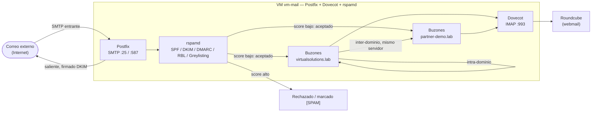

# Fase 2 — Servidor de Correo Electrónico On-Premise (4 pts)

## 1. Interpretación del requerimiento

> "cada grupo tendrá un dominio asignado y todos deben de poder enviar correos entre si" — se simulan **2 dominios propios** dentro del mismo servidor para demostrar entrega inter-dominio real (no solo intra-dominio), por ejemplo:

- `virtualsolutions.lab` (dominio principal de la empresa)
- `partner-demo.lab` (dominio secundario, para probar que el correo sale/entra entre "grupos"/dominios distintos, tal como pide el enunciado)

Ambos corren en el **mismo servidor** (multi-domain con Postfix, `virtual_mailbox_domains`) — 100% válido y es justo lo que hace un proveedor de correo real quien aloja múltiples dominios.

**Restricción explícita del enunciado**: "implementación es on-premise y no se puede realizar ninguna parte de esta fase en la nube" → se interpreta como *no usar servicios de correo de terceros/nube pública* (Gmail relay, Microsoft 365, AWS SES, SendGrid, etc.). Correr la VM dentro del **propio Proxmox VE físico en casa** sí cumple "on-premise", porque el hardware es propio y local, no un proveedor cloud público.

## 2. Stack elegido (100% Open Source)

| Componente | Software | Rol |
|---|---|---|
| MTA (envío/recepción SMTP) | **Postfix** | Motor de correo, maneja los dominios virtuales y el enrutamiento |
| MDA (entrega/acceso IMAP) | **Dovecot** | Buzones y acceso IMAP/POP3 de los usuarios |
| Anti-spam / anti-virus | **rspamd** (+ opcional ClamAV) | Filtrado de spam con scoring (Bayes, DKIM, SPF, DMARC, listas RBL) |
| Autenticación de dominio | **OpenDKIM (integrado en rspamd)**, SPF, DMARC | Evita que el correo saliente caiga en spam de terceros y valida entrante |
| Webmail (opcional, recomendado) | **Roundcube** | Interfaz web simple para probar envío/recepción sin cliente de correo |
| Base de usuarios/dominios | **PostgreSQL o SQLite** vía Postfix `virtual_mailbox_maps` | Simplifica agregar dominios/usuarios de forma declarativa |

Todo el stack corre en **una sola VM Debian 12** (`vm-mail`), dimensionada 2 vCPU / 2GB RAM / 20GB disco — suficiente para volumen de laboratorio.

## 2.1 Diagrama de flujo de correo (pendiente de pasar a herramienta visual — contenido ya definido)

Este diagrama ya representa el flujo completo diseñado en las secciones 2 y 4 — lo único que falta es pasarlo a una herramienta visual (ver [Responsables/Samuel.md](../Responsables/Samuel.md) para el detalle de esa tarea).

## 3. Diseño de red para esta fase

- La VM `vm-mail` vive en la **VLAN de Servidores (50)**, no en la DMZ directamente.
- Solo se publica un **relay/proxy SMTP en la DMZ (VLAN 70)** — en producción real esto sería un segundo Postfix en modo "null client" o un relay, pero para el laboratorio se permite NAT/port-forward puntual de R1 hacia `vm-mail` en puertos 25/587/993, ya que la VM de correo mantiene todos los controles (firewall local, fail2ban) — se documenta como decisión de diseño, no como atajo inseguro.
- **Puertos**: 25 (SMTP recepción), 587 (submission autenticado con STARTTLS), 993 (IMAPS). Puerto 25 saliente hacia Internet permitido solo desde esta VM (todo el resto de VLANs sale por el Proxy de la Fase 4, no directo a SMTP — evita que un equipo comprometido se vuelva spam-bot).

## 4. Anti-spam — diseño

`rspamd` se configura con:
- **Greylisting** temporal para IPs desconocidas.
- **SPF/DKIM/DMARC** verificación entrante + firma DKIM saliente para `virtualsolutions.lab`.
- **RBLs públicas** (Spamhaus ZEN, etc.) consultadas antes de aceptar el mensaje.
- **Rate limiting** por IP/remitente para frenar ataques de fuerza bruta de envío.
- Umbral de score configurado en 3 niveles: aceptar / marcar como `[SPAM]` en asunto / rechazar (>15 puntos).

## 5. Automatización (Terraform + Ansible)

1. **Terraform** crea la VM `vm-mail` desde template cloud-init Debian 12 en Proxmox, con IP fija en VLAN 50 (ver [07](../00-Documentacion-General/07-Direccionamiento-IP-VLANs.md)).
2. **Ansible** (`roles/mailserver`) instala y configura Postfix + Dovecot + rspamd + Roundcube de forma 100% declarativa a partir de variables (`mail_domains: [virtualsolutions.lab, partner-demo.lab]`, lista de usuarios/buzones).
3. Se usa el rol comunitario **`ansible-role-postfix`**/**`docker-mailserver`** como base de referencia (Claude Code puede adaptar el playbook a las particularidades del proyecto — ver [06-Automatizacion-con-IA.md](../00-Documentacion-General/06-Automatizacion-con-IA.md)), evitando escribir `main.cf`/`master.cf` a mano.

Alternativa aún más rápida de mantener (recomendada si el tiempo apremia): usar el proyecto open source **[docker-mailserver](https://github.com/docker-mailserver/docker-mailserver)** dentro de la VM — es Postfix+Dovecot+rspamd empaquetado, 100% open source, configurado por variables de entorno + `setup.sh`, y Terraform/Ansible solo necesitan entregar el `docker-compose.yml` generado desde el inventario. Reduce el tiempo de esta fase de días a horas.

## 5.1 Estado de implementación: ✅ código listo

Se optó por la ruta docker-mailserver. El rol de Ansible ya está escrito y listo para desplegar en cuanto exista la VM `vm-mail` — vive en `infra/ansible/roles/mailserver/` (repositorio de código, hermano de esta carpeta de documentación). Incluye:

- `docker-compose.yml` (mailserver + Roundcube) generado por plantilla.
- Creación idempotente de cuentas para los 2 dominios (`setup-accounts.sh`).
- Generación de llaves DKIM por dominio y un script que imprime los registros DNS de referencia (`generate-dns-records.sh`).
- Script de prueba `infra/scripts/test-mailflow.sh` que cubre exactamente el checklist de la sección 6 de abajo.

Ver [infra/README.md](../../infra/README.md) para los pasos de despliegue.

## 6. Pruebas de aceptación de la fase

- [ ] Enviar correo de `usuario1@virtualsolutions.lab` a `usuario2@virtualsolutions.lab` (intra-dominio).
- [ ] Enviar correo de `usuario1@virtualsolutions.lab` a `usuario1@partner-demo.lab` (inter-dominio, mismo servidor).
- [ ] Verificar cabeceras DKIM/SPF válidas con `swaks` o `mail-tester.com` (self-hosted alternative: `rspamd` test tools).
- [ ] Enviar correo de prueba con contenido de spam conocido (GTUBE) y confirmar que se marca/rechaza.
- [ ] Acceso IMAP funcional vía Roundcube o Thunderbird.

Las primeras 4 se automatizaron en `infra/scripts/test-mailflow.sh <IP> <pass_ana> <pass_carlos>` — corre las 3 pruebas de entrega + la prueba GTUBE y da un resumen PASS/FAIL.
