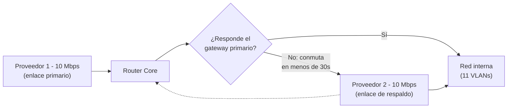
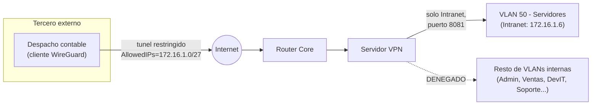
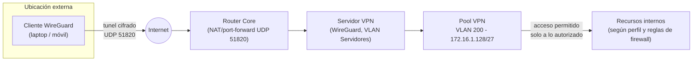
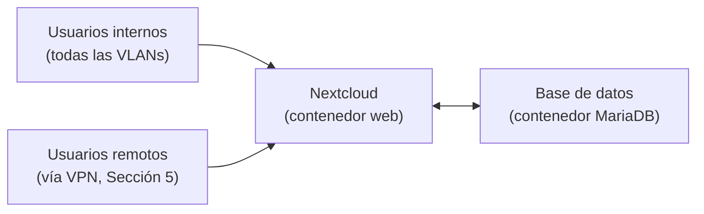
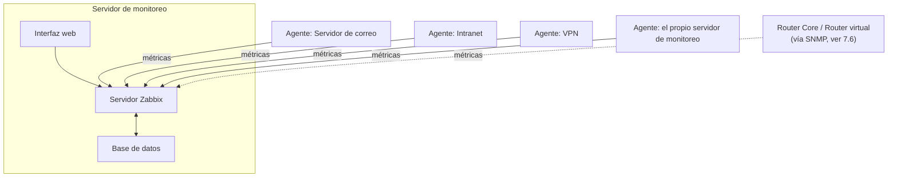
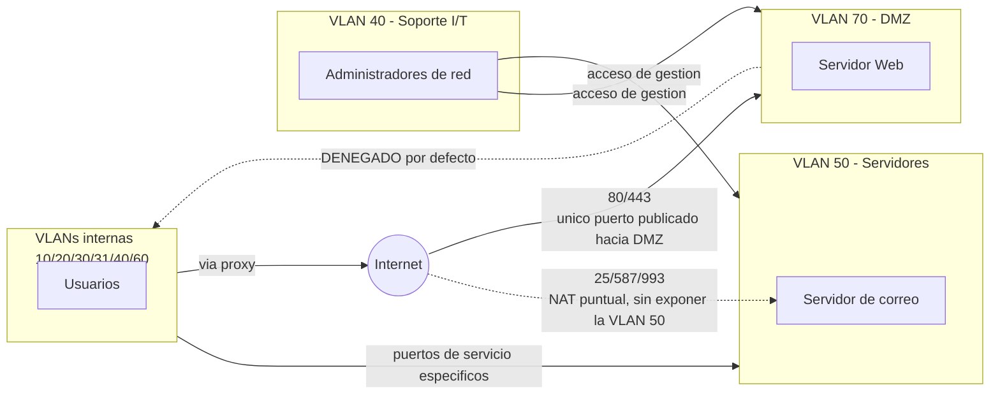
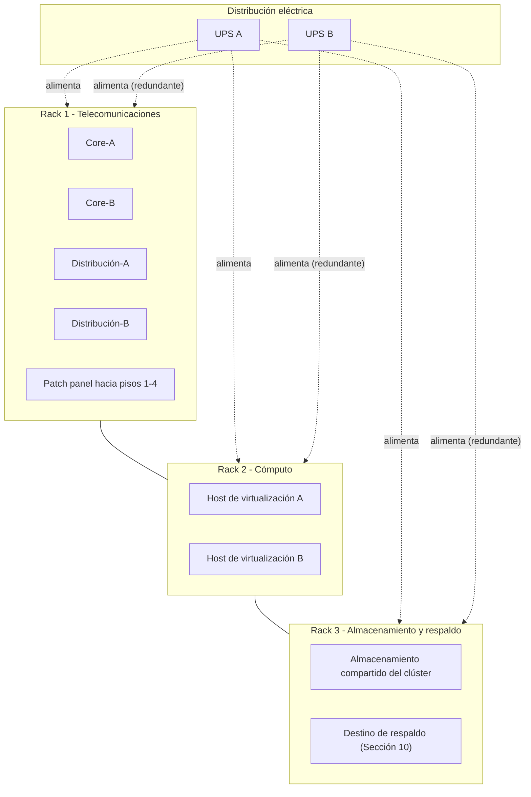
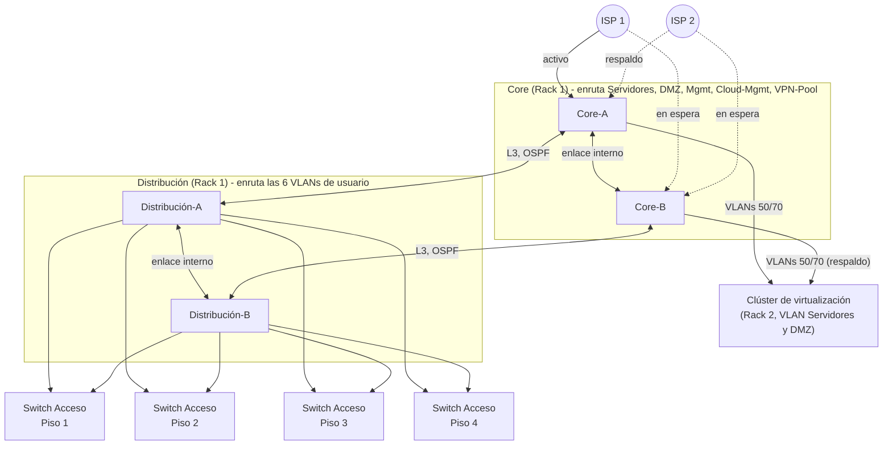
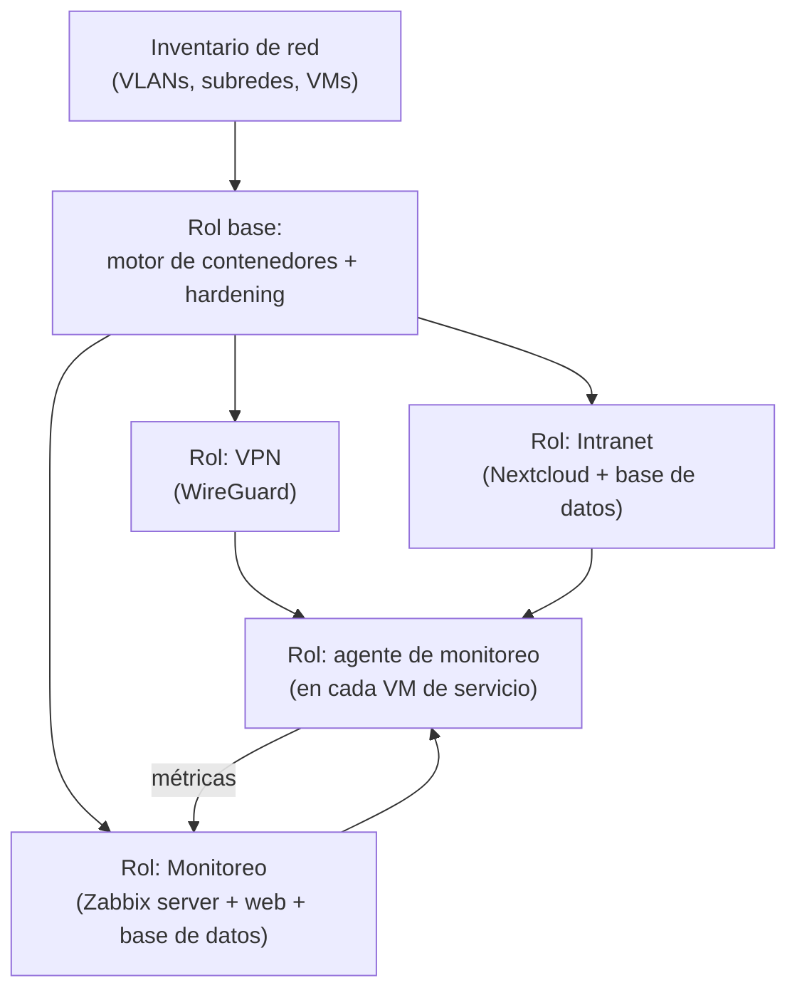

# Introducción

Este documento presenta el diseño de red de Virtual Solutions: conectividad de área local y extendida (LAN, WAN, Extranet), acceso remoto seguro (VPN), colaboración interna (Intranet), supervisión de la infraestructura (Monitoreo), y los controles de seguridad perimetral que protegen estos servicios.

Es el diseño que Virtual Solutions implementaría para operar su red del día a día: cómo se configura cada VLAN en el equipo de red, cómo se sostiene la conectividad a Internet ante la falla de un proveedor, cómo un empleado o un tercero externo accede de forma segura a un recurso interno, y qué plataformas de software sostienen la colaboración y la supervisión de la organización. Cada decisión se documenta con su configuración real, no solo con la descripción conceptual de qué hace cada pieza.

## Alcance

| Componente | Qué cubre |
|---|---|
| LAN | Segmentación por VLAN, dónde vive el enrutamiento de cada una entre Distribución y Core, y su configuración real en el equipo de red, con direccionamiento IP y DHCP por segmento |
| WAN | Conectividad hacia Internet y su mecanismo de continuidad ante falla, con configuración real de enrutamiento |
| Extranet | Acceso controlado para terceros externos a la organización, con un escenario concreto y su matriz de acceso |
| VPN de acceso remoto | Cómo un colaborador remoto llega a los recursos internos de forma segura, con archivos de configuración reales |
| Intranet | Plataforma de colaboración interna para equipos distribuidos |
| Monitoreo | Supervisión centralizada de la salud de la red y los servicios |
| Zonas desmilitarizadas (DMZ) | Qué es una DMZ, por qué se implementa, y su diseño con las reglas de firewall reales |
| Diagramas de servidores y centro de datos | Clasificación Tier IV, distribución de racks, clúster de virtualización y topología física |
| Alta disponibilidad | Mecanismos de continuidad por componente y objetivos de recuperación (RPO/RTO) por servicio |
| Seguridad de la red | Matriz de riesgos, cifrado, gestión de credenciales, parches y gestión de cambios |
| Manual de seguridad de aplicación y base de datos | Controles internos de cada aplicación y motor de base de datos, y el procedimiento ante un incidente |
| Costeo del proyecto | Inversión inicial, costos recurrentes y mano de obra, con precios de mercado verificados |

## Metodología

El direccionamiento de cada VLAN se calcula por necesidad real de hosts, no por convención: para cada segmento se toma el número real de dispositivos que debe alojar, se calculan los bits de host necesarios (el menor número que cubre esa cantidad más el margen de red, broadcast y gateway), y el bloque asignado corresponde a la potencia de 2 inmediata superior que satisface ese requerimiento. Así se llega a máscaras VLSM distintas por VLAN en vez de un /24 uniforme, y a un bloque base 172.16.0.0/16 porque la suma de los bloques individuales supera lo que cabe en un solo bloque tipo Clase C.

Cada decisión de diseño (qué protocolo de VPN, qué plataforma de colaboración, qué herramienta de monitoreo, qué mecanismo de failover) se resuelve comparando la opción elegida contra al menos una alternativa real, con criterios explícitos, en vez de presentarla como la única posible. Los precios del costeo (Sección 15) se verifican contra catálogos de proveedores reales en Guatemala al momento de escribir este documento, no se estiman a partir de listas de precios internacionales sin ajustar.

# 2. Diseño de Red de Área Local (LAN)

La red de área local de Virtual Solutions se organiza en un modelo jerárquico de 3 capas (Core, Distribución, Acceso) con 11 VLANs que segmentan la organización por función, cada una con una máscara VLSM ajustada a su necesidad real de hosts. Esta sección resume la segmentación, decide dónde vive el límite entre Capa 2 y Capa 3 para cada VLAN, y detalla la configuración real del equipo de red, la base sobre la cual operan la VPN, la Intranet y el Monitoreo descritos en las secciones siguientes.

## 2.1 Qué es una VLAN y por qué se segmenta la red

Una VLAN (Virtual LAN) es una red de Capa 2 lógicamente independiente dentro del mismo cableado físico. Los dispositivos de una VLAN solo se ven entre sí como si estuvieran en su propio switch aislado, aunque compartan el mismo switch físico que otras VLANs. Sin VLANs, los 184 usuarios de Virtual Solutions formarían un único dominio de difusión (broadcast domain): cualquier tráfico de difusión de Ventas llegaría también a Administración, y una falla de configuración en un equipo de Desarrollo podría degradar la red de toda la organización. Segmentar por VLAN resuelve dos problemas a la vez. Primero, aísla el tráfico de difusión por área, con menos tráfico innecesario y mejor rendimiento. Segundo, permite aplicar una política de seguridad distinta a cada segmento. Sin la segmentación no existiría un límite natural donde aplicar esa política.

## 2.2 Segmentación por VLAN

| VLAN | Nombre | Segmento | Subred | Hosts necesarios | Hosts disponibles | Gateway | Asignación | Enrutado en |
|---|---|---|---|---|---|---|---|---|
| 10 | ADMIN | Administración | 172.16.0.192/27 | 14 | 29 | 172.16.0.193 | DHCP | Distribución |
| 20 | VENTAS | Ventas | 172.16.0.0/26 | 30 | 61 | 172.16.0.1 | DHCP | Distribución |
| 30 | DEVIT-A | Desarrollo I/T (Piso 3) | 172.16.0.64/26 | 55 | 61 | 172.16.0.65 | DHCP | Distribución |
| 31 | DEVIT-B | Desarrollo I/T (Piso 4) | 172.16.0.128/26 | 55 | 61 | 172.16.0.129 | DHCP | Distribución |
| 40 | SOPORTE | Soporte I/T | 172.16.1.64/28 | 12 | 13 | 172.16.1.65 | DHCP | Distribución |
| 60 | VOIP | Telefonía IP | 172.16.1.80/28 | 6 | 13 | 172.16.1.81 | DHCP | Distribución |
| 50 | SERVERS | Servidores internos (correo, monitoreo, intranet, VPN, DHCP) | 172.16.1.0/27 | 20 | 29 | 172.16.1.1 | Estática | Core |
| 70 | DMZ | Servicios publicados a Internet | 172.16.1.96/29 | 2 | 5 | 172.16.1.97 | Estática | Core |
| 80 | CLOUD-MGMT | Nube privada, gestión | 172.16.1.104/29 | 2 | 5 | 172.16.1.105 | Estática | Core |
| 90 | MGMT | Gestión de equipos de red | 172.16.1.32/27 | 16 | 29 | 172.16.1.33 | Estática | Core |
| 200 | VPN-POOL | Clientes VPN remotos | 172.16.1.128/27 | 20 | 29 | 172.16.1.129 | WireGuard | Core |

"Hosts necesarios" es el conteo real de dispositivos que aloja cada VLAN (usuarios, servidores o perfiles remotos, según el segmento). "Hosts disponibles" es la capacidad utilizable del bloque asignado, es decir, el tamaño del bloque menos las 3 direcciones reservadas de red, broadcast y gateway. El bloque de cada VLAN corresponde a la potencia de 2 inmediata superior que cubre los hosts necesarios. La columna "Enrutado en" es la decisión central de esta sección y se justifica en el punto 2.3.

Todo el direccionamiento usa el bloque privado `172.16.0.0/16` (subred del rango Clase B privado `172.16.0.0/12`, RFC 1918), con máscara VLSM ajustada por VLAN, no un `/24` uniforme. El bloque base es de tamaño Clase B porque la suma de los 11 bloques individuales supera las 256 direcciones que caben en un bloque tamaño Clase C.

## 2.3 Dónde debe vivir el límite Capa 2 / Capa 3

Una alternativa considerada fue enrutar las 11 VLANs con un único enlace troncal desde Distribución hacia una sola interfaz del router Core (router-on-a-stick), una técnica válida y común como referencia conceptual, pero con dos problemas reales a esta escala: todo el tráfico entre cualquier par de VLANs, sin excepción, compartiría un solo enlace físico como cuello de botella, y ese mismo enlace sería un punto único de falla para el enrutamiento completo de la organización, no solo para el tráfico hacia Internet. Se descarta por esas dos razones.

La decisión de este diseño es ubicar el límite Capa 2 / Capa 3 en Distribución para las VLANs que son, en esencia, tráfico de usuario interno, y en el Core únicamente para las VLANs que necesitan quedar bajo control directo del firewall. El criterio no es el nombre de la VLAN, es su función real:

| VLAN | Necesita extenderse por Capa 2 más allá de su propio segmento | Su tráfico principal es hacia otras VLANs de usuario o hacia el Core/Internet | Necesita inspección de firewall en cada acceso | Decisión |
|---|---|---|---|---|
| Admin, Ventas, DevIT-A, DevIT-B, Soporte, VoIP | Sí, hacia sus propios puestos de trabajo en el piso correspondiente | Mayormente hacia el Core (Intranet, correo, Internet) | No entre ellas mismas; sí hacia Servidores/DMZ/Internet | Gateway en Distribución, con ruta obligatoria hacia el Core para todo lo que no es local |
| Servidores | No, sus miembros son máquinas virtuales físicamente en el centro de datos, no puestos de usuario | Es el destino de casi todo el tráfico anterior | Sí, siempre, es la VLAN con los datos más sensibles | Gateway en el Core, sin excepción |
| DMZ | No, el único miembro es el servidor Web público | Solo hacia Internet y hacia Servidores puntualmente | Sí, siempre, es la zona de menor confianza | Gateway en el Core, sin excepción |
| Nube privada (Cloud-Mgmt) | No, es un enlace punto a punto hacia el router virtual | Es en sí misma un enlace de enrutamiento | Sí, es un punto de interconexión externo al edificio | Gateway en el Core, sin excepción |
| Gestión de red (Mgmt) | Sí, pero solo para que cada switch tenga una interfaz de gestión, no para tráfico de usuario | Es el plano de control de todo el equipo de red | Sí, el acceso a la gestión de un switch no debe depender solo de estar conectado a la misma VLAN | Gateway en el Core; se permite como VLAN etiquetada hasta Acceso únicamente para que cada switch tenga su propia IP de gestión |
| Pool de VPN | No, sus miembros son túneles WireGuard, no puestos físicos | Es tráfico ya autenticado pero originado fuera del edificio | Sí, se trata con el mismo criterio que un origen externo | Gateway en el Core, sin excepción |

Esto deja 6 VLANs enrutadas en Distribución (Admin, Ventas, DevIT-A, DevIT-B, Soporte, VoIP) y 5 en el Core (Servidores, DMZ, Cloud-Mgmt, Mgmt, VPN-Pool). Ninguna de las 5 VLANs del Core se extiende por Capa 2 hacia Distribución o Acceso (la única excepción parcial es Mgmt, que se etiqueta hasta Acceso solo para dar una IP de gestión a cada switch, sin que Distribución enrute esa VLAN localmente). Esto es, en sí mismo, el control de seguridad más fuerte del diseño: no existe ningún cable, puerto o VLAN que conecte un puesto de usuario directamente con Servidores, DMZ o el pool de VPN. La única ruta posible es a través del Core, así que no hay forma de rodear el firewall aunque alguien lo intentara desde dentro del edificio.

## 2.4 Enlace de Acceso a Distribución

El enlace troncal entre cada switch de Acceso y Distribución transporta únicamente las VLANs que un puesto de usuario puede necesitar: las 6 VLANs de usuario más Mgmt, para que el propio switch de Acceso tenga una IP de gestión. Nunca transporta Servidores, DMZ, Cloud-Mgmt ni el pool de VPN, porque ningún dispositivo de usuario final vive en esas VLANs.

```
/interface bridge
add name=bridge-acceso vlan-filtering=yes

/interface bridge port
add bridge=bridge-acceso interface=ether1-hacia-distribucion tagged=bridge-acceso,ether1-hacia-distribucion
add bridge=bridge-acceso interface=ether2-hacia-distribucion-b tagged=bridge-acceso,ether2-hacia-distribucion-b

/interface bridge vlan
add bridge=bridge-acceso vlan-ids=10,20,30,31,40,60,90 \
    tagged=ether1-hacia-distribucion,ether2-hacia-distribucion-b
```

Cada switch de Acceso sube con dos enlaces, uno hacia Distribución-A y otro hacia Distribución-B (Sección 2.10), no con un solo cable hacia un único equipo. El filtrado de qué VLAN llega a cada puerto final de usuario (por ejemplo, solo VLAN 60 en los puertos PoE de los teléfonos) se resuelve dentro del propio switch de Acceso, fuera del alcance de esta sección.

## 2.5 Enrutamiento de las VLANs de usuario en Distribución

Distribución no es un simple switch de Capa 2: tiene una interfaz VLAN (SVI, *Switch Virtual Interface*) por cada una de las 6 VLANs de usuario, con su propia dirección de gateway. Esto es lo que evita el cuello de botella de un enlace troncal único: el tráfico entre dos VLANs de usuario, o de una VLAN de usuario hacia su propio segmento, se resuelve dentro del propio switch de Distribución, sin salir hacia el Core.

```
/interface bridge
add name=bridge-distribucion vlan-filtering=yes

/interface bridge port
add bridge=bridge-distribucion interface=ether1-hacia-piso1 tagged=bridge-distribucion,ether1-hacia-piso1
add bridge=bridge-distribucion interface=ether2-hacia-piso2 tagged=bridge-distribucion,ether2-hacia-piso2
add bridge=bridge-distribucion interface=ether3-hacia-piso3 tagged=bridge-distribucion,ether3-hacia-piso3
add bridge=bridge-distribucion interface=ether4-hacia-piso4 tagged=bridge-distribucion,ether4-hacia-piso4

/interface bridge vlan
add bridge=bridge-distribucion vlan-ids=10,20,30,31,40,60,90 \
    tagged=ether1-hacia-piso1,ether2-hacia-piso2,ether3-hacia-piso3,ether4-hacia-piso4

/interface vlan
add name=vlan10-admin vlan-id=10 interface=bridge-distribucion
add name=vlan20-ventas vlan-id=20 interface=bridge-distribucion
add name=vlan30-devit-a vlan-id=30 interface=bridge-distribucion
add name=vlan31-devit-b vlan-id=31 interface=bridge-distribucion
add name=vlan40-soporte vlan-id=40 interface=bridge-distribucion
add name=vlan60-voip vlan-id=60 interface=bridge-distribucion
```

El puerto que ya sale hacia el Core (`ether-hacia-core-a`, con su propia dirección IP para el enlace Layer 3 de la Sección 2.6) también participa en `bridge-distribucion` como puerto de acceso de la VLAN 90, mediante una interfaz VLAN independiente de esa dirección IP. Es la técnica estándar de una VLAN etiquetada conviviendo con una interfaz enrutada sobre el mismo puerto físico, no un segundo cable: le da a la VLAN de gestión, ya presente en el trunk hacia cada piso, una salida real hacia la SVI de Mgmt en el Core.

```
/interface vlan
add name=vlan90-uplink-core-a vlan-id=90 interface=ether-hacia-core-a

/interface bridge port
add bridge=bridge-distribucion interface=vlan90-uplink-core-a pvid=90

/interface bridge vlan
add bridge=bridge-distribucion vlan-ids=90 untagged=vlan90-uplink-core-a
```

Distribución existe como par redundante (Distribución-A y Distribución-B, Sección 15.2), así que cada SVI necesita una dirección de gateway que sobreviva a la caída de cualquiera de los dos equipos. Eso es exactamente lo que resuelve VRRP (*Virtual Router Redundancy Protocol*): ambos switches comparten una dirección IP virtual por VLAN, y solo uno de los dos (el maestro) responde al tráfico en un momento dado.

```
# Configuracion identica en Distribucion-A y Distribucion-B;
# solo cambia la prioridad (Distribucion-A = maestro, Distribucion-B = respaldo)
/interface vrrp
add interface=vlan10-admin vrid=10 priority=200 name=vrrp-admin
add interface=vlan20-ventas vrid=20 priority=200 name=vrrp-ventas
add interface=vlan30-devit-a vrid=30 priority=200 name=vrrp-devit-a
add interface=vlan31-devit-b vrid=31 priority=200 name=vrrp-devit-b
add interface=vlan40-soporte vrid=40 priority=200 name=vrrp-soporte
add interface=vlan60-voip vrid=60 priority=200 name=vrrp-voip

/ip address
add address=172.16.0.193/27 interface=vrrp-admin comment="Administracion (VIP)"
add address=172.16.0.1/26 interface=vrrp-ventas comment="Ventas (VIP)"
add address=172.16.0.65/26 interface=vrrp-devit-a comment="Desarrollo I/T Piso 3 (VIP)"
add address=172.16.0.129/26 interface=vrrp-devit-b comment="Desarrollo I/T Piso 4 (VIP)"
add address=172.16.1.65/28 interface=vrrp-soporte comment="Soporte I/T (VIP)"
add address=172.16.1.81/28 interface=vrrp-voip comment="Telefonia IP (VIP)"
```

En Distribución-B, la misma configuración se repite con `priority=100` en cada `/interface vrrp`. Si Distribución-A falla o se desconecta, Distribución-B detecta la ausencia de anuncios VRRP y asume la dirección virtual de las 6 VLANs en segundos, sin que ningún puesto de usuario note un cambio de gateway.

## 2.6 Enlace Layer 3 entre Distribución y Core

Todo lo que una VLAN de usuario necesita fuera de las 6 VLANs de Distribución (Servidores, DMZ, Internet, Mgmt más allá de la propia gestión local, el pool de VPN) sale por un enlace enrutado, no troncal, hacia el Core. Es un enlace Capa 3 puro para las 6 VLANs de usuario: no las transporta etiquetadas, cada extremo tiene su propia dirección IP y ese tráfico ya está siendo enrutado, no conmutado. La única excepción es la VLAN 90 (Mgmt), que sí viaja etiquetada sobre este mismo cable físico para que la gestión de cada switch llegue hasta el Core (detalle de configuración en la Sección 2.7).

Se reservan direcciones punto a punto para los cuatro enlaces de interconexión (dos enlaces Distribución-Core y los dos enlaces internos de cada par redundante):

| Enlace | Subred | Extremo A | Extremo B |
|---|---|---|---|
| Distribución-A ↔ Core-A | 172.16.1.160/30 | 172.16.1.161 (Distribución-A) | 172.16.1.162 (Core-A) |
| Distribución-B ↔ Core-B | 172.16.1.164/30 | 172.16.1.165 (Distribución-B) | 172.16.1.166 (Core-B) |
| Distribución-A ↔ Distribución-B | 172.16.1.168/30 | 172.16.1.169 (Distribución-A) | 172.16.1.170 (Distribución-B) |
| Core-A ↔ Core-B | 172.16.1.172/30 | 172.16.1.173 (Core-A) | 172.16.1.174 (Core-B) |

Los enlaces internos de cada par (Distribución-A↔B, Core-A↔B) no son un lujo: son la ruta alterna que usa OSPF si un enlace Distribución-Core falla. Si el enlace Distribución-A↔Core-A cae, el tráfico de Distribución-A llega al Core cruzando primero hacia Distribución-B (por su enlace interno) y de ahí hacia Core-B, sin intervención manual, porque OSPF recalcula la ruta automáticamente.

Configuración real en Distribución-A (Distribución-B, Core-A y Core-B siguen el mismo patrón con su propia dirección de la tabla anterior):

```
/ip address
add address=172.16.1.161/30 interface=ether-hacia-core-a comment="Enlace L3 hacia Core-A"
add address=172.16.1.169/30 interface=ether-hacia-distribucion-b comment="Enlace interno hacia Distribucion-B"

/routing ospf instance
add name=ospf-interno router-id=172.16.1.161

/routing ospf area
add instance=ospf-interno name=area-interna area-id=0.0.0.0

/interface ospf area
add interface=vlan10-admin area=area-interna
add interface=vlan20-ventas area=area-interna
add interface=vlan30-devit-a area=area-interna
add interface=vlan31-devit-b area=area-interna
add interface=vlan40-soporte area=area-interna
add interface=vlan60-voip area=area-interna
add interface=ether-hacia-core-a area=area-interna
add interface=ether-hacia-distribucion-b area=area-interna
```

Cada VLAN de usuario se anuncia en OSPF para que el Core aprenda automáticamente cómo llegar a ellas, sin rutas estáticas que alguien tenga que mantener a mano si una subred cambia. El Core, del lado opuesto, anuncia una ruta por defecto (`0.0.0.0/0`) hacia Distribución, para que cualquier destino que Distribución no conozca directamente (Internet, Servidores, DMZ) se envíe automáticamente hacia el Core.

Por qué enrutamiento dinámico y no rutas estáticas en este enlace: con dos Distribución y dos Core interconectados en cuatro enlaces, mantener rutas estáticas a mano por cada combinación de falla posible es exactamente el tipo de complejidad operativa que un protocolo de enrutamiento dinámico existe para eliminar. Si un enlace cae, OSPF recalcula el mejor camino en segundos; con rutas estáticas, alguien tendría que detectar la falla y corregir la ruta manualmente. El mismo razonamiento ya aplicaba en este diseño para el enlace Core-Nube privada (VLAN 80); ahora se extiende de forma consistente al enlace Distribución-Core.

## 2.7 Configuración de las VLANs del Core

Las 5 VLANs que permanecen en el Core (Servidores, DMZ, Cloud-Mgmt, Mgmt, VPN-Pool) no tienen presencia de Capa 2 en Distribución ni Acceso, salvo Mgmt, que sí llega etiquetada desde Acceso hasta el Core, atravesando el mismo enlace Layer 3 de la Sección 2.6 como su única excepción etiquetada, para que cada switch tenga una dirección de gestión (Sección 2.3). Ningún puesto de usuario final vive en las otras cuatro; sus únicos miembros de Capa 2 son las máquinas virtuales del clúster de cómputo (Sección 9.4) y el servidor Web de la DMZ, conectados directamente a los puertos del Core, sin switch intermedio: con solo dos hosts físicos, y con 16 puertos Gigabit disponibles en cada CCR2004, agregar un switch adicional solo para esos cables sería un equipo más que administrar y una falla más posible, sin resolver ningún problema real.

Host A y Host B se conectan con dos tarjetas de red cada uno, una hacia Core-A y otra hacia Core-B, exactamente por la misma razón que un switch de Acceso sube con un cable a cada Distribución (Sección 2.4): un host conectado a un solo Core perdería toda su red si ese Core específico falla, sin importar que el otro Core esté disponible y que VRRP haya movido el gateway. La siguiente configuración se aplica en ambos Core, con el mismo bridge y las mismas VLANs, cada uno recibiendo su propio cable de cada host:

```
/interface bridge
add name=bridge-core vlan-filtering=yes

/interface vlan
add name=vlan90-downlink-dist-a vlan-id=90 interface=ether-hacia-distribucion-a

/interface bridge port
add bridge=bridge-core interface=ether-hacia-host-a tagged=bridge-core,ether-hacia-host-a
add bridge=bridge-core interface=ether-hacia-host-b tagged=bridge-core,ether-hacia-host-b
add bridge=bridge-core interface=vlan90-downlink-dist-a pvid=90

/interface bridge vlan
add bridge=bridge-core vlan-ids=50,70 tagged=ether-hacia-host-a,ether-hacia-host-b
add bridge=bridge-core vlan-ids=90 untagged=vlan90-downlink-dist-a

/interface vlan
add name=vlan50-servers vlan-id=50 interface=bridge-core
add name=vlan70-dmz vlan-id=70 interface=bridge-core
add name=vlan80-cloudmgmt vlan-id=80 interface=bridge-core
add name=vlan90-mgmt vlan-id=90 interface=bridge-core
add name=vlan200-vpnpool vlan-id=200 interface=bridge-core
```

Del lado del host, esto se resuelve con *bonding* activo/pasivo entre las dos tarjetas de red del hipervisor: mientras el enlace hacia Core-A responde, todo el tráfico sale por ahí; si ese enlace o el propio Core-A cae, el hipervisor conmuta hacia la tarjeta que va a Core-B en segundos, sin que las máquinas virtuales pierdan su dirección IP ni la conexión necesite reiniciarse. Es el mismo principio de VRRP aplicado del lado del servidor en vez del lado del router.

Los enlaces hacia Host A y Host B llevan VLAN 50 y 70 etiquetadas porque ambos hosts alojan máquinas virtuales de las dos VLANs a la vez (Sección 9.4): el hipervisor de cada host entrega a cada VM el tráfico de su propia VLAN, igual que un switch de Acceso lo hace con un puesto de trabajo. Cloud-Mgmt (80) y VPN-Pool (200) no se etiquetan hacia ningún puerto físico porque no tienen miembros de Capa 2 propios: Cloud-Mgmt es un enlace de enrutamiento punto a punto hacia el router virtual, y VPN-Pool solo existe dentro del túnel WireGuard que corre en `vm-vpn`.

Igual que en Distribución, el Core es un par redundante (Core-A y Core-B, Sección 15.2) y usa VRRP para que las 5 direcciones de gateway sobrevivan a la caída de cualquiera de los dos equipos. A diferencia de Distribución, en el Core el rol de maestro/respaldo no es solo por VRRP: el Core también hace NAT y firewall con seguimiento de estado (*stateful*), y un firewall con seguimiento de estado no puede operar de forma activa/activa en dos equipos que no sincronizan su tabla de conexiones entre sí. Por eso Core-A es maestro para las 5 VLANs y para el NAT/firewall del WAN al mismo tiempo, y Core-B queda en espera completa hasta que VRRP detecte la ausencia de Core-A. Esto evita el enrutamiento asimétrico: mientras Core-A esté disponible, absolutamente todo el tráfico de entrada y salida pasa por el mismo equipo, así que el firewall siempre ve ambos lados de cada conexión.

```
/interface vrrp
add interface=vlan50-servers vrid=50 priority=200 name=vrrp-servers
add interface=vlan70-dmz vrid=70 priority=200 name=vrrp-dmz
add interface=vlan80-cloudmgmt vrid=80 priority=200 name=vrrp-cloudmgmt
add interface=vlan90-mgmt vrid=90 priority=200 name=vrrp-mgmt
add interface=vlan200-vpnpool vrid=200 priority=200 name=vrrp-vpnpool

/ip address
add address=172.16.1.1/27 interface=vrrp-servers comment="Servidores internos (VIP)"
add address=172.16.1.97/29 interface=vrrp-dmz comment="DMZ (VIP)"
add address=172.16.1.105/29 interface=vrrp-cloudmgmt comment="Nube privada - gestion (VIP)"
add address=172.16.1.33/27 interface=vrrp-mgmt comment="Gestion de equipos de red (VIP)"
add address=172.16.1.129/27 interface=vrrp-vpnpool comment="Pool de clientes VPN (VIP)"
```

En Core-B, la misma configuración se repite con `priority=100`. Las reglas de NAT y firewall (Secciones 5.5, 7.6 y 8.4) se configuran de forma idéntica en ambos equipos, listas para activarse de inmediato si Core-B asume el rol de maestro, pero solo el maestro las aplica sobre tráfico real en un momento dado.

## 2.8 Servidor DHCP

DHCP (Dynamic Host Configuration Protocol) asigna automáticamente dirección IP, máscara, gateway y DNS a un dispositivo cuando se conecta a la red, en vez de configurar cada estación manualmente. Con 184 usuarios repartidos en varias VLANs, la configuración manual no solo sería lenta: sería la causa más común de errores de direccionamiento, como dos equipos con la misma IP o una máscara incorrecta. Las 6 VLANs de usuario (Administración, Ventas, Desarrollo I/T, Soporte I/T, VoIP) asignan dirección por DHCP. Las VLANs del Core (Servidores, DMZ, Nube privada, Gestión, pool de VPN) usan direccionamiento estático o gestionado por su propio servicio, porque cada host en esas VLANs necesita una dirección predecible para las reglas de firewall y NAT del resto del documento.

El servicio de DHCP se implementa en un servidor dedicado (`vm-dhcp`, 172.16.1.9, en la VLAN de Servidores, detrás del Core) y no en Distribución ni en el Core. Como el servidor DHCP no está en la misma VLAN que ningún cliente, y vive detrás del enlace Layer 3 hacia el Core, Distribución necesita reenviarle las solicitudes con el relay de DHCP:

```
/ip dhcp-relay
add name=relay-admin interface=vlan10-admin dhcp-server=172.16.1.9 local-address=172.16.0.193
add name=relay-ventas interface=vlan20-ventas dhcp-server=172.16.1.9 local-address=172.16.0.1
add name=relay-devit-a interface=vlan30-devit-a dhcp-server=172.16.1.9 local-address=172.16.0.65
add name=relay-devit-b interface=vlan31-devit-b dhcp-server=172.16.1.9 local-address=172.16.0.129
add name=relay-soporte interface=vlan40-soporte dhcp-server=172.16.1.9 local-address=172.16.1.65
add name=relay-voip interface=vlan60-voip dhcp-server=172.16.1.9 local-address=172.16.1.81
```

Una solicitud DHCP se envía por difusión (broadcast), que no cruza de una VLAN a otra ni de Distribución al Core por sí sola; el relay la convierte en un paquete unicast dirigido a `172.16.1.9` (`dhcp-server`), que Distribución envía por el enlace Layer 3 de la Sección 2.6, con la dirección de gateway de esa VLAN como origen (`local-address`). El Core, del otro lado, permite ese tráfico hacia Servidores igual que cualquier otro (Sección 2.9).

Configuración real del servidor (ISC DHCP Server, `/etc/dhcp/dhcpd.conf`), sin cambios respecto al direccionamiento ya definido:

```
authoritative;
default-lease-time 86400;
max-lease-time 86400;
option domain-name-servers 172.16.1.6;

# VLAN 10, Administracion
subnet 172.16.0.192 netmask 255.255.255.224 {
  range 172.16.0.199 172.16.0.222;
  option routers 172.16.0.193;
}

# VLAN 20, Ventas
subnet 172.16.0.0 netmask 255.255.255.192 {
  range 172.16.0.11 172.16.0.62;
  option routers 172.16.0.1;
}

# VLAN 30, Desarrollo I/T Piso 3
subnet 172.16.0.64 netmask 255.255.255.192 {
  range 172.16.0.75 172.16.0.126;
  option routers 172.16.0.65;
}

# VLAN 31, Desarrollo I/T Piso 4
subnet 172.16.0.128 netmask 255.255.255.192 {
  range 172.16.0.139 172.16.0.190;
  option routers 172.16.0.129;
}

# VLAN 40, Soporte I/T
subnet 172.16.1.64 netmask 255.255.255.240 {
  range 172.16.1.70 172.16.1.78;
  option routers 172.16.1.65;
}

# VLAN 60, Telefonia IP
subnet 172.16.1.80 netmask 255.255.255.240 {
  range 172.16.1.82 172.16.1.94;
  option routers 172.16.1.81;
}
```

`option domain-name-servers` se declara una sola vez de forma global porque las 6 VLANs usan el mismo resolutor interno (172.16.1.6, el servidor de correo/Intranet), en vez de repetirla en cada bloque `subnet`. `default-lease-time` y `max-lease-time` en 86400 segundos fijan la concesión en 1 día. El rango de cada `subnet` deja fuera la dirección del gateway y un pequeño margen inicial reservado para equipos con IP fija dentro de la misma VLAN, como impresoras o puntos de acceso.

## 2.9 Qué tráfico se rutea localmente y qué debe cruzar el firewall

| Origen | Destino | Dónde se resuelve | Cruza el firewall del Core |
|---|---|---|---|
| Un puesto en Admin, Ventas, DevIT-A/B, Soporte o VoIP | Otro puesto en cualquiera de esas mismas 6 VLANs | SVI de Distribución | No |
| Cualquiera de las 6 VLANs de usuario | Servidores (Intranet, correo, Monitoreo), DMZ, Internet, VPN-Pool | Distribución envía por el enlace Layer 3 hacia el Core | Sí, siempre |
| Un teléfono en VoIP | El PBX (en Servidores) | Distribución → Core | Sí |
| Un administrador en Soporte | La interfaz de gestión de un switch (Mgmt) | Distribución → Core → de regreso hacia Mgmt | Sí |
| DMZ | Cualquier VLAN interna | No existe ruta; regla explícita de rechazo en el Core (Sección 8.4) | Se deniega en el Core, no hay ruta alterna posible |
| Un cliente VPN ya autenticado | Recursos internos autorizados | Core (el pool de VPN vive ahí) | Sí, con las mismas reglas que cualquier otro origen |
| Core ↔ router virtual de la nube privada (Cloud-Mgmt) | Enlace de enrutamiento dinámico (OSPF, Sección 10.1) | Core | Es en sí mismo un límite del Core |

Ninguna fila de esta tabla permite que un puesto de usuario alcance Servidores, DMZ, Cloud-Mgmt o el pool de VPN sin pasar por el Core: esas 4 VLANs no tienen presencia de Capa 2 en Distribución ni en Acceso, así que no existe un camino físico alterno que evite el firewall, no solo una regla que lo prohíba.

## 2.10 Redundancia y puntos únicos de falla

| Componente | Mecanismo de redundancia | Punto único de falla que elimina |
|---|---|---|
| Gateway de las 6 VLANs de usuario | VRRP entre Distribución-A y Distribución-B (Sección 2.5) | La caída de un switch de Distribución ya no deja sin gateway a ninguna VLAN de usuario |
| Gateway de las 5 VLANs del Core | VRRP entre Core-A y Core-B (Sección 2.7) | La caída de un Core ya no deja sin gateway a Servidores, DMZ, Cloud-Mgmt, Mgmt o el pool de VPN |
| Enlace Distribución-Core | Dos enlaces Layer 3 (A-A y B-B) más los enlaces internos de cada par, con OSPF recalculando la ruta (Sección 2.6) | Ya no existe un único enlace troncal cuya caída aísle el enrutamiento completo de la organización |
| Enlace Acceso-Distribución | Cada switch de Acceso sube con dos enlaces, uno a cada Distribución (Sección 2.4) | La caída de un switch de Distribución ya no aísla un piso completo |
| Conexión de los hosts de virtualización al Core | Cada host tiene dos tarjetas de red, una a Core-A y otra a Core-B, con bonding activo/pasivo en el hipervisor (Sección 2.7) | La caída de un Core ya no deja sin red a las VMs de Servidores y DMZ |
| Bucles de Capa 2 | RSTP habilitado en los bridges de Acceso y Distribución donde existen enlaces redundantes | Una topología con más de un camino físico entre dos switches no genera una tormenta de broadcast |

Punto único de falla que permanece, reconocido explícitamente: el centro de datos sigue siendo una sola ubicación física (un solo edificio, un solo cuarto de telecomunicaciones para el Core). La redundancia de esta sección cubre equipos y enlaces, no un desastre que afecte al edificio completo (incendio, corte prolongado de energía más allá de la autonomía de UPS y generador de la Sección 9.2); una segunda ubicación física para el Core es la evolución natural de este diseño si Virtual Solutions decide cubrir ese escenario, pero está fuera del alcance de una red de un solo edificio.

## 2.11 Principios de segmentación aplicados a VPN, Intranet y Monitoreo

- VPN, Intranet y Monitoreo viven en la VLAN de Servidores (50), enrutada en el Core, no en la DMZ ni en una VLAN propia, porque ninguno de los tres es un servicio público no autenticado (el criterio que sí obliga a usar la DMZ, ver Sección 8).
- El acceso remoto vía VPN entra por su propia VLAN (200), también enrutada en el Core, y no se inyecta directamente en la VLAN de Servidores. Esto permite aplicar una política de acceso distinta, más restrictiva, al tráfico que llega desde fuera de la red física, incluso cuando ese tráfico va destinado a los mismos servidores internos.
- Ningún servicio adicional requiere abrir una VLAN nueva. Los 11 segmentos ya definidos, repartidos entre Distribución y Core según su función real, cubren cada necesidad de VPN, Intranet, Monitoreo y DMZ.

# 3. Diseño de Conectividad WAN

## 3.1 Enlaces contratados

Virtual Solutions dispone de dos enlaces de Internet de banda ancha, 10 Mbps cada uno, contratados con proveedores independientes entre sí. El objetivo de estos dos enlaces es redundancia, no ancho de banda agregado: operan bajo un esquema de failover, no de balanceo de carga. El Core opera como par redundante (Core-A y Core-B, Sección 2.7); ambos enlaces WAN y toda la configuración de esta sección se replican de forma idéntica en los dos equipos, pero solo Core-A, el maestro VRRP, los mantiene activos mientras esté disponible, para que el NAT y el firewall siempre vean el tráfico completo de una conexión desde el mismo equipo.

Cada proveedor entrega un único circuito físico (una sola fibra o cobre hasta el punto de demarcación), no dos. Para que ese único circuito llegue tanto a Core-A como a Core-B, en el punto de demarcación de cada proveedor se coloca un switch no administrable de 5 puertos, sin ninguna configuración ni VLAN: el circuito del proveedor entra por un puerto, y dos cables salen de ahí, uno hacia Core-A y otro hacia Core-B. No es un servicio adicional que se le pide al proveedor, es equipo propio de Virtual Solutions cuya única función es repetir la señal Ethernet a los dos routers; ambos la reciben en todo momento, y solo el maestro VRRP la usa activamente. Es el mismo principio de bajo costo que ya usa el ATS de rack de la Sección 9.2 para dar doble alimentación a un equipo con una sola fuente de poder, aplicado aquí a la conexión de un proveedor con una sola salida hacia dos routers. Ambos switches se montan en el Rack 1, junto a Core-A y Core-B, por proximidad al equipo que alimentan.

Que ese switch sea un único equipo por proveedor no reabre el punto único de falla que el diseño busca eliminar: si el switch de ISP1 fallara, el efecto que ven Core-A y Core-B es idéntico al de una caída del propio proveedor (pierden la señal de ese circuito), y es exactamente el escenario que ya cubre el mecanismo de failover de la Sección 3.2, sin necesitar un mecanismo adicional. Por ser un equipo no administrable, tampoco se agrega al monitoreo por SNMP de la Sección 7: no tiene una interfaz de gestión que consultar, y su falla ya se refleja de inmediato en la pérdida del gateway del proveedor correspondiente, que sí está monitoreada.

## 3.2 Mecanismo de failover

Un enlace WAN (Wide Area Network) es la conexión que saca a la red interna de Virtual Solutions hacia Internet. A diferencia de una VLAN (Capa 2, dentro del edificio), el enlace WAN cruza la red del proveedor de Internet. Con un solo enlace, cualquier corte del proveedor (mantenimiento, falla de fibra, corte de energía en su central) deja a toda la organización sin Internet; el mecanismo de failover existe para que un segundo proveedor, independiente del primero, tome el tráfico automáticamente sin que nadie tenga que reconfigurar nada a mano.

| Aspecto | Detalle |
|---|---|
| Mecanismo | Dos rutas por defecto con distinta distancia administrativa, más verificación activa del enlace primario mediante comprobación periódica hacia el gateway de cada proveedor |
| Alternativa considerada | Balanceo de carga entre ambos enlaces (repartir el tráfico en vez de solo conmutar), descartado porque el objetivo del diseño es redundancia. Con enlaces de 10 Mbps cada uno, perder la mitad de la capacidad ante una falla mientras se balancea es peor que tener el respaldo completo disponible en standby |
| Objetivo de detección y conmutación | Menor a 30 segundos entre la caída del enlace primario y la activación del enlace secundario |
| Verificación | Monitoreo continuo (Sección 7) de disponibilidad, latencia y pérdida de paquetes en ambos enlaces |

La distancia administrativa es el criterio que usa RouterOS para elegir, entre varias rutas posibles hacia el mismo destino, cuál instalar en la tabla de enrutamiento activa: un número que representa qué tan confiable es esa fuente de la ruta, donde el valor más bajo gana. La ruta por defecto hacia Internet (`0.0.0.0/0`) tiene aquí dos entradas posibles, una por cada proveedor. Configurando la ruta hacia el proveedor primario con distancia 1 y la ruta hacia el proveedor de respaldo con distancia 2, el router siempre prefiere la primaria mientras esté disponible, y solo instala la de respaldo cuando la primaria deja de ser válida.



## 3.3 Configuración real de enrutamiento

El mecanismo de failover se implementa con rutas de distinta distancia administrativa combinadas con `check-gateway=ping`, que hace que RouterOS retire automáticamente una ruta de la tabla de enrutamiento activa cuando el gateway asociado deja de responder a los pings periódicos, y con `netwatch`, que monitorea el gateway primario y registra el evento de failover. Es el patrón estándar de RouterOS para failover de dos ISP sin necesitar un protocolo de enrutamiento dinámico hacia el proveedor:

```
# Interfaces WAN
/interface ethernet
set [find default-name=ether1] name=WAN1-ISP-Primario
set [find default-name=ether2] name=WAN2-ISP-Respaldo

# Direcciones IP de cada enlace (asignadas por el proveedor, ejemplo ilustrativo)
/ip address
add address=203.0.113.2/30 interface=WAN1-ISP-Primario
add address=198.51.100.2/30 interface=WAN2-ISP-Respaldo

# Rutas por defecto con distinta distancia administrativa:
# la ruta primaria (distancia 1) se prefiere mientras esté activa
/ip route
add dst-address=0.0.0.0/0 gateway=203.0.113.1 distance=1 check-gateway=ping comment="WAN primario"
add dst-address=0.0.0.0/0 gateway=198.51.100.1 distance=2 check-gateway=ping comment="WAN respaldo"

# Netwatch monitorea el gateway primario cada pocos segundos;
# si deja de responder, RouterOS retira automáticamente la ruta de distancia 1
# de la tabla de enrutamiento activa y el tráfico recalcula hacia la de distancia 2
/tool netwatch
add host=203.0.113.1 interval=5s timeout=2s down-script="log warning \"WAN primario caido - failover activo\"" up-script="log info \"WAN primario recuperado\""
```

Sin `check-gateway=ping`, una ruta con `distance=1` seguiría instalada (y por lo tanto preferida) aunque el enlace físico ya no funcione, porque el parámetro no verifica que el proveedor tenga salida real a Internet, solo que la interfaz esté activa. Con ambas rutas configuradas y `check-gateway` activo, la conmutación ocurre sin intervención manual: al fallar los pings hacia `203.0.113.1` (típicamente 2-3 intentos con el `timeout` configurado), esa ruta se marca inválida, y la única ruta por defecto que queda activa es la del enlace de respaldo, cumpliendo el objetivo de menos de 30 segundos de conmutación.

Alternativa de balanceo (PCC), documentada como referencia técnica para un escenario que priorice repartir carga en vez de solo conmutar, no es la configuración activa de este diseño, que prioriza redundancia sobre ancho de banda agregado:

```
/ip firewall mangle
add chain=prerouting src-address=172.16.0.0/16 dst-address=!172.16.0.0/16 \
    action=mark-connection new-connection-mark=WAN1-conn per-connection-classifier=both-addresses:2/0
add chain=prerouting src-address=172.16.0.0/16 dst-address=!172.16.0.0/16 \
    action=mark-connection new-connection-mark=WAN2-conn per-connection-classifier=both-addresses:2/1
```

# 4. Extranet

## 4.1 Qué resuelve

La extranet responde a una necesidad distinta del acceso remoto de empleados (Sección 5): permitir que una organización externa, un proveedor, un contador externo, un cliente con integración de datos, acceda a un recurso interno puntual, sin convertirse en un usuario más de la red corporativa. El diseño evita dos errores comunes: exponer el recurso directamente a Internet (sin control ni cifrado) y, en el extremo opuesto, darle a un tercero el mismo nivel de acceso que a un empleado.

## 4.2 Escenario de referencia

Virtual Solutions trabaja con un despacho contable externo que necesita consultar mensualmente los reportes financieros generados por Administración, alojados en la Intranet (Nextcloud). El despacho no es personal de la empresa, no debe tener visibilidad de ningún otro recurso (Desarrollo I/T, Soporte I/T, Monitoreo), y su acceso debe poder revocarse de inmediato si termina la relación contractual.

## 4.3 Mecanismo: dos niveles según el alcance requerido

| Nivel de acceso | Mecanismo | Cuándo se usa |
|---|---|---|
| Mínimo (un solo servicio público) | Publicación puntual a través de la DMZ (Sección 8), solo el puerto necesario | El tercero solo necesita un aplicativo específico, sin autenticarse contra la red interna |
| Acceso restringido a recursos internos (como el escenario 4.2) | Perfil de VPN individual, con `AllowedIPs` limitado únicamente a la subred donde vive el recurso autorizado, no a `172.16.0.0/16` completo | El tercero necesita alcanzar un recurso que vive dentro de la red interna (como la Intranet), sin exponerlo públicamente |

Para el escenario de referencia, el despacho contable recibe un perfil de VPN igual en mecánica al de un empleado remoto (mismo servidor WireGuard, Sección 5), pero con una configuración de rutas deliberadamente más angosta:

```
# Perfil WireGuard para un socio externo (despacho contable).
# A diferencia de un perfil de empleado, AllowedIPs NO incluye toda la red interna,
# solo el /27 de Servidores donde vive la Intranet
[Interface]
PrivateKey = <llave privada del cliente>
Address = 172.16.1.145/32

[Peer]
PublicKey = <llave pública del servidor VPN>
Endpoint = vpn.virtualsolutions.lab:51820
AllowedIPs = 172.16.1.0/27
PersistentKeepalive = 25
```

Esta restricción de `AllowedIPs` se refuerza además con una regla de firewall en el Core que limita, dentro de ese `/27`, el tráfico del perfil del despacho contable únicamente al puerto de la Intranet (8081/TLS). Es un doble control: el túnel ya no permite alcanzar nada fuera de la VLAN de Servidores, y dentro de esa VLAN el firewall todavía reduce el alcance a un solo servicio.

## 4.4 Matriz de acceso para terceros

| Origen | Destino permitido | Protocolo/Puerto | Revocación |
|---|---|---|---|
| Perfil VPN, despacho contable | Intranet (172.16.1.6) | HTTPS 8081 | Eliminar el perfil del servidor WireGuard, efecto inmediato, sin esperar expiración de sesión |
| Perfil VPN, proveedor de soporte de un fabricante (ejemplo) | Solo el equipo específico que interviene | Según el servicio (SSH/HTTPS de gestión) | Perfil temporal con fecha de expiración automática, según la política de gestión de accesos de terceros |
| Público general | Servidor Web (DMZ) | HTTP/HTTPS 80/443 | No aplica, es un servicio público por diseño |

## 4.5 Diagrama



El perfil del socio externo comparte la misma plataforma de VPN que usan los empleados (Sección 5), no se construye una segunda plataforma de acceso remoto solo para terceros, pero su alcance queda limitado tanto a nivel de túnel (`AllowedIPs`) como a nivel de firewall del Core, cumpliendo el principio de menor privilegio que rige el acceso de cualquier perfil externo a la red.

# 5. VPN de Acceso Remoto

## 5.1 Por qué WireGuard y no OpenVPN

El diseño exige que los usuarios autorizados puedan acceder a recursos corporativos desde ubicaciones externas sin exponer directamente servicios internos a Internet. Se evaluaron las dos opciones estándar de VPN de acceso remoto:

| Criterio | WireGuard (elegido) | OpenVPN |
|---|---|---|
| Superficie de código | ~4,000 líneas, auditable en días, no semanas | Cientos de miles de líneas |
| Ubicación de ejecución | Espacio de kernel, menor sobrecarga, mayor rendimiento | Espacio de usuario, mayor sobrecarga por conmutación de contexto |
| Criptografía | Suite moderna fija: Curve25519 (intercambio de llaves), ChaCha20-Poly1305 (cifrado autenticado), BLAKE2s (hashing), sin negociación de cifrado ni downgrade posible | Múltiples suites configurables, más flexible, pero también más superficie de configuración incorrecta |
| Complejidad de configuración | Mínima, un par de llaves públicas/privadas por perfil | Requiere infraestructura de certificados (PKI) completa |
| Adopción en el kernel Linux | Integrado en el kernel desde la versión 5.6 | Módulo de espacio de usuario |
| Comportamiento ante roaming (cambio de red del cliente) | Reconecta de forma transparente al detectar un nuevo `Endpoint`, apropiado para un usuario que se mueve entre WiFi y datos móviles | Requiere renegociar la sesión completa |

Decisión: WireGuard, por menor superficie de error de configuración, mejor rendimiento, y una base de código considerablemente más pequeña y auditable. OpenVPN queda documentado como alternativa clásica, técnicamente válida, si se requiriera compatibilidad con clientes legados que no soporten WireGuard.

## 5.2 Cómo funciona el protocolo

WireGuard implementa el protocolo criptográfico Noise (patrón `Noise_IK`): cada extremo del túnel tiene un par de llaves Curve25519 (pública/privada) generado una sola vez. El establecimiento del túnel no es una negociación tradicional tipo TLS: es un intercambio de llaves autenticado en 1-RTT (una sola ida y vuelta) que deriva una llave de sesión simétrica, renovada automáticamente cada 2 minutos o 2^60 paquetes (lo que ocurra primero) sin interrumpir la conexión. Esto es lo que permite que un perfil no requiera renovar manualmente ningún certificado ni recordar una contraseña. La seguridad reside enteramente en la posesión de la llave privada del dispositivo.

## 5.3 Diseño lógico



Cada empleado remoto recibe un perfil con una dirección IP fija dentro del pool `172.16.1.128/27` (VLAN 200), lo que permite controlar el tráfico proveniente de usuarios remotos antes de otorgar acceso hacia otros segmentos. El perfil llega con acceso a la intranet y al correo interno por defecto, y a su VLAN de origen únicamente si su rol lo requiere, mediante una regla de control de acceso puntual, no acceso general.

## 5.4 Configuración real del servidor y del cliente

Generación de llaves (se ejecuta una sola vez por dispositivo, la llave privada nunca sale de ese dispositivo):

```
wg genkey | tee privatekey | wg pubkey > publickey
```

Configuración del servidor (dentro del contenedor WireGuard, generada a partir de las variables de despliegue de la Sección 13):

```
[Interface]
PrivateKey = <llave privada del servidor>
Address = 172.16.1.130/27
ListenPort = 51820

# Un bloque [Peer] por cada perfil de cliente autorizado
[Peer]
# empleado-1
PublicKey = <llave pública del cliente>
AllowedIPs = 172.16.1.131/32
```

Configuración de un perfil de cliente típico (empleado, acceso completo a la red interna vía las reglas del Core):

```
[Interface]
PrivateKey = <llave privada del cliente>
Address = 172.16.1.131/32
DNS = 172.16.1.6

[Peer]
PublicKey = <llave pública del servidor>
Endpoint = vpn.virtualsolutions.lab:51820
AllowedIPs = 172.16.0.0/16
PersistentKeepalive = 25
```

`PersistentKeepalive = 25` envía un paquete de mantenimiento cada 25 segundos, necesario porque la mayoría de routers domésticos y NAT de operadores móviles cierran la traducción de puertos UDP tras un corto período de inactividad. Sin este parámetro, el servidor podría dejar de poder iniciar tráfico hacia el cliente aunque el túnel siga "activo" desde el punto de vista del cliente.

## 5.5 Reenvío de puerto en el Core

El servidor VPN vive en `172.16.1.7`, una dirección privada (RFC 1918) que no es alcanzable desde Internet. NAT (Network Address Translation) es lo que traduce una dirección pública (la del enlace WAN) hacia esa dirección privada interna, para que un paquete que llega de Internet dirigido al puerto de WireGuard sepa a qué servidor interno entregarse. Sin NAT, la única forma de que el servidor VPN fuera alcanzable desde Internet sería darle una dirección pública propia: inviable y menos seguro, porque expondría la interfaz completa del servidor en vez de solo el puerto necesario.

```
# Traduccion de direcciones: el puerto UDP de WireGuard llega desde Internet
# y se reenvia a la VM del servidor VPN dentro de la VLAN de Servidores
/ip firewall nat
add chain=dstnat protocol=udp dst-port=51820 in-interface=WAN1-ISP-Primario \
    action=dst-nat to-addresses=172.16.1.7 to-ports=51820 comment="NAT hacia vm-vpn"

# Regla de filtro que permite explicitamente ese trafico entrante -
# sin esta regla, el NAT reenviaria el paquete pero el filtro por defecto lo bloquearia
/ip firewall filter
add chain=forward protocol=udp dst-port=51820 dst-address=172.16.1.7 action=accept comment="Permitir WireGuard hacia vm-vpn"
```

El orden de las reglas importa: RouterOS evalúa el `filter` en secuencia y aplica la primera coincidencia, por eso la regla de `accept` específica del puerto de WireGuard va antes que cualquier regla de bloqueo general que se agregue después en la misma cadena, siguiendo el mismo principio "denegar por defecto, permitir por excepción" que se aplica en el resto del firewall (Sección 11).

## 5.6 Configuración de despliegue del servicio

| Aspecto | Valor configurado |
|---|---|
| Imagen de contenedor | `lscr.io/linuxserver/wireguard:latest` (genera automáticamente pares de llaves y perfiles de cliente, sin manejo manual de criptografía) |
| Puerto de escucha | UDP 51820 |
| Subred interna del túnel | 172.16.1.128/27 (VLAN 200, pool de VPN) |
| Rutas permitidas por túnel (perfil estándar) | 172.16.0.0/16 (toda la red interna, filtrado luego por reglas de firewall según el perfil) |
| Perfiles generados | 20: Gerencia General (2), Administración/Finanzas (2), Ventas en campo (6), Soporte I/T en turnos de guardia (4), Desarrollo I/T con trabajo remoto (4), y 2 perfiles de reserva para contingencia |
| Formato de entrega del perfil | Archivo `.conf` (importable en cliente de escritorio) más código QR (para la aplicación móvil) |

El servicio depende de que el router Core reenvíe el tráfico UDP del puerto de escucha hacia esta máquina virtual. Esa regla ya se muestra en la Sección 5.5 como parte de la configuración del Core.

No los 184 usuarios de la organización necesitan un perfil de VPN: el acceso remoto se otorga a quien realmente trabaja fuera de la oficina o necesita disponibilidad fuera de horario, no a toda la plantilla por defecto. Los 20 perfiles cubren gerencia y administración (decisiones y aprobaciones que no pueden esperar a estar en la oficina), la fuerza de ventas en campo (que por naturaleza del puesto trabaja fuera del edificio), Soporte I/T de guardia (atención de incidentes fuera de horario) y una porción de Desarrollo I/T con esquema de trabajo remoto parcial, más un margen de reserva. El bloque de 32 direcciones (29 disponibles) deja margen de crecimiento sobre esos 20 sin tener que reasignar el bloque completo si el número de perfiles remotos aumenta.

## 5.7 Seguridad del servicio

- El túnel cifra todo el tráfico entre el cliente remoto y la red corporativa de extremo a extremo. Ningún servicio interno queda expuesto directamente a Internet, solo el puerto UDP de WireGuard llega desde el exterior.
- Cada perfil de cliente es individual y trazable a una persona. No se comparten perfiles entre usuarios.
- El acceso que un perfil obtiene una vez conectado se limita por las mismas reglas de control de acceso del resto de la red (Sección 2.9). La VPN no es una puerta de acceso total a la red, es un segmento más sujeto a las mismas políticas.
- Los perfiles de terceros (Sección 4) usan el mismo mecanismo con un `AllowedIPs` deliberadamente más angosto. La restricción de alcance se decide por perfil, no por plataforma.

# 6. Intranet

## 6.1 Qué es la Intranet y qué resuelve

La Intranet es la plataforma de colaboración interna de Virtual Solutions: el espacio donde los 184 usuarios de la organización comparten archivos, coordinan calendarios y se comunican por chat o videollamada sin salir de la red corporativa ni depender de una cuenta personal en un servicio de terceros. Reemplaza la combinación informal de correo electrónico, carpetas compartidas de red y una herramienta de videollamada distinta cada vez, que es como operan hoy la mayoría de organizaciones sin una intranet formal, sin historial de versiones de archivos, sin control central de quién tiene acceso a qué, y sin un solo lugar donde buscar un documento.

## 6.2 Por qué Nextcloud

Se evaluaron cuatro opciones reales del mercado:

| Criterio | Nextcloud (elegido) | Google Workspace | Microsoft 365 | ownCloud |
|---|---|---|---|---|
| Modelo | Autoalojado (on-premise), código abierto | SaaS comercial, alojado por Google | SaaS comercial, alojado por Microsoft | Autoalojado, núcleo abierto con funciones de pago |
| Costo recurrente | Ninguna licencia, solo el costo de la VM que ya está presupuestada (Sección 15) | ~US$6-18/usuario/mes según plan, con 184 usuarios, US$1,100-3,300/mes | ~US$6-22/usuario/mes, rango similar | Plan Community gratuito, pero videollamada y varias apps de colaboración requieren la edición Enterprise de pago |
| Control y soberanía de los datos | Total, los datos nunca salen de la VLAN de Servidores de la organización | Los datos viven en la infraestructura de Google, sujetos a sus términos de servicio | Los datos viven en la infraestructura de Microsoft | Total si se usa la edición Community |
| Archivos + calendario + chat + videollamada en un solo producto | Sí (Files, Calendar, Talk) | Sí, pero repartido entre Drive/Calendar/Meet como productos separados | Sí, pero repartido entre SharePoint/Outlook/Teams | Archivos y calendario sí; chat/videollamada requieren la edición de pago |
| Aplicaciones de escritorio y móvil | Sí, oficiales y gratuitas | Sí | Sí | Sí |
| Extensibilidad | Ecosistema de apps propio (más de 200 apps oficiales: firma electrónica, formularios, control de contraseñas, etc.) | Limitada a lo que Google ofrece | Limitada a lo que Microsoft ofrece | Menor ecosistema que Nextcloud |

Decisión: Nextcloud, porque es la única opción que cumple simultáneamente los tres requisitos no negociables del diseño: código abierto, control total de los datos dentro de la infraestructura propia de Virtual Solutions, y los cuatro servicios de colaboración (archivos, calendario, chat, videollamada) integrados en un solo producto sin pagar por una edición Enterprise. Google Workspace y Microsoft 365 se descartan por delegar los datos de la organización a un tercero y por su costo recurrente por usuario (a 184 usuarios, entre US$13,200 y US$39,600 al año solo en licenciamiento). ownCloud se descarta porque las funciones de chat y videollamada, parte explícita del requisito de este diseño, solo están disponibles en su edición de pago, mientras que en Nextcloud son gratuitas desde la instalación base.

## 6.3 Arquitectura del servicio



Nextcloud se despliega en la VLAN de Servidores, junto con el resto de servicios internos. No requiere estar en la DMZ, ya que su uso está pensado para usuarios autenticados de la organización (internos o conectados vía VPN), no para consumo público desde Internet.

## 6.4 Estructura de grupos y permisos

Los grupos de Nextcloud replican la segmentación organizacional ya definida por VLAN, en vez de inventar una estructura de permisos aparte:

| Grupo Nextcloud | Corresponde a | Carpetas compartidas con acceso |
|---|---|---|
| `admin-finanzas` | VLAN 10 (Administración) | Reportes financieros, nómina |
| `ventas` | VLAN 20 (Ventas) | Propuestas comerciales, contratos con clientes |
| `devit` | VLAN 30/31 (Desarrollo I/T) | Documentación técnica, wikis de proyecto |
| `soporte` | VLAN 40 (Soporte I/T) | Procedimientos de operación, bitácoras |
| `todos` | Toda la organización | Comunicados generales, calendario compartido |
| `externos` | Perfiles de Extranet (Sección 4) | Solo la carpeta específica autorizada por caso, nunca `todos` |

Esta correspondencia directa entre VLAN y grupo de colaboración evita que la segmentación de red (Capa 3) y la segmentación de acceso a archivos (aplicación) diverjan con el tiempo. Si alguien cambia de área, el mismo proceso de alta/baja de la política de gestión de identidad cubre ambos.

## 6.5 Aplicaciones habilitadas

| Aplicación | Función | Justificación |
|---|---|---|
| Files | Archivos compartidos con control de versiones | Reemplaza carpetas compartidas de red sin control de versiones |
| Calendar | Calendario compartido por grupo | Cubre el requisito de coordinación de equipos distribuidos |
| Talk | Chat y videollamadas (incluye videollamada grupal vía WebRTC) | Cubre "conferencias vía Web" sin depender de Zoom/Teams |
| Contacts | Directorio interno de contactos | Complementa el correo corporativo con un directorio centralizado |
| Deck | Tableros tipo kanban por equipo | Coordinación de tareas de Ventas y Desarrollo I/T sin una herramienta externa de gestión de proyectos |
| Forms | Formularios internos con resultados centralizados | Encuestas de clima laboral, solicitudes internas, sin depender de Google Forms |

## 6.6 Dimensionamiento de almacenamiento

El disco de 30 GB asignado a esta máquina virtual (ver Sección 13.10) se calcula así: 184 usuarios con una cuota individual de 100 MB de archivos de oficina (no se contempla almacenamiento de video ni respaldos masivos, que tienen su propio mecanismo) suman ≈18 GB, más ≈8 GB para la base de datos y los metadatos de versión de archivos que mantiene Nextcloud, más margen de crecimiento. El crecimiento real de uso se mide con el propio monitoreo de espacio en disco (Sección 7) y el volumen del contenedor se amplía sin necesidad de reinstalar el servicio.

## 6.7 Cifrado y respaldo

- El acceso web se sirve por HTTPS, con certificado propio del dominio interno `virtualsolutions.lab`. La política de cifrado en tránsito de la organización (Sección 11.2) aplica aquí sin excepción.
- El volumen de datos de Nextcloud (`docker-data/nextcloud`) y el de la base de datos (`docker-data/db`) se incluyen en el mismo mecanismo de respaldo automatizado del resto de servidores (copias diarias hacia un disco distinto del de arranque, ver Sección 10.1). No se trata como un servicio aparte con su propia estrategia de respaldo.

## 6.8 Implementación real

| Aspecto | Valor configurado |
|---|---|
| Imagen de aplicación | `nextcloud:apache` |
| Imagen de base de datos | `mariadb:10.11` |
| Puerto expuesto | 8081 |
| Aprovisionamiento del administrador | Automático vía variables de entorno en el primer arranque (usuario y contraseña definidos por infraestructura como código). No requiere pasar por el asistente de instalación web |
| Dominios de confianza configurados | `intranet.virtualsolutions.lab`, `172.16.1.6` |
| Aislamiento de credenciales | Contraseñas de base de datos y de administrador gestionadas mediante bóveda cifrada de secretos, nunca en texto plano en el código de automatización |

Nextcloud queda accesible en `http://<IP de la máquina virtual>:8081` una vez desplegado, con el usuario administrador ya configurado. No requiere intervención manual adicional para el primer uso.

# 7. Monitoreo de Infraestructura

## 7.1 Qué es Zabbix y por qué se usa

Zabbix es una plataforma de monitoreo de infraestructura de código abierto: un servidor central que recolecta métricas de otros equipos (servidores, aplicaciones, routers) de forma periódica, las compara contra umbrales definidos, y genera una alerta cuando algo se sale de rango. Recolecta esas métricas de dos formas. La primera es un agente (un pequeño proceso instalado en cada servidor) que reporta datos propios del sistema operativo, como uso de CPU, memoria y disco. La segunda es SNMP (Sección 7.6), para equipos como el router Core que no pueden ejecutar ese agente. El diseño requiere visibilidad proactiva de la salud de la red y de los servicios, es decir, detectar una degradación antes de que se convierta en una interrupción reportada por un usuario, y esa es exactamente la función de Zabbix: convertir "el sistema está lento" (algo que un usuario nota después) en "el disco de la Intranet lleva 3 días subiendo de uso y va a llenarse en una semana" (algo que Soporte I/T puede prevenir antes).

Se evaluaron dos opciones:

| Criterio | Zabbix (elegido) | LibreNMS |
|---|---|---|
| Cobertura | Red y servidores con una sola herramienta (agente por servidor + SNMP para equipo de red) | Especializado en descubrimiento automático de topología de red (SNMP/LLDP) |
| Alcance para este proyecto | Cubre los tres tipos de activo a supervisar (servicios de aplicación, servidores, equipos de red) sin operar dos plataformas distintas | Requeriría una segunda herramienta para monitoreo de servidores/aplicaciones |

Decisión: Zabbix, porque para un equipo pequeño operando varios servicios a la vez, un solo panel de monitoreo que cubra red y servidores es más práctico que dos herramientas especializadas. LibreNMS queda documentado como alternativa superior específicamente para auto-descubrimiento de topología (SNMP/LLDP), un criterio que no es determinante para una red de 11 VLANs con topología fija y ya documentada. El valor de LibreNMS crece con redes grandes y cambiantes, no es el caso de Virtual Solutions.

## 7.2 Arquitectura del servicio



## 7.3 Grupos de host y organización

| Grupo de host | Miembros | Propósito |
|---|---|---|
| `servidores` | vm-mail, vm-vpn, vm-intranet, vm-monitor | Todos los servicios de aplicación, monitoreados por agente |
| `equipo-red` | Core-A, Core-B, Distribución-A, Distribución-B, Router virtual | Infraestructura de red, monitoreada vía SNMP en vez de agente |

## 7.4 Disparadores (triggers) configurados

| Disparador | Condición | Severidad | Acción |
|---|---|---|---|
| Servicio caído | El agente no responde por más de 3 minutos | Desastre | Notificación inmediata por correo y webhook |
| Uso de CPU sostenido | > 85% durante más de 5 minutos | Advertencia | Notificación por correo |
| Uso de disco crítico | > 90% de uso en el volumen de datos | Alta | Notificación inmediata, riesgo de interrupción de Intranet/correo |
| Enlace WAN caído | El objeto de tracking del IP SLA en el Core (Sección 3.3) reporta el gateway primario sin respuesta | Alta | Notificación inmediata, confirma que el failover está activo |
| Certificado por vencer | Menos de 15 días para expirar (servicios con TLS) | Advertencia | Notificación con antelación suficiente para renovar sin corte de servicio |
| Peers de VPN sin actividad reciente | Ningún handshake de WireGuard registrado en más de 24 horas para un perfil activo | Información | Revisión manual, puede indicar un perfil abandonado a dar de baja |
| Cambio de maestro VRRP | Distribución-B o Core-B asume el rol de maestro para cualquier VLAN (Secciones 2.5 y 2.7) | Alta | Notificación inmediata, aunque el servicio sigue arriba, confirma que el equipo primario de esa capa está caído o inalcanzable |
| Adyacencia OSPF caída | Un enlace entre Distribución y Core, o entre los equipos de un mismo par, deja de reportar vecino OSPF activo (Sección 2.6) | Alta | Notificación inmediata, el tráfico sigue fluyendo por el enlace redundante, pero ya no hay camino alterno disponible |

## 7.5 Escalamiento y notificaciones

Un disparador solo es útil si llega a la persona correcta con la urgencia correcta, por eso las acciones de Zabbix no envían todas las alertas al mismo canal ni a la misma persona. Configuración real de la acción para el disparador de mayor severidad (servicio caído):

```
# Tipo de medio: correo (para todas las severidades)
/usr/media_type
- Nombre: correo-soporte
  Tipo: Email
  SMTP: mail.virtualsolutions.lab:587 (STARTTLS)

# Tipo de medio: webhook de Telegram (solo Desastre y Alta)
/usr/media_type
- Nombre: telegram-guardia
  Tipo: Webhook
  Parámetros: bot_token, chat_id (grupo "Soporte I/T - Guardia")

# Acción: "Servicio caído"
/actions
Condición: Severidad >= Desastre
Operación 1 (inmediata): Enviar a grupo de usuarios "soporte-it" vía correo-soporte y telegram-guardia
Operación 2 (si no se reconoce en 15 min): Escalar a grupo "administradores-ti" (gerencia técnica) vía correo-soporte
Operación 3 (si no se reconoce en 30 min): Escalar a "admin-finanzas", un corte de servicio prolongado es un evento que la gerencia debe conocer, no solo el equipo técnico
```

Las severidades Advertencia e Información (uso de CPU, certificados por vencer, peers inactivos) solo notifican por correo al grupo `soporte-it`, sin escalamiento automático. Esto evita fatiga de alertas para eventos que no requieren respuesta inmediata, y reserva Telegram y el escalamiento a gerencia para lo que sí la requiere.

## 7.6 Monitoreo de equipos de red vía SNMP

Para Core-A, Core-B, Distribución-A, Distribución-B y el router virtual, el monitoreo se realiza vía SNMP (Simple Network Management Protocol) en lugar de agente. Un equipo de red no ejecuta el agente nativo de Zabbix, pero sí puede exponer sus métricas (estado de interfaz, tráfico, CPU) para que un sistema externo las consulte periódicamente, que es exactamente lo que hace SNMP y para lo que se usa aquí: darle a Zabbix visibilidad de los cuatro equipos sin instalarle software adicional a ninguno. La misma configuración se aplica individualmente en cada uno de los cuatro, con el `router-id`/nombre de contacto ajustado a cada equipo:

```
/snmp
set enabled=yes contact="soporte-it@virtualsolutions.lab" location="Core - Data Center"
/snmp community
add name=v3-monitoreo security=private
/snmp user
add name=zabbix-ro security-level=authPriv authentication-protocol=SHA1 authentication-password=<contraseña> \
    encryption-protocol=AES encryption-password=<contraseña>
/ip firewall filter
add chain=input protocol=udp dst-port=161 src-address=172.16.1.5 action=accept comment="SNMP solo desde vm-monitor"
add chain=input protocol=udp dst-port=161 action=drop comment="Denegar SNMP desde cualquier otro origen"
```

La última regla es la que evita que habilitar SNMP se convierta en una superficie de ataque nueva: el puerto solo acepta consultas desde la IP del propio servidor de Monitoreo, cualquier otro origen se descarta. `security-level=authPriv` exige que cada consulta llegue autenticada y cifrada. Sin esto, SNMPv3 se comportaría como v2c: la información de la red viajaría en texto plano. Objetos (OID) que se consultan una vez habilitado el servicio:

| Métrica | OID (rama estándar) | Qué indica |
|---|---|---|
| Estado de interfaz | `1.3.6.1.2.1.2.2.1.8` (`ifOperStatus`) | Si una interfaz WAN o de VLAN está activa |
| Tráfico entrante/saliente por interfaz | `1.3.6.1.2.1.2.2.1.10` / `.16` (`ifInOctets` / `ifOutOctets`) | Consumo real de cada enlace, incluyendo los WAN |
| Uso de CPU | `1.3.6.1.4.1.14988.1.1.3.14` (rama privada MikroTik) | Salud general del router |
| Temperatura | `1.3.6.1.4.1.14988.1.1.3.10` (rama privada MikroTik) | Alerta temprana ante sobrecalentamiento en el rack |

Se usa SNMPv3 (con autenticación y cifrado) en vez de v2c (comunidad en texto plano) para no introducir una superficie de acceso sin cifrar en el mismo Core que sostiene todo el enrutamiento, consistente con la política de cifrado de gestión de la organización (Sección 11.2), que prohíbe protocolos de administración sin cifrar.

## 7.7 Paneles y visualización

- Dashboard general: un panel único con el estado agregado de los tres grupos de host (`servidores`, `equipo-red`), el conteo de disparadores activos por severidad, y el histórico de disponibilidad de los últimos 7 días de cada servicio. Es la vista que se deja abierta en el puesto de Soporte I/T durante horario laboral.
- Mapa de red: un mapa visual (Zabbix Maps) que reproduce la topología lógica de la Sección 2, con el Core en el centro y cada VLAN como un nodo conectado, y el color del enlace cambiando a rojo si el disparador de esa VLAN o su gateway está activo. Permite identificar de un vistazo qué segmento tiene un problema sin leer una lista de eventos.
- Gráficas de interfaz WAN: tráfico entrante/saliente de ambos enlaces (`ifInOctets`/`ifOutOctets` vía SNMP, Sección 7.6) superpuestos en una sola gráfica, para visualizar tanto el consumo normal como el momento exacto de un failover (una caída abrupta a cero en un enlace con el tráfico apareciendo simultáneamente en el otro).

## 7.8 Gestión de usuarios y permisos

El acceso a Zabbix replica el principio de menor privilegio del resto del diseño: no todo el que necesita ver el estado de un servicio necesita poder reconfigurar los disparadores.

| Rol de Zabbix | Grupo asignado | Permiso |
|---|---|---|
| Super Admin | Un usuario nominal en Soporte I/T | Acceso total, único rol que puede modificar disparadores, acciones y usuarios |
| Admin | Resto de Soporte I/T | Lectura y escritura sobre hosts y disparadores, sin poder administrar usuarios |
| User (solo lectura) | `admin-finanzas` (gerencia) | Solo el dashboard general (Sección 7.7): visibilidad del estado, sin acceso a configuración ni a detalles técnicos de cada host |

## 7.9 Retención de datos (housekeeping)

| Dato | Retención | Justificación |
|---|---|---|
| Historial de métricas (valores crudos) | 30 días | Suficiente para diagnosticar un incidente reciente sin acumular volumen indefinidamente |
| Tendencias (promedios por hora) | 1 año | Permite comparar la carga actual contra la misma época del año anterior sin guardar cada muestra individual |
| Eventos y problemas | 1 año | Trazabilidad de incidentes para la matriz de riesgos (Sección 11.1) y auditorías |

## 7.10 Implementación real

| Aspecto | Valor configurado |
|---|---|
| Imagen del servidor | `zabbix/zabbix-server-pgsql:alpine-6.4-latest` |
| Imagen de interfaz web | `zabbix/zabbix-web-nginx-pgsql:alpine-6.4-latest` |
| Base de datos | PostgreSQL 15 (alpine) |
| Puerto de interfaz web | 8082 |
| Puerto de recepción de agentes | 10051 |
| Agentes desplegados | Uno por cada máquina virtual de servicio (correo, intranet, VPN, y el propio servidor de monitoreo). Se agrega automáticamente a cada nueva máquina virtual que se incorpore al inventario |
| Credenciales iniciales | Usuario y contraseña por defecto de Zabbix, con cambio obligatorio exigido en el primer inicio de sesión |

Para los equipos de red (Core-A, Core-B, Distribución-A, Distribución-B y router virtual), el monitoreo se realiza vía SNMP en lugar de agente, con la configuración mostrada en la Sección 7.6.

# 8. Zonas Desmilitarizadas (DMZ)

## 8.1 Qué es una DMZ y por qué se implementa

Una zona desmilitarizada (DMZ) es un segmento de red intermedio entre Internet y la red interna, donde se colocan los únicos servicios que deben ser alcanzables desde el exterior. El principio es simple pero fácil de romper en la práctica: ningún host que reciba tráfico no autenticado de Internet debe vivir en el mismo segmento que los datos y sistemas internos de la organización. Si ese host se compromete, por ejemplo una vulnerabilidad en el servidor Web, el atacante gana presencia dentro de la DMZ, no dentro de la red donde viven Administración, Ventas o los servidores de Intranet y correo.

Virtual Solutions necesita un servidor Web accesible públicamente (sitio corporativo, portal de contacto con clientes). Es, por definición, un servicio no autenticado y abierto a cualquier origen en Internet, exactamente el perfil de riesgo que una DMZ existe para contener. Sin una DMZ, la alternativa sería publicar ese servidor directamente en una VLAN interna (inaceptable: un compromiso del servidor Web daría al atacante una ruta directa hacia Administración o Servidores) o no publicarlo en absoluto (inviable: la organización necesita presencia web pública). La DMZ resuelve esto asignándole su propio segmento, la VLAN 70, con reglas de firewall que asumen, por diseño, que ese segmento puede llegar a comprometerse, y que el daño de que eso ocurra no debe propagarse más allá de sus límites.

## 8.2 Diseño

La VLAN 70 (DMZ) aloja únicamente el servidor Web público. El servidor de correo no se publica desde la DMZ: permanece en la VLAN de Servidores, y el router Core aplica traducción de direcciones puntual (NAT/port-forward) únicamente hacia los puertos de correo necesarios (25, 587, 993). Esto mantiene todos los controles propios de esa máquina virtual (firewall local, protección contra fuerza bruta) sin necesidad de exponer un segundo segmento completo solo porque uno de sus servicios recibe conexiones externas.

## 8.3 Reglas de firewall, resumen

| Origen → Destino | Regla |
|---|---|
| Internet → DMZ | Solo el puerto publicado del servidor Web (80/443) |
| Internet → servidor de correo (vía traducción de direcciones puntual) | Solo 25/587/993, nunca acceso abierto al resto de la VLAN de Servidores |
| DMZ → LAN interna | Denegado por defecto. Si el servidor Web se compromete, no debe poder alcanzar Administración o Servidores |
| LAN interna → DMZ | Permitido solo para administración (acceso remoto de gestión) desde la VLAN de Soporte I/T |

Este es el patrón clásico de 3 zonas (Internet, DMZ, Interna), implementado con listas de control de acceso en el propio router Core. No requiere un firewall dedicado adicional para el tamaño y alcance de esta red.

## 8.4 Configuración real

```
# --- NAT: publicar el servidor Web (DMZ) ---
/ip firewall nat
add chain=dstnat protocol=tcp dst-port=80 in-interface=WAN1-ISP-Primario \
    action=dst-nat to-addresses=172.16.1.98 to-ports=80 comment="NAT HTTP hacia vm-web"
add chain=dstnat protocol=tcp dst-port=443 in-interface=WAN1-ISP-Primario \
    action=dst-nat to-addresses=172.16.1.98 to-ports=443 comment="NAT HTTPS hacia vm-web"

# --- NAT: publicar puntualmente el correo (VLAN Servidores, no la DMZ) ---
/ip firewall nat
add chain=dstnat protocol=tcp dst-port=25 in-interface=WAN1-ISP-Primario \
    action=dst-nat to-addresses=172.16.1.4 to-ports=25 comment="NAT SMTP hacia vm-mail"
add chain=dstnat protocol=tcp dst-port=587 in-interface=WAN1-ISP-Primario \
    action=dst-nat to-addresses=172.16.1.4 to-ports=587 comment="NAT Submission hacia vm-mail"
add chain=dstnat protocol=tcp dst-port=993 in-interface=WAN1-ISP-Primario \
    action=dst-nat to-addresses=172.16.1.4 to-ports=993 comment="NAT IMAPS hacia vm-mail"

# --- Filtro: aceptar solo lo publicado, denegar todo lo demas por defecto ---
/ip firewall filter
add chain=forward protocol=tcp dst-port=80,443 dst-address=172.16.1.98 action=accept comment="Permitir HTTP/HTTPS hacia DMZ"
add chain=forward protocol=tcp dst-port=25,587,993 dst-address=172.16.1.4 action=accept comment="Permitir correo hacia vm-mail"

# --- Regla critica: la DMZ NUNCA inicia conexion hacia la LAN interna ---
add chain=forward src-address=172.16.1.96/29 dst-address=172.16.0.0/16 action=drop comment="DMZ no puede iniciar trafico hacia la LAN interna"

# --- Administracion de la DMZ, solo desde Soporte I/T ---
add chain=forward src-address=172.16.1.64/28 dst-address=172.16.1.96/29 protocol=tcp dst-port=22,443 action=accept comment="Gestion de DMZ desde Soporte I/T"

# --- Regla final del chain forward: denegar todo lo no contemplado explicitamente ---
add chain=forward action=drop comment="Denegar por defecto"
```

El orden de las reglas importa: RouterOS evalúa el `filter` en secuencia y aplica la primera coincidencia, por eso las reglas de `accept` explícitas van antes que la regla de `drop` general al final de la cadena. Es la implementación concreta del principio "denegar por defecto, permitir por excepción" que rige toda la política de seguridad de la red (Sección 11).

## 8.5 Diagrama de zonas



## 8.6 Endurecimiento adicional del servidor Web

Más allá de las reglas de firewall del Core, el propio servidor Web dentro de la DMZ aplica sus propios controles. El principio de defensa en profundidad (Sección 11) no se satisface solo con el perímetro:

- Terminación TLS en el propio servidor Web, con redirección automática de HTTP a HTTPS.
- Cabeceras de seguridad HTTP estándar (`Strict-Transport-Security`, `X-Content-Type-Options`, `X-Frame-Options`) para mitigar clases comunes de ataque del lado del navegador.
- Límite de tasa de solicitudes por IP origen, como mitigación básica ante abuso o intentos de fuerza bruta contra cualquier formulario público.
- Ningún proceso ni credencial con privilegios hacia el resto de la red. El servidor Web no tiene ninguna ruta de red hacia la VLAN de Servidores más allá de lo que el propio Core permite explícitamente.

# 9. Diagramas de Servidores y Centro de Datos

## 9.1 Qué cubre esta sección

Las secciones anteriores describen los servicios (VPN, Intranet, Monitoreo, DMZ) y su configuración lógica. Esta sección documenta dónde viven físicamente: el centro de datos que los aloja, el clúster de servidores que los ejecuta, y cómo se distribuyen las máquinas virtuales entre los servidores físicos disponibles.

## 9.2 Centro de datos, clasificación Tier IV

El centro de datos de Virtual Solutions se diseña bajo la clasificación Tier IV del Uptime Institute, el nivel más alto de disponibilidad, con tolerancia a fallas (fault tolerance): ningún componente individual, al fallar, puede interrumpir el servicio.

| Componente | Diseño |
|---|---|
| Disponibilidad garantizada | 99.995% (menos de 26.3 minutos de indisponibilidad no planificada al año) |
| Distribución eléctrica | 2N: dos sistemas de UPS y dos generadores de respaldo completamente independientes, cada uno capaz de sostener toda la carga por sí solo |
| Enfriamiento | 2N: dos sistemas de aire acondicionado de precisión (CRAC) independientes, cualquiera de los dos sostiene la temperatura del rack por sí solo |
| Conectividad externa | Doble acometida de fibra desde el proveedor hasta el rack de telecomunicaciones, coincidiendo con los dos enlaces WAN independientes de la Sección 3 |
| Control de acceso físico | Lector de credencial + PIN en la puerta del centro de datos, registro de acceso con cámara, sin llave física que pueda copiarse sin autorización |
| Detección y supresión de incendios | Detección temprana por aspiración (VESDA) y supresión por gas limpio (no rociadores de agua, que dañarían el equipo) |

## 9.3 Distribución de racks



Cada rack recibe alimentación de ambos UPS simultáneamente (fuentes redundantes en cada equipo). La falla de un UPS no desconecta ningún rack, consistente con el diseño 2N de la Sección 9.2.

## 9.4 Clúster de virtualización y distribución de VMs

Los cinco servidores virtuales del diseño (VPN, Intranet, Monitoreo, correo, servidor Web de la DMZ) se distribuyen entre dos hosts físicos de virtualización, de forma que la carga de cada host quede balanceada y cualquiera de los dos pueda absorber temporalmente la carga completa del clúster ante la falla del otro (migración en vivo, ver Sección 10.1):

| Host físico | VMs alojadas | vCPU asignado | RAM asignada | Disco asignado |
|---|---|---|---|---|
| Host A | vm-intranet, vm-vpn | 3 | 3 GB | 40 GB |
| Host B | vm-mail, vm-monitor, vm-web | 5 | 5 GB | 50 GB |
| Total del clúster | 5 VMs | 8 vCPU | 8 GB | 90 GB |

Especificación del servidor físico (idéntico en ambos hosts, para que la migración en vivo no dependa de hardware distinto): HPE ProLiant DL20 Gen10 Plus, 1U para bastidor, procesador Intel Xeon serie E, 32 GB de RAM (margen suficiente para alojar temporalmente la carga completa del otro host ante una falla), almacenamiento en RAID 1 para tolerancia a falla de disco individual, doble fuente de alimentación redundante. El costeo de este equipo se detalla en la Sección 15.

## 9.5 Topología física de red



Distribución enruta localmente las 6 VLANs de usuario (Admin, Ventas, DevIT-A/B, Soporte, VoIP) y solo envía hacia el Core lo que no puede resolver por sí sola. El Core enruta directamente las VLANs que necesitan quedar bajo control del firewall (Servidores, DMZ, Cloud-Mgmt, Mgmt, VPN-Pool) y es el único punto por donde ese tráfico puede pasar, porque esas VLANs no tienen presencia de Capa 2 en Distribución ni en Acceso (Sección 2.3). Cada switch de Acceso sube con un enlace a cada Distribución, cada host del clúster de virtualización sube con un enlace a cada Core, y cada Distribución tiene su propio enlace Layer 3 hacia su Core correspondiente, de forma que la caída de un solo equipo o un solo enlace no aísla ningún piso, ni deja sin red a las VMs, ni interrumpe el enrutamiento hacia Internet (Sección 2.10).

# 10. Alta Disponibilidad

## 10.1 Mecanismos por componente

| Componente | Mecanismo de continuidad |
|---|---|
| Conectividad a Internet | 2 enlaces de proveedores independientes con failover automático en el router Core (Sección 3.3), sin balanceo, por diseño |
| Enrutamiento Core ↔ Nube privada, Distribución ↔ Core | OSPF, con convergencia automática ante falla de enlace o de equipo, sin rutas estáticas (Sección 2.6) |
| Gateway de cada VLAN | VRRP entre los dos equipos de cada capa: Distribución-A/B para las VLANs de usuario, Core-A/B para Servidores, DMZ, Cloud-Mgmt, Mgmt y VPN-Pool (Secciones 2.5 y 2.7) |
| Data Center | Diseño Tier IV del centro de datos corporativo, energía y enfriamiento en configuración 2N (Sección 9.2) |
| Router Core y switch de distribución | Par redundante (2N) en cada capa, con enlaces internos propios entre los dos equipos de cada par (Sección 2.6) |
| Cómputo (hosts de virtualización) | Clúster de 2 hosts de virtualización con migración en vivo de máquinas virtuales ante falla de un nodo (Sección 9.4). Ningún servicio depende de un único servidor físico |
| Almacenamiento | Almacenamiento distribuido/replicado entre los hosts del clúster (RAID en cada nodo más replicación entre nodos). Ningún volumen de datos vive en un solo disco físico |
| Respaldo de máquinas virtuales | Respaldo nativo de la plataforma de virtualización, programado periódicamente, con destino a almacenamiento distinto del volumen de producción. Respaldar en el mismo volumen que puede fallar no constituye un respaldo real |
| Datos | Copias de seguridad automatizadas con frecuencia diaria hacia el almacenamiento de respaldo |

## 10.2 Objetivos de recuperación por servicio

| Servicio | RPO (pérdida de datos máxima tolerable) | RTO (tiempo de recuperación máximo) | Cómo se cumple |
|---|---|---|---|
| Intranet (Nextcloud) | 24 horas | 4 horas | Respaldo diario del volumen de datos y la base de datos; reconstrucción del contenedor vía Ansible en minutos, restauración del volumen desde el respaldo más reciente |
| Monitoreo (Zabbix) | 24 horas | 4 horas | Igual mecanismo. La pérdida de histórico de métricas de un día es aceptable, la pérdida de configuración de disparadores no lo es, por eso se respalda la base de datos completa |
| VPN (WireGuard) | No aplica, sin estado persistente relevante más allá de las llaves | 1 hora | Los perfiles de cliente se regeneran o se reimportan desde la copia entregada originalmente a cada usuario; el contenedor se reconstruye vía Ansible sin dependencia de un respaldo de datos |

Estos objetivos son consistentes con el estándar de disponibilidad general definido para toda la organización. Los servicios de esta sección no introducen un criterio distinto, lo heredan del diseño general.

# 11. Seguridad

Esta sección define el marco de políticas de seguridad de la red (gestión de identidad, cifrado, gestión de cambios, defensa en profundidad) y muestra cómo se materializa concretamente en cada servicio descrito en este documento: LAN/WAN, VPN, Extranet, Intranet, Monitoreo y DMZ.

## 11.1 Matriz de riesgos

| Amenaza | Probabilidad | Impacto | Mitigación aplicada |
|---|---|---|---|
| Fuerza bruta contra el puerto VPN expuesto | Media | Alto (acceso a la red interna) | WireGuard no responde a paquetes no autenticados (a diferencia de SSH/RDP, no hay ni siquiera un banner que confirme que el servicio existe). El puerto es efectivamente invisible para un escaneo sin la llave correcta |
| Perfil VPN robado o extraviado (laptop perdida) | Baja | Alto | Perfil individual y trazable a una persona (§5.7); revocación inmediata eliminando el `[Peer]` del servidor, sin depender de que el dispositivo se conecte para invalidarlo |
| Compromiso del servidor Web en la DMZ (vulnerabilidad de aplicación, inyección) | Media | Medio (acotado por diseño) | Regla de firewall que deniega por defecto cualquier conexión DMZ → LAN interna (§8.4); parcheo regular del CMS/framework del sitio y cuenta de base de datos del sitio con privilegios mínimos (solo lectura/escritura sobre su propio esquema, sin acceso a otras bases de datos del servidor) |
| Phishing dirigido a un usuario de Administración/Finanzas para robar sus credenciales de Intranet | Media | Alto (acceso a reportes financieros) | Autenticación de dos factores obligatoria para el grupo `admin-finanzas` en Nextcloud; registro de auditoría de inicios de sesión y descargas de archivos, revisado por Soporte I/T |
| Denegación de servicio (DoS) volumétrico contra los enlaces WAN | Baja-Media (enlaces de 10 Mbps son un objetivo de bajo costo para saturar) | Alto (indisponibilidad total mientras dura el ataque) | Filtrado en el borde ofrecido por el proveedor de Internet (contratado como parte del enlace); superficie pública mínima por diseño (solo DMZ, VPN y correo, Sección 11.2) reduce los puntos que un atacante puede usar como objetivo directo; el disparador de enlace WAN caído (Sección 7.4) notifica de inmediato si un enlace deja de responder |
| Amenaza interna: un empleado con acceso legítimo exfiltra archivos antes de su salida de la organización | Baja | Alto (fuga de información) | Revocación de acceso como parte obligatoria del proceso de baja de personal; registro de auditoría de descargas en Nextcloud consultable retroactivamente ante una sospecha |
| Ransomware que cifra el volumen de datos de un servicio | Baja | Alto (pérdida de datos e indisponibilidad) | Respaldo diario hacia almacenamiento distinto del volumen de producción (Sección 10.1); el volumen de respaldo no es accesible desde el contenedor del servicio, por lo que un cifrado del volumen activo no alcanza también al respaldo |
| Robo o acceso físico no autorizado a un servidor del centro de datos | Baja | Alto (acceso directo a los discos) | Control de acceso físico del centro de datos (Sección 9); cifrado de disco a nivel del host de virtualización, de forma que un disco extraído no es legible sin la llave de cifrado del host |
| Credenciales de servicio expuestas en el código | Baja (mitigado por diseño) | Alto si ocurre | Ninguna contraseña en texto plano, todas referenciadas desde una bóveda cifrada de secretos (§11.3) |
| Imagen de contenedor desactualizada con una vulnerabilidad conocida | Media | Medio-Alto según la vulnerabilidad | Versiones de imagen fijadas explícitamente (no `latest` salvo WireGuard, donde el propio proveedor recomienda seguir su tag rolling), lo que permite actualizar de forma controlada, no accidental, y revisar el changelog antes de aplicar |
| Interceptación de tráfico de monitoreo (SNMP en texto plano) | Media si se usa SNMPv2c | Medio (visibilidad de la topología, no acceso directo) | SNMPv3 con autenticación y cifrado, restringido por firewall a la IP del servidor de Monitoreo (§7.6) |
| Abuso de un perfil de Extranet más allá de lo autorizado | Baja | Medio (acotado por diseño) | `AllowedIPs` restringido a un solo `/27` o recurso específico, reforzado con regla de firewall adicional dentro de ese segmento (§4.3) |

## 11.2 Cifrado y superficie expuesta

| Servicio | Cifrado en tránsito | Superficie expuesta a Internet |
|---|---|---|
| VPN (WireGuard) | Cifrado autenticado de extremo a extremo (criptografía moderna, ver Sección 5.2) | Solo el puerto UDP de escucha, ningún otro servicio interno se expone directamente |
| Intranet (Nextcloud) | HTTPS en producción (certificado propio o de autoridad pública, según el dominio real de despliegue) | Ninguna, accesible solo desde la red interna o vía VPN, nunca publicada directamente a Internet |
| Monitoreo (Zabbix) | Acceso administrativo por HTTPS | Ninguna, accesible solo desde la red interna |
| Servidor Web (DMZ) | HTTPS en el puerto publicado | Puerto 80/443 únicamente, aislado en su propia VLAN sin ruta de regreso a la LAN interna |

Ningún servicio se publica sin necesidad: la única superficie que Internet puede alcanzar directamente es el puerto de VPN y el puerto del servidor Web en la DMZ (más el correo, publicado puntualmente sin exponer su VLAN). Todo lo demás (Intranet, Monitoreo, base de datos de cada servicio) vive exclusivamente en la red interna.

## 11.3 Gestión de credenciales y secretos

Ningún servicio de la red tiene contraseñas ni llaves en texto plano dentro del código de automatización:

- Las contraseñas de bases de datos y cuentas administrativas (Intranet, Monitoreo) se gestionan mediante una bóveda cifrada de secretos, separada del código versionado en texto plano.
- WireGuard no requiere gestión manual de contraseñas: las llaves criptográficas de cada perfil se generan automáticamente por el propio servicio al aprovisionarse.
- Las credenciales por defecto de fábrica (por ejemplo, el usuario administrador inicial de Zabbix) quedan marcadas explícitamente para cambio obligatorio en el primer uso, nunca se documentan como configuración final.

## 11.4 Gestión de imágenes y parches

| Servicio | Imagen fijada | Política de actualización |
|---|---|---|
| VPN | `lscr.io/linuxserver/wireguard:latest` | Revisión mensual del changelog del proveedor antes de actualizar, WireGuard en sí cambia con poca frecuencia |
| Intranet | `nextcloud:apache`, `mariadb:10.11` | Fijar a una versión menor específica de Nextcloud antes de producción (no `latest`), siguiendo el ciclo de soporte oficial |
| Monitoreo | `zabbix/zabbix-server-pgsql:alpine-6.4-latest`, `postgres:15-alpine` | Migrar a una versión menor fija antes de producción; alinear con el ciclo de soporte extendido de Zabbix LTS |

Fijar versiones específicas (no `latest`) en producción es una práctica deliberada: permite que una actualización sea una decisión evaluada, con su propio ciclo de prueba en el laboratorio antes de aplicarse, en vez de un cambio no controlado cada vez que se reconstruye un contenedor, consistente con la política de gestión de parches definida en la Sección 11.8.

## 11.5 Hardening base aplicado a toda máquina virtual

Todas las máquinas virtuales de la red reciben, antes de su rol específico, una configuración base común:

- Sincronización horaria activa (crítico para que los registros de auditoría y la validación de sesiones cifradas sean confiables).
- Motor de contenedores como única superficie de ejecución de cada servicio, lo que minimiza la instalación de paquetes directamente sobre el sistema operativo anfitrión.
- Zona horaria y configuración de sistema estandarizadas, para que los registros de todos los servicios sean comparables entre sí durante una investigación de incidente.

## 11.6 Segmentación aplicada a los servicios centrales

VPN, Intranet y Monitoreo se ubican en la VLAN de Servidores, no en la DMZ. El criterio de ubicación no es "recibe tráfico de fuera de la LAN" (la VPN sí lo recibe), sino "expone un servicio completo de forma anónima o pública a Internet" (lo que solo aplica al servidor Web). Este criterio evita el error común de sobre-poblar la DMZ con cualquier servicio que en algún momento toque tráfico externo, cuando el riesgo real que la DMZ mitiga es distinto: contener el daño si un servicio público y no autenticado se compromete.

Esta separación no depende únicamente de reglas de firewall que alguien podría desconfigurar por error. Servidores, DMZ, Cloud-Mgmt y VPN-Pool no tienen presencia de Capa 2 en Distribución ni en Acceso (Sección 2.3): ningún puesto de usuario final está conectado, ni siquiera indirectamente, a un cable o puerto que lleve a esas VLANs. La única ruta física posible hacia ellas es el enlace Layer 3 hacia el Core, donde vive el firewall. Es la diferencia entre "está prohibido por una regla" y "no existe el camino": una mala configuración de ACL podría abrir un acceso no deseado, pero no puede inventar un cable que no existe.

## 11.7 Monitoreo como control de seguridad, no solo de disponibilidad

La plataforma de monitoreo (Sección 7) no solo mide disponibilidad, es también el mecanismo de detección temprana de eventos de seguridad: intentos de conexión fallidos repetidos hacia la VPN, caída inesperada de un servicio expuesto en la DMZ, o desviación sostenida de los patrones normales de tráfico en los enlaces WAN. Estas señales alimentan el proceso de respuesta a incidentes: aislar el segmento afectado a nivel de firewall del Core, revocar el perfil de VPN comprometido si aplica, y documentar la causa antes de restaurar el servicio.

## 11.8 Gestión de cambios en la configuración de red

Cualquier cambio a las reglas de firewall, a los perfiles de VPN activos, o a la configuración de los servicios de esta red sigue el mismo flujo: revisión antes de aplicar en producción, con ventana de mantenimiento anunciada para cambios de alto impacto (por ejemplo, modificar el rango de direcciones del pool de VPN o las reglas de la DMZ) y remediación de emergencia documentada retroactivamente cuando la urgencia no permite esperar esa revisión previa.

Esta sección cubre la seguridad de la red y los servicios a nivel de diseño. El detalle operativo de seguridad dentro de cada aplicación y su base de datos (políticas de contraseñas, aislamiento de esquemas, cifrado en reposo, procedimiento ante un incidente de aplicación) se documenta como manual independiente en la Sección 12.

# 12. Manual de Seguridad de Aplicación y Base de Datos

## 12.1 Alcance de este manual

La Sección 11 define la política de seguridad a nivel de red (firewall, cifrado en tránsito, segmentación). Este manual baja un nivel: qué controles se aplican dentro de cada aplicación y de cada motor de base de datos, para que un atacante que ya alcanzó el puerto correcto de un servicio (porque tiene un perfil de VPN legítimo, por ejemplo) siga encontrando controles adicionales antes de llegar a los datos.

## 12.2 Nextcloud (Intranet) y MariaDB

| Control | Configuración |
|---|---|
| Usuario de base de datos | `nextcloud`, con privilegios limitados a `SELECT, INSERT, UPDATE, DELETE` sobre el esquema `nextcloud` únicamente, nunca el usuario `root` de MariaDB |
| Alcance de red de la base de datos | El contenedor de MariaDB no publica ningún puerto hacia la VLAN de Servidores ni ninguna otra. Solo es alcanzable desde el contenedor de Nextcloud a través de la red interna de Docker (`docker-data` network), invisible incluso para otro proceso en la misma máquina virtual |
| Autenticación de usuarios | Contraseña con mínimo 12 caracteres exigido por política de Nextcloud; autenticación de dos factores obligatoria para el grupo `admin-finanzas` (Sección 11.1) y opcional, pero recomendada, para el resto |
| Control de fuerza bruta | Módulo Brute-force protection nativo de Nextcloud, bloquea temporalmente una IP origen tras 5 intentos fallidos de inicio de sesión |
| Cifrado en reposo | Cifrado de disco a nivel del host de virtualización (Sección 11.1) cubre tanto el volumen de archivos como el de la base de datos. Un disco extraído del servidor no es legible sin la llave del host |
| Registro de auditoría | Módulo Admin Audit habilitado, registra inicio de sesión, descarga, compartición y eliminación de archivo, consultable por fecha y usuario |
| Política de compartición externa | Los enlaces públicos de compartición de archivos requieren contraseña y fecha de expiración obligatoria, nunca un enlace público indefinido sin contraseña |

## 12.3 Zabbix (Monitoreo) y PostgreSQL

| Control | Configuración |
|---|---|
| Usuario de base de datos | `zabbix`, con privilegios limitados al esquema `zabbix`. La extensión `pgcrypto` se instala con permisos mínimos necesarios, no con superusuario |
| Alcance de red de la base de datos | Igual que en 12.2: PostgreSQL no expone puerto fuera de la red interna de Docker del propio contenedor de monitoreo |
| Autenticación de usuarios | Contraseña obligatoria de cambio en el primer inicio de sesión (Sección 11.3); los roles de usuario (Super Admin, Admin, User) siguen la tabla de permisos de la Sección 7.8 |
| Protección de credenciales de SNMP y agentes | Las credenciales de autenticación SNMPv3 (Sección 7.6) y las claves psk de los agentes se almacenan cifradas dentro de la configuración de Zabbix, no en texto plano en los archivos de despliegue |
| Cifrado en reposo | Cifrado de disco a nivel de host, igual que 12.2 |
| Registro de auditoría | El log de auditoría nativo de Zabbix registra cada cambio de configuración (disparador, acción, usuario): quién cambió qué y cuándo, necesario para poder atribuir un cambio no autorizado |

## 12.4 WireGuard (VPN)

WireGuard no usa base de datos ni contraseñas de usuario. Su modelo de seguridad es distinto y se detalla en la Sección 5.2. Los controles de este manual que sí aplican:

- Las llaves privadas de cada perfil nunca se transmiten ni se almacenan en el servidor. Solo la llave pública de cada `[Peer]` vive en la configuración del servidor.
- El archivo `.conf` del servidor (que sí contiene la llave privada del servidor) se protege con permisos de archivo `600` (solo el usuario root del contenedor puede leerlo) y se excluye explícitamente del control de versiones.
- La entrega del perfil de cliente al usuario final se hace por un canal ya autenticado (en persona o por la propia Intranet, nunca por correo sin cifrar), porque el archivo `.conf` del cliente contiene su llave privada. Quien lo intercepte puede suplantar a ese usuario en la VPN.

## 12.5 Servidor Web (DMZ)

| Control | Configuración |
|---|---|
| Superficie de la aplicación | Sin panel de administración expuesto públicamente. La gestión de contenido se hace solo desde la VLAN de Soporte I/T (regla de firewall, Sección 8.4) |
| Validación de entradas | Cualquier formulario público (contacto, cotización) valida y sanea la entrada en el servidor, no solo en el navegador, para mitigar inyección y cross-site scripting |
| Cabeceras de seguridad | `Strict-Transport-Security`, `X-Content-Type-Options`, `X-Frame-Options`, `Content-Security-Policy` (Sección 8.6) |
| Base de datos del sitio (si aplica) | Cuenta de base de datos exclusiva del sitio, sin privilegios sobre ningún otro esquema, mismo principio que 12.2 y 12.3 |

## 12.6 Procedimiento ante un incidente de aplicación o base de datos

1. Detección: un disparador de Zabbix (Sección 7.4) o una anomalía reportada por un usuario inicia el procedimiento.
2. Contención: aislar el servicio afectado a nivel de firewall del Core (deniega su tráfico saliente hacia el resto de la red) sin apagarlo todavía, para preservar evidencia.
3. Evaluación: revisar el registro de auditoría de la aplicación (12.2/12.3) y los registros del propio contenedor para determinar el alcance, es decir, qué cuenta, qué datos, desde qué origen.
4. Erradicación y recuperación: si hay evidencia de compromiso del contenedor, se reconstruye desde la imagen fijada (Sección 11.4) y se restaura el volumen de datos desde el respaldo más reciente anterior al incidente (Sección 10.2), no desde el volumen potencialmente comprometido.
5. Post-mortem: se documenta la causa raíz y se agrega, si aplica, una fila nueva a la matriz de riesgos (Sección 11.1). Un incidente real siempre implica revisar si el riesgo que lo causó ya estaba identificado.

## 12.7 Checklist de verificación previo a producción

| Verificación | Aplica a |
|---|---|
| Todas las credenciales por defecto de fábrica fueron cambiadas | Nextcloud, Zabbix |
| Ningún usuario de base de datos tiene privilegios fuera de su propio esquema | MariaDB, PostgreSQL |
| Ningún puerto de base de datos está publicado fuera de la red interna de Docker | MariaDB, PostgreSQL |
| TLS/HTTPS habilitado con certificado válido, sin excepciones de navegador | Nextcloud, Zabbix, servidor Web |
| Autenticación de dos factores habilitada para el grupo `admin-finanzas` | Nextcloud |
| Bóveda de secretos cifrada contiene todas las contraseñas, ninguna en texto plano en el código | Todos los servicios |
| El respaldo más reciente se restauró de prueba al menos una vez (no solo se generó) | Nextcloud, Zabbix |
| El archivo `.conf` del servidor WireGuard tiene permisos restringidos y no está en control de versiones | VPN |

# 13. Despliegue de los Servicios

Los tres servicios centrales de esta sección (VPN, Intranet, Monitoreo) se despliegan como contenedores administrados por automatización de infraestructura, sobre las tres máquinas virtuales de la VLAN de Servidores especificadas en 11.10. Esta sección documenta esa configuración real: qué se instala en cada máquina, con qué parámetros, y en qué orden.

## 13.1 Principio de diseño: una sola fuente de verdad

Todo el proyecto se construye alrededor de un inventario único que describe VLANs, subredes y máquinas virtuales. A partir de ese inventario, la automatización de infraestructura genera la configuración de cada servicio, lo que evita que el direccionamiento IP, las VLANs o las especificaciones de cada máquina virtual queden documentadas en un lugar y configuradas en otro de forma inconsistente.

## 13.2 Arquitectura de despliegue



Cada máquina virtual recibe primero el rol base (motor de contenedores y configuración común), luego su rol específico de servicio, y finalmente el rol de agente de monitoreo, de forma que toda VM queda supervisada desde el momento en que termina de aprovisionarse, sin un paso manual adicional.

## 13.3 Playbook maestro

```yaml
---
# Playbook maestro: orquesta los cuatro servicios de la VLAN de Servidores.

- name: Servidor de correo (docker-mailserver)
  hosts: mailserver
  become: true
  roles:
    - mailserver

- name: VPN de acceso remoto (WireGuard)
  hosts: vpn
  become: true
  roles:
    - vpn

- name: Intranet (Nextcloud)
  hosts: intranet
  become: true
  roles:
    - intranet

- name: Monitoreo (Zabbix server)
  hosts: monitoring
  become: true
  roles:
    - monitoring

- name: Agente de Zabbix en todas las VMs monitoreadas
  hosts: mailserver:intranet:vpn:monitoring
  become: true
  roles:
    - zabbix_agent
```

Cada `play` se dirige a un grupo del inventario (`hosts:`), aplicando el rol correspondiente solo a las máquinas virtuales que le corresponden. El último `play` es deliberadamente distinto: se ejecuta contra la unión de los 4 grupos de servicio (`mailserver:intranet:vpn:monitoring`), porque el agente de monitoreo es el único rol que se aplica a todas las VMs, no a un grupo específico.

## 13.4 Inventario de ejecución

```ini
; IPs estáticas asignadas en la VLAN de Servidores (ver Sección 13.10)

[mailserver]
vm-mail ansible_host=172.16.1.4 ansible_user=ansible

[vpn]
vm-vpn ansible_host=172.16.1.7 ansible_user=ansible

[intranet]
vm-intranet ansible_host=172.16.1.6 ansible_user=ansible

[monitoring]
vm-monitor ansible_host=172.16.1.5 ansible_user=ansible
```

## 13.5 Rol base, común a toda máquina virtual

```yaml
---
# Se aplica a TODAS las VMs del proyecto. Instala Docker (todo el proyecto
# usa contenedores para minimizar configuración manual) y aplica hardening mínimo.

- name: Instalar dependencias base
  apt:
    name: [ca-certificates, curl, gnupg, chrony]
    state: present

- name: Agregar el repositorio de Docker
  apt_repository:
    repo: "deb [arch=amd64] https://download.docker.com/linux/debian {{ ansible_distribution_release }} stable"
    state: present

- name: Instalar Docker Engine + plugin de Compose
  apt:
    name: [docker-ce, docker-ce-cli, containerd.io, docker-compose-plugin]
    state: present

- name: Asegurar que chrony (sincronización de hora) esté activo
  systemd:
    name: chrony
    state: started
    enabled: true

- name: Configurar zona horaria
  community.general.timezone:
    name: "{{ common_timezone | default('America/Guatemala') }}"
```

## 13.6 Definición del contenedor de VPN

Variables (`defaults/main.yml`):

```yaml
vpn_install_dir: /opt/vpn
vpn_image: "lscr.io/linuxserver/wireguard:latest"
vpn_listen_port: 51820
vpn_internal_subnet: "172.16.1.128"  # VLAN 200 (vpn-pool), bloque /27
vpn_allowed_ips: "172.16.0.0/16"     # toda la LAN interna, vía el túnel
vpn_peer_count: 20
vpn_timezone: "America/Guatemala"
```

Plantilla de `docker-compose.yml` generada por Ansible:

```yaml
services:
  wireguard:
    image: {{ vpn_image }}
    container_name: wireguard
    cap_add: [NET_ADMIN, SYS_MODULE]
    environment:
      - PUID=1000
      - PGID=1000
      - TZ={{ vpn_timezone }}
      - SERVERPORT={{ vpn_listen_port }}
      - PEERS={{ vpn_peer_count }}
      - INTERNAL_SUBNET={{ vpn_internal_subnet }}
      - ALLOWEDIPS={{ vpn_allowed_ips }}
    volumes: ["./config:/config", "/lib/modules:/lib/modules"]
    ports: ["{{ vpn_listen_port }}:{{ vpn_listen_port }}/udp"]
    sysctls: ["net.ipv4.conf.all.src_valid_mark=1"]
    restart: unless-stopped
```

## 13.7 Definición del contenedor de Intranet

Variables (`defaults/main.yml`):

```yaml
intranet_install_dir: /opt/intranet
intranet_image: "nextcloud:apache"
intranet_db_image: "mariadb:10.11"
intranet_port: 8081
intranet_admin_user: admin
intranet_trusted_domains:
  - "intranet.virtualsolutions.lab"
  - "172.16.1.6"
```

Plantilla de `docker-compose.yml` generada por Ansible (fragmento):

```yaml
services:
  intranet-db:
    image: {{ intranet_db_image }}
    environment:
      - MYSQL_ROOT_PASSWORD={{ intranet_db_root_password }}
      - MYSQL_DATABASE=nextcloud
      - MYSQL_USER=nextcloud
    volumes: ["./docker-data/db:/var/lib/mysql"]

  nextcloud:
    image: {{ intranet_image }}
    depends_on: [intranet-db]
    ports: ["{{ intranet_port }}:80"]
    environment:
      - NEXTCLOUD_ADMIN_USER={{ intranet_admin_user }}
      - NEXTCLOUD_ADMIN_PASSWORD={{ intranet_admin_password }}
      - NEXTCLOUD_TRUSTED_DOMAINS={{ intranet_trusted_domains | join(' ') }}
    volumes: ["./docker-data/nextcloud:/var/www/html"]
```

## 13.8 Definición del contenedor de Monitoreo

Variables (`defaults/main.yml`):

```yaml
monitoring_install_dir: /opt/monitoring
monitoring_db_image: "postgres:15-alpine"
monitoring_server_image: "zabbix/zabbix-server-pgsql:alpine-6.4-latest"
monitoring_web_image: "zabbix/zabbix-web-nginx-pgsql:alpine-6.4-latest"
monitoring_web_port: 8082
```

Plantilla de `docker-compose.yml` generada por Ansible (fragmento):

```yaml
services:
  zabbix-db:
    image: {{ monitoring_db_image }}
    environment:
      - POSTGRES_USER=zabbix
      - POSTGRES_PASSWORD={{ monitoring_db_password }}
      - POSTGRES_DB=zabbix

  zabbix-server:
    image: {{ monitoring_server_image }}
    depends_on: [zabbix-db]
    ports: ["10051:10051"]

  zabbix-web:
    image: {{ monitoring_web_image }}
    depends_on: [zabbix-server]
    ports: ["{{ monitoring_web_port }}:8080"]
```

## 13.9 Rol del agente de monitoreo

```yaml
---
# Rol liviano (sin Docker) aplicado a TODAS las VMs monitoreadas:
# instala el agente nativo de Zabbix y lo apunta hacia vm-monitor.

- name: Instalar el paquete de repositorio de Zabbix
  apt:
    deb: "{{ zabbix_release_deb_url }}"

- name: Instalar zabbix-agent2
  apt:
    name: zabbix-agent2
    state: present

- name: Configurar Server / ServerActive / Hostname
  lineinfile:
    path: /etc/zabbix/zabbix_agent2.conf
    regexp: "^{{ item.key }}="
    line: "{{ item.key }}={{ item.value }}"
  loop:
    - { key: "Server", value: "{{ zabbix_agent_server_ip }}" }
    - { key: "ServerActive", value: "{{ zabbix_agent_server_ip }}" }
    - { key: "Hostname", value: "{{ inventory_hostname }}" }
  notify: reiniciar zabbix-agent2

- name: Asegurar que zabbix-agent2 esté activo
  systemd:
    name: zabbix-agent2
    state: started
    enabled: true
```

Variable de apuntamiento (`group_vars/all.yml`):

```yaml
zabbix_agent_server_ip: "172.16.1.5"   # vm-monitor
```

## 13.10 Especificación de las máquinas virtuales

| Máquina virtual | Rol | VLAN | Dirección IP | vCPU | RAM | Disco |
|---|---|---|---|---|---|---|
| Servidor de VPN | vpn | Servidores | 172.16.1.7 | 1 | 1 GB | 10 GB |
| Servidor de Intranet | intranet | Servidores | 172.16.1.6 | 2 | 2 GB | 30 GB |
| Servidor de Monitoreo | monitoring | Servidores | 172.16.1.5 | 2 | 2 GB | 20 GB |

Estas tres máquinas virtuales, junto con el servidor de correo y el servidor Web de la DMZ, son las 5 VMs distribuidas entre los dos hosts físicos del clúster de virtualización (Sección 9.4). Usan un tipo de procesador virtual genérico compatible entre ambos hosts, requisito para que la migración en vivo entre Host A y Host B (Sección 10.1) no dependa de que el hardware de destino sea idéntico al de origen.

## 13.11 Gestión de secretos

Ninguna contraseña vive en el playbook ni en los `defaults`. `group_vars/all.yml` referencia variables que se resuelven contra una bóveda cifrada (`group_vars/vault.yml`, no versionada en claro):

```yaml
# group_vars/all.yml
intranet_db_root_password: "{{ vault_intranet_db_root_password }}"
intranet_db_password: "{{ vault_intranet_db_password }}"
intranet_admin_password: "{{ vault_intranet_admin_password }}"
monitoring_db_password: "{{ vault_monitoring_db_password }}"
```

La bóveda se crea con `ansible-vault create group_vars/vault.yml` y se aplica con `--ask-vault-pass` en cada ejecución del playbook. El contenido cifrado sí puede versionarse en el repositorio sin exponer ningún secreto en texto plano.

## 13.12 Pasos de despliegue

1. Aprovisionar las tres máquinas virtuales según la especificación de la Sección 13.10.
2. Registrar sus direcciones IP reales en `ansible/inventory/hosts.ini` (Sección 13.4).
3. Crear la bóveda cifrada de secretos con todas las contraseñas referenciadas (Sección 13.11).
4. Ejecutar `ansible-playbook -i inventory/hosts.ini site.yml --ask-vault-pass`.
5. Validar cada servicio con el script de pruebas de la Sección 14.

Ninguna configuración se realiza manualmente dentro de los contenedores. El estado deseado se declara en el código, y volver a ejecutar el playbook reconstruye el ambiente completo de forma idéntica si un servidor necesita reemplazarse o un contenedor se corrompe, sin depender de pasos manuales documentados aparte.

# 14. Validación y Pruebas

## 14.1 Criterios de aceptación

| Servicio | Criterio de aceptación |
|---|---|
| Intranet | La interfaz web responde correctamente y el estado del sistema reporta operativo |
| Monitoreo | La interfaz web de Zabbix responde y permite iniciar sesión |
| VPN | El servicio de WireGuard responde y muestra al menos un perfil con intercambio de tráfico reciente registrado |

## 14.2 Script de verificación

```bash
#!/usr/bin/env bash
# Verifica que los 3 servicios (Intranet, Monitoreo, VPN) estén arriba.
# Uso: ./test-servicios.sh <ip_vm-intranet> <ip_vm-monitor> <ip_vm-vpn>

IP_INTRANET="${1:?Uso: $0 <ip_vm-intranet> <ip_vm-monitor> <ip_vm-vpn>}"
IP_MONITOR="${2:?Falta ip_vm-monitor}"
IP_VPN="${3:?Falta ip_vm-vpn}"

check_http() {
  local desc="$1" url="$2"
  code=$(curl -s -o /dev/null -w "%{http_code}" --max-time 5 "$url" || echo "000")
  if [[ "$code" =~ ^(200|301|302)$ ]]; then
    echo "PASS: ${desc} (HTTP ${code})"; pass=$((pass + 1))
  else
    echo "FAIL: ${desc} (HTTP ${code})"; fail=$((fail + 1))
  fi
}

check_http "Nextcloud (intranet) - status.php" "http://${IP_INTRANET}:8081/status.php"
check_http "Zabbix web" "http://${IP_MONITOR}:8082/"

if ssh -o ConnectTimeout=5 "ansible@${IP_VPN}" "docker exec wireguard wg show" 2>/dev/null; then
  echo "PASS: WireGuard respondió"; pass=$((pass + 1))
else
  echo "FAIL: sin acceso a vm-vpn (${IP_VPN})"; fail=$((fail + 1))
fi

echo "Resumen: ${pass} pruebas OK, ${fail} fallidas"
[ "$fail" -eq 0 ]
```

## 14.3 Salida esperada de una ejecución exitosa

```
== Nextcloud (intranet) - status.php ==
PASS: Nextcloud (intranet) - status.php (HTTP 200)

== Zabbix web ==
PASS: Zabbix web (HTTP 200)

== WireGuard: peers activos en vm-vpn ==
interface: wg0
  public key: <clave pública del servidor>
  private key: (hidden)
  listening port: 51820

peer: <clave pública del cliente empleado-1>
  endpoint: 190.xxx.xxx.xxx:54821
  allowed ips: 172.16.1.131/32
  latest handshake: 47 seconds ago
  transfer: 128.4 KiB received, 892.1 KiB sent

PASS: WireGuard respondió, revisar arriba cuáles peers tienen 'latest handshake' reciente

================================================================
Resumen: 3 pruebas OK, 0 fallidas
================================================================
```

Un `latest handshake` reciente (segundos o pocos minutos) confirma que el túnel está efectivamente en uso, no solo que el contenedor está corriendo. Es la diferencia entre "el servicio existe" y "el servicio funciona de extremo a extremo", que es lo que realmente valida esta prueba.

## 14.4 Guía de resolución de fallas comunes

| Síntoma | Causa probable | Verificación |
|---|---|---|
| `Nextcloud - status.php` da HTTP 000 o timeout | El contenedor no arrancó, o el puerto 8081 no está expuesto | `docker ps` en vm-intranet; revisar `docker logs intranet` |
| `Zabbix web` da HTTP 50x | La base de datos PostgreSQL no está lista todavía (arranque en frío) | Reintentar tras 30-60 segundos. El healthcheck de `depends_on` no espera a que Postgres termine de inicializar la primera vez |
| WireGuard responde pero sin peers con handshake reciente | El reenvío de puerto UDP 51820 en el Core no está configurado, o el cliente no tiene el perfil correcto | Confirmar la regla de NAT de la Sección 5.5 en el Core; confirmar que el archivo `.conf` del cliente coincide con el `[Peer]` del servidor |
| SSH a vm-vpn falla desde el script | Llave SSH del usuario `ansible` no autorizada en esa VM, o IP incorrecta en el inventario | Confirmar `ansible/inventory/hosts.ini` contra el IP real asignado a la VM |

## 14.5 Dependencias de configuración del Core

Dos de las pruebas anteriores solo pasan si el router Core tiene su propia configuración aplicada, ya mostrada en este mismo documento, no en un trabajo aparte:

- El reenvío de tráfico UDP hacia el servidor de VPN (regla de NAT de la Sección 5.5), sin el cual ningún cliente externo puede establecer el túnel aunque el servicio esté corriendo correctamente.
- La habilitación de SNMP en el router Core y en el router virtual (Sección 7.6), sin la cual el servidor de Monitoreo no puede recolectar sus métricas de red. Los agentes de servidor sí funcionan de forma independiente a esto.

# 15. Costeo del Proyecto

## 15.1 Metodología

Los precios de equipo de red y cableado provienen de cotizaciones en vivo contra Pacifiko.com y Kemik.gt, verificadas para el equipo MikroTik real que especifica este diseño (166 puestos de trabajo reales, 366 drops, memoria de cálculo completa en la Sección 15.3). Los precios de servidores se verifican de forma independiente contra el catálogo de Pacifiko.com. Los conceptos sin un proveedor único verificable (enlaces WAN dedicados, generador, climatización, mano de obra) se presentan como estimación justificada o como partida a cotizar directamente, marcada explícitamente como tal. Todos los montos se expresan en quetzales (Q), con su equivalente aproximado en dólares al tipo de cambio de referencia Q7.80/US$1.

## 15.2 Equipo de red

| Equipo | Cantidad | Precio unitario | Subtotal | Fuente |
|---|---|---|---|---|
| Router Core, redundante, MikroTik CCR2004-16G-2S+ (16x Gigabit, 2x10G SFP+) | 2 | Q4,630.00 | Q9,260.00 | Verificado, Pacifiko.com |
| Switch de Distribución, redundante, MikroTik CRS326-24S+2Q+RM | 2 | Q5,714.00 | Q11,428.00 | Verificado, Pacifiko.com |
| Switch de Acceso 48p PoE+, MikroTik CRS354-48P-4S+2Q+RM (2 Piso 1, 2 Piso 2, 3 Piso 3, 3 Piso 4) | 10 | Q9,444.00 | Q94,440.00 | Verificado, Pacifiko.com |
| Switch no administrable, punto de demarcación WAN (reparte el circuito de cada proveedor hacia Core-A y Core-B, Sección 3.1) | 2 | Q180.00 | Q360.00 | Estimado sobre referencia de mercado, sin cotización directa |
| Subtotal equipo de red | | | Q115,488.00 | |

El Core y la Distribución se implementan en par redundante para cerrar el punto único de falla de red (Sección 10.1). La cantidad de switches de acceso no corresponde a una estimación arbitraria de "uno por piso": se deriva del dimensionamiento real de puntos de red por piso (2 drops por puesto de trabajo, redondeado al SKU comercial de 48 puertos, ver Sección 15.3), 10 switches en total repartidos según la carga real de cada piso. Los dos switches de demarcación WAN son equipo simple y sin configuración (ni VLANs ni administración), su único propósito es dejar que el circuito de un solo proveedor llegue físicamente a los dos Core.

Por qué MikroTik: frente a una cotización real de Cisco Meraki para el mismo alcance (switches de acceso + distribución redundante + router Core redundante, sin mezclar con cableado), Q714,000 a 760,000, MikroTik cuesta aproximadamente entre 6.2 y 6.6 veces menos (Q115,488 frente a Q714,000-760,000). La diferencia no es un error de cálculo ni Meraki "incluye más" que justifique el salto: son dos decisiones de marca y de modelo de licenciamiento distintas. Meraki cobra una licencia de suscripción anual por equipo además del hardware (el propio equipo deja de administrarse si la licencia vence), mientras que RouterOS se paga una sola vez con el equipo y queda funcional de forma indefinida. RouterOS también es un sistema operativo de nivel profesional real (soporta VLANs, OSPF, firewall con NAT y reglas de acceso, SNMPv3, todo lo mostrado en este documento), no una versión limitada orientada a redes domésticas. Y usar un solo fabricante en Core, Distribución y Acceso mantiene un único ecosistema de administración, en vez de mezclar comandos y firmwares de marcas distintas. Ambas cifras están documentadas con fuente real y verificable: se eligió MikroTik después de comparar ambas opciones, no por defecto.

## 15.3 Cableado estructurado

La cantidad de material se deriva de una memoria de cálculo real, no de una estimación arbitraria: 166 puestos de trabajo (los 184 endpoints declarados incluyen 12 servidores que se cablean directo al rack del centro de datos y 6 teléfonos IP que comparten el segundo drop del puesto donde están ubicados, no abren un puesto nuevo) × 2 salidas por puesto (dato + voz/reserva) = 332 drops, más un margen del 10% para áreas comunes, salas de reunión y puntos de acceso WiFi = 366 drops. Con una corrida promedio de 45 m por drop (muy por debajo del máximo de 90 m que permite la norma TIA-568-C) y un 10% adicional de desperdicio en terminaciones, el total es 366 × 45 m × 1.10 ≈ 18,117 m, que en cajas comerciales de 305 m equivale a 60 cajas.

| Ítem | Cantidad | Precio unitario | Subtotal |
|---|---|---|---|
| Cable UTP Cat 6, caja de 305 m | 60 cajas | Q650.00 | Q39,000.00 |
| Fibra óptica OM4 multimodo, backbone vertical (MDF hacia los 3 IDF), carrete de 500 m | 1 | Q3,500.00 | Q3,500.00 |
| Patch panels 24 puertos Cat 6 (3 IDF Piso 1, 3 MDF Piso 2, 5 IDF Piso 3, 5 IDF Piso 4) | 16 | Q350.00 | Q5,600.00 |
| Keystone jacks Cat 6 (1 por drop) | 366 | Q18.00 | Q6,588.00 |
| Faceplates dobles (166 puestos más margen de áreas comunes) | 183 | Q25.00 | Q4,575.00 |
| Racks de pared 12U (IDF, 1 por piso) | 3 | Q900.00 | Q2,700.00 |
| Rack de piso 42U (centro de datos: telecomunicaciones, cómputo, almacenamiento, Sección 9.3) | 3 | Q4,500.00 | Q13,500.00 |
| UPS de piso, line-interactive 1000VA (1 por IDF) | 3 | Q900.00 | Q2,700.00 |
| Patch cords Cat 6 (interconexión de servidores y racks dentro del centro de datos) | 20 | Q45.00 | Q900.00 |
| Certificación de cableado (366 puntos, los 4 parámetros de TIA-568-C.2) | 1 servicio | Variable, cotizar local | N/A |
| Subtotal cableado estructurado | | | Q78,563.00 |

## 15.4 Centro de datos

| Equipo | Cantidad | Precio unitario | Subtotal | Fuente |
|---|---|---|---|---|
| Servidor de virtualización, HPE ProLiant DL20 Gen10 Plus (Xeon E, 32 GB RAM, RAID 1) | 2 (clúster, Sección 9.4) | Q23,760.00 | Q47,520.00 | Verificado, Pacifiko.com |
| UPS central, doble conversión 2N, APC Smart-UPS 6kVA Rack 6U 208V (rama A + rama B) | 2 | Q40,113.00 | Q80,226.00 | Verificado, Kemik.gt |
| Unidad CRAC/CRAH de precisión, 2 toneladas, 2N (Sección 9.2) | 2 | Q54,600.00 | Q109,200.00 | Estimado sobre referencia de mercado (US$4,000-12,000 instalado para 1-3 toneladas), sin cotización directa en Guatemala |
| Generador diésel con ATS, 15 kVA trifásico (Sección 9.2) | 1 | Q34,000.00 | Q34,000.00 | Estimado sobre referencia regional (generador + tablero de transferencia automática), sin cotización directa en Guatemala |
| Subtotal centro de datos | | | Q270,946.00 | |

El CRAC y el generador se presentan con precio estimado, no cotización directa en Guatemala: ambos equipos se cotizan normalmente a la medida (capacidad exacta, insonorización, obra civil de instalación), y los distribuidores locales consultados (Grupo PC, entre otros) solo ofrecen "solicitar cotización" sin lista de precios pública. El monto mostrado usa como referencia precios de mercado para equipos de capacidad equivalente y debe confirmarse con una cotización directa antes de la compra.

El CRAC y el generador se dejan como partida a cotizar directamente, no como una cifra inventada: su precio depende de la instalación y la obra civil específica del sitio, no solo del equipo, la misma razón por la que no se fija un número único en el resto del proyecto para estos dos rubros.

## 15.5 Software

| Servicio | Licencia | Costo |
|---|---|---|
| RouterOS, incluido con cada equipo MikroTik | Incluida en el hardware | Q0.00 |
| Nextcloud (Intranet) | AGPL, código abierto | Q0.00 |
| Zabbix (Monitoreo) | GPL, código abierto | Q0.00 |
| WireGuard (VPN) | GPL, código abierto, integrado en el kernel Linux | Q0.00 |
| ISC DHCP Server | ISC License, código abierto | Q0.00 |
| MariaDB / PostgreSQL | GPL / PostgreSQL License, código abierto | Q0.00 |
| Docker / Ansible | Apache 2.0, código abierto | Q0.00 |
| Total licenciamiento | | Q0.00 |

La elección de software libre en cada una de estas decisiones (Sección 6.2 para Intranet, Sección 7.1 para Monitoreo, Sección 5.1 para VPN) no es solo una preferencia técnica: evita entre Q102,960 y Q308,880 al año (US$13,200 a 39,600, Sección 6.2) que costaría licenciar Google Workspace o Microsoft 365 para 184 usuarios, y un costo comparable evitado en licenciamiento de una plataforma de monitoreo comercial equivalente a Zabbix.

## 15.6 Costos recurrentes (OPEX)

| Concepto | Costo mensual | Costo anual | Base |
|---|---|---|---|
| Enlace WAN dedicado 10 Mbps, proveedor 1 (Sección 3.1) | Q1,900.00 (estimado) | Q22,800.00 | Estimado sobre el rango de mercado de internet corporativo dedicado en Guatemala (Claro Empresas / Tigo Business). Un enlace dedicado y simétrico con SLA cuesta considerablemente más por Mbps que un plan residencial de mejor esfuerzo |
| Enlace WAN dedicado 10 Mbps, proveedor 2 (respaldo) | Q1,900.00 (estimado) | Q22,800.00 | Igual base que el anterior |
| Energía eléctrica adicional del centro de datos (2 servidores, equipo de red, climatización) | Q1,500.00 (estimado) | Q18,000.00 | Estimado sobre el consumo típico de un rack pequeño en tarifa comercial |
| Certificados TLS | Q0.00 | Q0.00 | Let's Encrypt, renovación automatizada (Sección 12.2/12.5) |
| Soporte y mantenimiento | N/A | N/A | Cubierto por el tiempo de Soporte I/T ya presupuestado en la operación de la organización, no es un costo adicional de este diseño |
| Total OPEX anual | | Q63,600.00 (≈US$8,154) | |

## 15.7 Costo de implementación (mano de obra)

| Actividad | Horas estimadas | Tarifa (técnico junior, mercado GT) | Subtotal |
|---|---|---|---|
| Configuración de VLANs, VRRP y OSPF en Distribución y Core, DHCP relay (Sección 2) | 32 | Q120/hora | Q3,840.00 |
| Configuración de WAN, failover y reglas de firewall/DMZ (Secciones 3, 8) | 20 | Q120/hora | Q2,400.00 |
| Despliegue de VPN, Intranet y Monitoreo vía automatización (Sección 13) | 24 | Q120/hora | Q2,880.00 |
| Pruebas de validación y documentación de resultados (Sección 14) | 8 | Q120/hora | Q960.00 |
| Total implementación | 84 horas | | Q10,080.00 (≈US$1,292) |

## 15.8 Resumen de inversión

| Rubro | Monto |
|---|---|
| Equipo de red (Sección 15.2) | Q115,488.00 |
| Cableado estructurado (Sección 15.3) | Q78,563.00 |
| Centro de datos, incluye CRAC y generador (Sección 15.4) | Q270,946.00 |
| Mano de obra de implementación (Sección 15.7) | Q10,080.00 |
| Inversión inicial total | Q475,077.00 (≈US$60,907) |
| OPEX (recurrente anual) | Q63,600.00 (≈US$8,154/año) |

Usar un solo fabricante (MikroTik) en Core, Distribución y Acceso simplifica el inventario de repuestos y la curva de aprendizaje del equipo de Soporte I/T, que administra un solo conjunto de comandos y firmware en vez de varios. Frente a esta inversión, usar software libre en los tres servicios centrales evita entre Q102,960 y Q308,880 anuales que costaría el licenciamiento comercial equivalente (Sección 15.5), un ahorro recurrente que compensa una parte significativa de la inversión en hardware ya en los primeros años de operación.

# 16. Conclusiones

Este documento presenta el diseño y la configuración real que Virtual Solutions implementaría para operar su red: la segmentación por VLAN con su configuración literal en el equipo de red, la conectividad hacia el exterior con continuidad ante falla, el acceso controlado para empleados remotos y para terceros, los servicios internos de colaboración y supervisión, el aislamiento de zonas que limita el daño posible si el único servicio expuesto públicamente llegara a comprometerse, y la infraestructura física, la seguridad de aplicación/base de datos y el costeo que sostienen ese diseño.

Los puntos clave de este diseño:

- Segmentación por 11 VLANs con VLSM real (bloque base `172.16.0.0/16`, máscara ajustada a la necesidad de cada segmento), enrutadas jerárquicamente entre Distribución (las 6 VLANs de usuario, con VRRP y sin cuello de botella de un solo enlace) y Core (Servidores, DMZ, Cloud-Mgmt, Mgmt y VPN-Pool, sin presencia de Capa 2 fuera del Core, para que no exista una ruta física que evite el firewall), con OSPF entre ambas capas (Sección 2).
- Continuidad de Internet mediante dos proveedores independientes en esquema de failover, con configuración real de RouterOS (rutas de distinta distancia administrativa + `check-gateway=ping` + `netwatch`) y detección/conmutación en menos de 30 segundos.
- Un modelo de extranet propio, con un escenario concreto y una restricción de alcance a nivel de túnel (`AllowedIPs`) y de firewall, que evita darle a un tercero externo el mismo nivel de acceso que a un empleado.
- Acceso remoto mediante WireGuard, elegido por su menor superficie de código, mejor rendimiento y criptografía moderna sin negociación insegura, con archivos de configuración reales de servidor y cliente, y cada perfil limitado por las mismas reglas de segmentación del resto de la red, no como una puerta de acceso total.
- Colaboración interna mediante Nextcloud, elegido frente a Google Workspace, Microsoft 365 y ownCloud por control de datos, costo y funcionalidad integrada (Sección 6.2), con su estructura de grupos alineada a la segmentación de VLANs.
- Supervisión centralizada con Zabbix que cubre servidores y equipo de red desde una sola plataforma, con escalamiento de alertas por severidad, paneles de visualización y control de acceso por rol (Sección 7), funcionando también como mecanismo de detección temprana de eventos de seguridad.
- Una arquitectura de zonas con reglas de firewall reales (sintaxis RouterOS completa) que limita la exposición real a Internet a los servicios estrictamente necesarios, sobre una DMZ cuyo propósito y diseño se justifican explícitamente (Sección 8).
- Un centro de datos Tier IV con su distribución de racks y un clúster de dos servidores de virtualización con migración en vivo, documentado con sus diagramas físicos (Sección 9).
- Una matriz de riesgos con 12 amenazas realistas y su mitigación correspondiente, y un manual de seguridad específico de aplicación y base de datos: usuarios de mínimo privilegio, aislamiento de red de cada base de datos, cifrado en reposo y un procedimiento de respuesta ante incidentes (Secciones 11 y 12).
- Un costeo completo del proyecto, con precios de mercado verificados para el hardware principal, que incluye el equipo de red, el cableado estructurado y el centro de datos completo (Sección 15).

Los tres servicios centrales de software (VPN, Intranet, Monitoreo) se documentan con su configuración real de despliegue (roles de automatización, plantillas de contenedor, variables y credenciales gestionadas de forma segura) y un procedimiento de prueba con su salida esperada, de modo que el diseño no se queda en la descripción conceptual de qué hace cada servicio, sino que muestra exactamente cómo se configura, cómo se protege y cómo se verifica que funciona.
