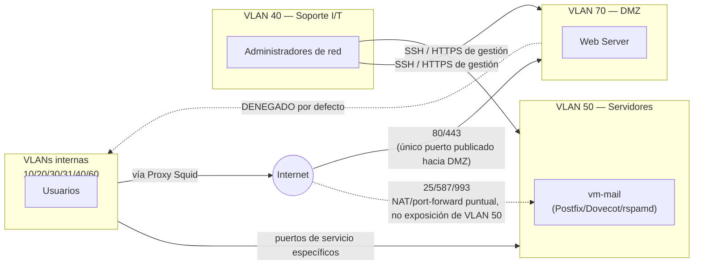

# Fase 3 — LAN, WAN, Extranet, VPN, Intranet, VLAN (2 pts)

## 1. Diseño LAN, WAN, Extranet, VPN, Intranet, VLAN

### 1.1 LAN
Ver [00-Arquitectura-General.md](../00-Documentacion-General/00-Arquitectura-General.md) y [07-Direccionamiento-IP-VLANs.md](../00-Documentacion-General/07-Direccionamiento-IP-VLANs.md) para el detalle completo de VLANs y direccionamiento. Resumen: 8 VLANs de datos/servicios + 1 VLAN de gestión + 1 pool VPN, todas enrutadas por R1 (Core L3).

### 1.2 WAN
- 2 enlaces de banda ancha de 10 Mbps cada uno, proveedores distintos, terminados en R1.
- **Redundancia**: configuración de dos rutas por defecto con distinta distancia administrativa + *recursive gateway* que hace ping-check al gateway de cada ISP (patrón estándar en MikroTik RouterOS), o balanceo por PCC (Per Connection Classifier) si se prefiere repartir carga en vez de solo failover.
- **Failover objetivo**: <30s de detección + conmutación ante caída de un enlace.

### 1.3 Extranet
Acceso controlado y limitado para terceros (ej. un proveedor o cliente externo que necesita consultar un aplicativo puntual): se resuelve publicando **únicamente** el servicio necesario a través de la DMZ (VLAN 70), nunca dando acceso directo a la LAN interna. Si se requiere acceso más amplio para un socio, se emite un perfil VPN WireGuard restringido por firewall a solo los recursos autorizados (no acceso total a la red).

### 1.4 VPN de acceso remoto
- **WireGuard** sobre UDP 51820, corriendo en `vm-vpn` (imagen `linuxserver/wireguard`, que autogenera perfiles de cliente `.conf` + QR sin manejo manual de llaves).
- Cada empleado remoto recibe un perfil con IP fija dentro del pool `VLAN 200` (ver documento 07), permitiéndole llegar a Intranet (Nextcloud), correo interno y, si su rol lo requiere, a su VLAN de origen vía ACL puntual.
- Se prefiere WireGuard sobre OpenVPN por: configuración más simple (menos superficie de error), mejor rendimiento (corre en espacio de kernel, no en espacio de usuario), criptografía moderna fija sin negociación (Curve25519 para intercambio de llaves, ChaCha20-Poly1305 para cifrado autenticado, BLAKE2s para hashing — sin downgrade posible a una suite débil), y una base de código de solo ~4,000 líneas (auditable en días, no semanas, frente a las cientas de miles de líneas de OpenVPN). Se documenta OpenVPN como alternativa clásica por si el catedrático lo pide explícitamente, o si se requiere compatibilidad con clientes legados.

### 1.5 Intranet
Software sugerido: **Nextcloud** (VM `vm-intranet`, VLAN Servidores).
- Archivos compartidos por área (carpetas con permisos por grupo LDAP/local, mapeando los mismos grupos que las VLANs).
- Calendario compartido, chat (Nextcloud Talk) para reuniones rápidas — cubre el requisito de "herramientas de colaboración en línea" y "conferencias vía Web" del enunciado sin depender de Zoom/Teams (que no son open source ni on-premise).
- Alternativa más liviana si se busca solo wiki/documentación: **Wiki.js**.

### 1.6 VLAN
Tabla completa en [07-Direccionamiento-IP-VLANs.md](../00-Documentacion-General/07-Direccionamiento-IP-VLANs.md).

## 2. Software de intranet sugerido
**Nextcloud** — justificación: es la suite open source más completa para "trabajo a distancia y equipos virtuales" (archivos + calendario + chat + videollamadas vía Nextcloud Talk/Jitsi integrado), se despliega en un solo contenedor/VM, y tiene apps de escritorio/móvil para los 184 usuarios.

Complemento para e-learning (mencionado en el enunciado): **Moodle**, VM aparte si el alcance del curso lo requiere — se deja como extensión opcional, no crítica para la evaluación de esta fase.

## 3. Software de monitoreo para equipos de red

**Zabbix** (VM `vm-monitor`, VLAN Servidores):
- Monitorea disponibilidad y métricas de R1, switch físico, VR1, SV1 (vía SNMP en MikroTik/VyOS) y de cada VM de servicio (agente Zabbix).
- Dashboards de: uso de enlaces WAN (para justificar si algún día hay que subir de 10 a 20 Mbps), estado OSPF (adyacencias caídas), disponibilidad de servicios (SMTP, HTTP, DHCP).
- Alertas por correo/webhook ante caída de un servicio crítico.

Alternativa más ligera si solo se necesita monitoreo de red (sin servidores): **LibreNMS** — mejor auto-descubrimiento de topología L2/L3 vía SNMP/LLDP, pero Zabbix es más versátil para cubrir servidores + red con una sola herramienta, por eso es la recomendación principal.

## 4. Zonas desmilitarizadas (DMZ)

- **VLAN 70 (DMZ)**: aloja **únicamente el Web Server** (Fase 4). Decisión final: el correo **no** se publica desde la DMZ — `vm-mail` se queda en la VLAN de Servidores (50) y R1 hace NAT/port-forward puntual hacia esos puertos (25/587/993), manteniendo todos los controles de la propia VM (firewall local, fail2ban) sin necesidad de exponer un segundo segmento. Detalle de esa decisión en [Fase2-Servidor-Correo.md](../Fase-2-Servidor-Correo/02-Fase2-Servidor-Correo.md) §3.
- Reglas de firewall en R1: 
  - Internet → DMZ: solo el puerto publicado del Web Server (80/443).
  - Internet → `vm-mail` (VLAN Servidores, vía port-forward puntual): solo 25/587/993, nunca acceso abierto al resto de esa VLAN.
  - DMZ → LAN interna: **denegado por defecto** (si el Web Server se compromete, no debe poder pivotar a Administración/Servidores).
  - LAN interna → DMZ: permitido para administración (SSH/HTTPS de gestión) desde la VLAN de Soporte I/T únicamente.
- Esto es el patrón clásico de 3 zonas (Internet / DMZ / Interna) implementado con ACLs en el mismo Router Core, sin necesitar un firewall dedicado adicional (RouterOS lo soporta bien vía `/ip firewall filter` con chains por VLAN).

### Diagrama de zonas (pendiente de pasar a herramienta visual — contenido ya definido)

Este diagrama representa exactamente las reglas ya definidas arriba — falta pasarlo a una herramienta visual (ver [Responsables/Jeferson.md](../Responsables/Jeferson.md)).

## 5. Alta disponibilidad

| Componente | Mecanismo de HA |
|---|---|
| Internet | 2 enlaces (Claro + Tigo) + failover automático en R1 — no balanceo, el enunciado pide redundancia |
| Enrutamiento Core↔Nube | OSPF (convergencia dinámica ante falla de enlace, no rutas estáticas — cumple restricción explícita del enunciado) |
| Data Center | Diseño Tier 4 — ver [06-Data-Center-Tier4.md](../Fase-1-Diseno-Red-Corporativa/06-Data-Center-Tier4.md) (energía y enfriamiento 2N) |
| Almacenamiento (laboratorio) | 1 solo SSD externo portátil (ver [05-Terraform-Ansible-IaC.md](../00-Documentacion-General/05-Terraform-Ansible-IaC.md) §8) — **sin RAID, punto único de falla reconocido**; en producción real se recomienda Ceph/almacenamiento distribuido (roadmap, no obligatorio para esta entrega) |
| Respaldo de VMs (laboratorio) | `vzdump` (backup nativo de Proxmox VE, no requiere Proxmox Backup Server dedicado) programado por cron, con destino a un **segundo disco USB distinto del SSD de arranque** — respaldar en el mismo disco que falla no es respaldo real |
| Cómputo (producción) | 3 hosts de virtualización en clúster HA con Ceph — documentado como diseño de producción en [06-Data-Center-Tier4.md](../Fase-1-Diseno-Red-Corporativa/06-Data-Center-Tier4.md) §3.1; el laboratorio corre en **1 solo nodo**, sin clúster |
| Datos | Snapshots diarios automatizados (cron + `vzdump` de Proxmox) hacia disco secundario |

Nota de alcance: para el laboratorio individual con 1 servidor físico, la HA a nivel de hipervisor (clúster multi-nodo) queda como **diseño documentado para producción** (mencionado explícitamente aquí para cumplir el requisito de diseño), mientras que la demo funcional usa el único nodo con backups automatizados como mitigación práctica.

## 6. Estado de implementación: ✅ código listo

Los 3 servicios de esta fase ya están escritos como roles de Ansible en [`infra/ansible/roles/`](../../infra/ansible/roles/):

| Servicio | Rol | Cómo se implementó |
|---|---|---|
| VPN de acceso remoto | `vpn/` | WireGuard vía imagen `linuxserver/wireguard` — autogenera perfiles de cliente (.conf + QR) para el pool VLAN 200 |
| Intranet | `intranet/` | Nextcloud + MariaDB vía docker-compose, admin autoprovisionado |
| Monitoreo | `monitoring/` + `zabbix_agent/` | Zabbix server+web+PostgreSQL, más un rol de agente liviano que se aplica a todas las VMs del proyecto |

Script de verificación: `infra/scripts/test-fase3-services.sh <ip_intranet> <ip_monitor> <ip_vpn>` — confirma que Nextcloud y Zabbix respondan por HTTP y que WireGuard tenga peers activos. Pasos completos de despliegue en [infra/README.md](../../infra/README.md).

## 7. Seguridad de la Fase 3

Aplica el marco de políticas de [05-Politicas-Seguridad.md](../Fase-1-Diseno-Red-Corporativa/05-Politicas-Seguridad.md) específicamente a los 3 servicios de esta fase — no repite esas políticas generales, muestra cómo se materializan aquí.

**Cifrado y superficie expuesta**: de los 3 servicios (VPN, Intranet, Monitoreo), solo el puerto UDP 51820 de WireGuard queda expuesto a Internet. Nextcloud (8081) y Zabbix (8082) son accesibles únicamente desde la LAN interna o vía VPN — nunca publicados directamente. El único otro servicio expuesto a Internet en todo el proyecto es el Web Server en la DMZ (§4), con su propia regla de firewall aislada.

**Gestión de secretos**: ninguna contraseña vive en texto plano en el código de automatización — `intranet_db_root_password`, `intranet_db_password`, `intranet_admin_password` y `monitoring_db_password` se referencian desde `group_vars/all.yml` pero se resuelven contra `group_vars/vault.yml` (cifrado con Ansible Vault, no versionado en claro). WireGuard no necesita este mecanismo: el propio contenedor genera sus llaves criptográficas al arrancar.

**Por qué VPN/Intranet/Monitoreo NO van en la DMZ**: el criterio de qué va en la DMZ no es "recibe tráfico externo" (la VPN sí lo recibe, en su puerto UDP), es "expone un servicio completo de forma pública y no autenticada" — solo el Web Server cumple eso. Meter la VPN o Nextcloud a la DMZ "porque hablan con el exterior" sería un error de diseño: diluiría el propósito de la DMZ, que es contener el daño si un servicio público sin autenticación previa se compromete.

**Monitoreo como control de seguridad, no solo de disponibilidad**: Zabbix (rol `monitoring` + `zabbix_agent`) es también el mecanismo de detección temprana de eventos relevantes de seguridad — intentos fallidos repetidos contra la VPN, caída inesperada del Web Server en la DMZ, desviación sostenida del tráfico normal en los enlaces WAN. Estas señales alimentan el proceso de respuesta a incidentes ya definido en la política de seguridad de Fase 1 (§1.11).

**Hardening base**: el rol `common` (Docker + `chrony` + zona horaria) se aplica antes que cualquier rol de servicio en las 3 VMs de esta fase — sincronización horaria activa es crítica para que los timestamps de auditoría y la validación de sesiones cifradas sean confiables entre servicios.
