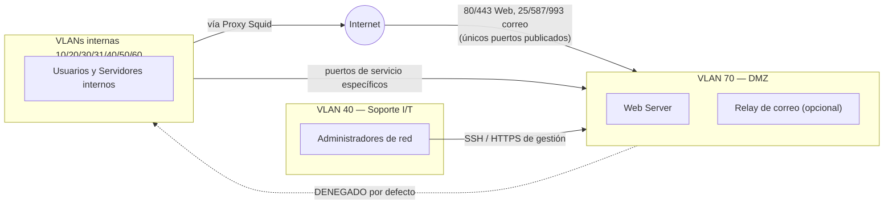

# Fase 3 — LAN, WAN, Extranet, VPN, Intranet, VLAN (2 pts)

## 1. Diseño LAN, WAN, Extranet, VPN, Intranet, VLAN

### 1.1 LAN
Ver [00-Arquitectura-General.md](../00-Documentacion-General/00-Arquitectura-General.md) y [07-Direccionamiento-IP-VLANs.md](../00-Documentacion-General/07-Direccionamiento-IP-VLANs.md) para el detalle completo de VLANs y direccionamiento. Resumen: 8 VLANs de datos/servicios + 1 VLAN de gestión + 1 pool VPN, todas enrutadas por R1 (Core L3).

### 1.2 WAN
- 2 enlaces de banda ancha de 10 Mbps cada uno, proveedores distintos, terminados en R1.
- **Redundancia**: configuración de dos rutas por defecto con distinta distancia administrativa + *recursive gateway* que hace ping-check al gateway de cada ISP (patrón estándar en MikroTik RouterOS), o balanceo por PCC (Per Connection Classifier) si se prefiere repartir carga en vez de solo failover.
- **Failover objetivo**: <30s de detección + conmutación ante caída de un enlace.

### 1.3 Extranet
Acceso controlado y limitado para terceros (ej. un proveedor o cliente externo que necesita consultar un aplicativo puntual): se resuelve publicando **únicamente** el servicio necesario a través de la DMZ (VLAN 70), nunca dando acceso directo a la LAN interna. Si se requiere acceso más amplio para un socio, se emite un perfil VPN WireGuard restringido por firewall a solo los recursos autorizados (no acceso total a la red).

### 1.4 VPN de acceso remoto
- **WireGuard** sobre UDP, corriendo en una VM (`vm-vpn`) o directamente en R1 (RouterOS ≥7 trae WireGuard nativo — reduce un salto y una VM).
- Cada empleado remoto recibe un perfil con IP fija dentro del pool `VLAN 200` (ver documento 07), permitiéndole llegar a Intranet (Nextcloud), correo interno y, si su rol lo requiere, a su VLAN de origen vía ACL puntual.
- Se prefiere WireGuard sobre OpenVPN por: configuración más simple (menos superficie de error), mejor rendimiento (menor overhead, corre en el espacio de kernel), y auditoría de código más pequeña (más fácil de confiar). Se documenta OpenVPN como alternativa clásica por si el catedrático lo pide explícitamente.

### 1.5 Intranet
Software sugerido: **Nextcloud** (VM `vm-intranet`, VLAN Servidores).
- Archivos compartidos por área (carpetas con permisos por grupo LDAP/local, mapeando los mismos grupos que las VLANs).
- Calendario compartido, chat (Nextcloud Talk) para reuniones rápidas — cubre el requisito de "herramientas de colaboración en línea" y "conferencias vía Web" del enunciado sin depender de Zoom/Teams (que no son open source ni on-premise).
- Alternativa más liviana si se busca solo wiki/documentación: **Wiki.js**.

### 1.6 VLAN
Tabla completa en [07-Direccionamiento-IP-VLANs.md](../00-Documentacion-General/07-Direccionamiento-IP-VLANs.md).

## 2. Software de intranet sugerido
**Nextcloud** — justificación: es la suite open source más completa para "trabajo a distancia y equipos virtuales" (archivos + calendario + chat + videollamadas vía Nextcloud Talk/Jitsi integrado), se despliega en un solo contenedor/VM, y tiene apps de escritorio/móvil para los 184 usuarios.

Complemento para e-learning (mencionado en el enunciado): **Moodle**, VM aparte si el alcance del curso lo requiere — se deja como extensión opcional, no crítica para la evaluación de esta fase.

## 3. Software de monitoreo para equipos de red

**Zabbix** (VM `vm-monitor`, VLAN Servidores):
- Monitorea disponibilidad y métricas de R1, switch físico, VR1, SV1 (vía SNMP en MikroTik/VyOS) y de cada VM de servicio (agente Zabbix).
- Dashboards de: uso de enlaces WAN (para justificar si algún día hay que subir de 10 a 20 Mbps), estado OSPF (adyacencias caídas), disponibilidad de servicios (SMTP, HTTP, DHCP).
- Alertas por correo/webhook ante caída de un servicio crítico.

Alternativa más ligera si solo se necesita monitoreo de red (sin servidores): **LibreNMS** — mejor auto-descubrimiento de topología L2/L3 vía SNMP/LLDP, pero Zabbix es más versátil para cubrir servidores + red con una sola herramienta, por eso es la recomendación principal.

## 4. Zonas desmilitarizadas (DMZ)

- **VLAN 70 (DMZ)**: aloja el Web Server (Fase 4) y, si se opta por publicar el correo directamente, el relay SMTP.
- Reglas de firewall en R1: 
  - Internet → DMZ: solo puertos publicados explícitamente (80/443 Web, 25/587/993 correo).
  - DMZ → LAN interna: **denegado por defecto** (si el Web Server se compromete, no debe poder pivotar a Administración/Servidores).
  - LAN interna → DMZ: permitido para administración (SSH/HTTPS de gestión) desde la VLAN de Soporte I/T únicamente.
- Esto es el patrón clásico de 3 zonas (Internet / DMZ / Interna) implementado con ACLs en el mismo Router Core, sin necesitar un firewall dedicado adicional (RouterOS lo soporta bien vía `/ip firewall filter` con chains por VLAN).

### Diagrama de zonas (pendiente de pasar a herramienta visual — contenido ya definido)

Este diagrama representa exactamente las reglas ya definidas arriba — falta pasarlo a una herramienta visual (ver [Responsables/Jeferson.md](../Responsables/Jeferson.md)).

## 5. Alta disponibilidad

| Componente | Mecanismo de HA |
|---|---|
| Internet | 2 ISP + failover automático en R1 |
| Enrutamiento Core↔Nube | OSPF (convergencia dinámica ante falla de enlace, no rutas estáticas — cumple restricción explícita del enunciado) |
| Data Center | Diseño Tier 4 — ver [10-Data-Center-Tier4.md](../Fase-1-Diseno-Red-Corporativa/10-Data-Center-Tier4.md) (energía y enfriamiento 2N) |
| Servicios críticos (correo, web) | Backups automatizados de VMs vía Proxmox Backup Server (snapshot + restore rápido); para producción real se recomienda a futuro clúster Proxmox de 3 nodos con Ceph, documentado como roadmap, no como parte obligatoria de esta entrega de laboratorio |
| Datos | Snapshots diarios automatizados (cron + `vzdump` de Proxmox) hacia disco secundario |

Nota de alcance: para el laboratorio individual con 1 servidor físico, la HA a nivel de hipervisor (clúster multi-nodo) queda como **diseño documentado para producción** (mencionado explícitamente aquí para cumplir el requisito de diseño), mientras que la demo funcional usa el único nodo con backups automatizados como mitigación práctica.
