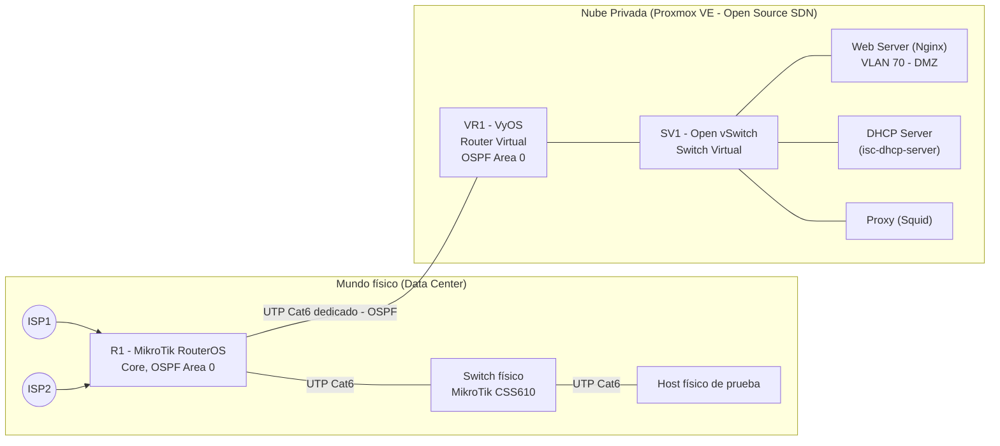

# Fase 4 — Implementación de la Nube Privada / SDN (7 pts)

Esta es la fase de mayor peso y la que se prueba en vivo. Aquí se detalla exactamente qué se construye y cómo se cumple cada restricción explícita del enunciado.

## 1. Checklist de restricciones del enunciado (léase primero)

| Restricción | Cómo se cumple |
|---|---|
| DHCP debe dar IP a **TODA** la red | 1 VM DHCP (isc-dhcp-server) con un *scope* (subnet declaration) por cada VLAN; R1 hace *DHCP relay* (`ip-helper`) desde cada VLAN hacia la IP de esa VM |
| Web Server con página de verificación, en DMZ | VM Nginx en VLAN 70 (DMZ), sirve página estática de status |
| Proxy restringe Internet, solo puerto 80 disponible para llegar al Web Server | Squid en modo *forward proxy* obligatorio para salida a Internet + regla de firewall en R1 que bloquea 80/tcp saliente directo excepto hacia la IP del Web Server |
| Nube privada virtual: Switch Virtual SV1 + Router Virtual VR1 | Open vSwitch (`SV1`) + VyOS (`VR1`), ambos VMs/bridges dentro de Proxmox |
| Core físico R1 | MikroTik RouterOS físico (o GNS3 solo si no hay equipo — no es el caso acá) |
| 1 switch físico para clientes | MikroTik CSS610 físico |
| 1 host físico en el Data Center para pruebas | Laptop/PC conectado al switch físico |
| Protocolo de enrutamiento dinámico R1↔VR1, a discreción | **OSPF** (área única 0.0.0.0) |
| Conexión R1↔VR1 con UTP Cat 6 si es físico, si no GNS3 conectado a la SDN | Cable físico Cat 6 desde el puerto del MikroTik hasta la NIC del servidor Proxmox dedicada a la SDN |
| SDN 100% Open Source, mínimo 1 switch + 1 router virtual, **NO** GNS3/VMware | Open vSwitch + VyOS, ambos corriendo sobre KVM (Proxmox), sin GNS3 |
| GNS3 solo para el Core, no para la SDN | Se usa GNS3 **únicamente** si finalmente no se compra el MikroTik físico (plan B) — con el hardware comprado, no se usa GNS3 en absoluto |
| No rutas estáticas | Todo el enrutamiento entre R1 y VR1, y la publicidad de las VLANs, se hace por OSPF (redistribución de conectadas donde aplique) |
| Conectividad bidireccional probada | Ver sección 6 (plan de pruebas) |

## 2. Topología física y lógica de esta fase

## 3. Componente por componente

### 3.1 DHCP — debe cubrir TODA la red
- VM `vm-dhcp` (Debian 12 + `isc-dhcp-server`), IP fija en la VLAN de Servidores.
- `dhcpd.conf` con una declaración `subnet` por cada VLAN de la tabla en [07-Direccionamiento-IP-VLANs.md](../00-Documentacion-General/07-Direccionamiento-IP-VLANs.md) (Admin, Ventas, Desarrollo A/B, Soporte, VoIP, y también la subred de la propia Nube Privada).
- En R1 (y en VR1 para la subred de la nube), se activa **DHCP relay** (`ip dhcp-relay` en RouterOS / `dhcp-relay` en VyOS) apuntando a la IP de `vm-dhcp`, para que un solo servidor entregue direcciones a todas las VLANs sin tener que replicar el servicio.
- Este archivo `dhcpd.conf` se **genera automáticamente** desde el inventario YAML (ver [06-Automatizacion-con-IA.md](../00-Documentacion-General/06-Automatizacion-con-IA.md)) — cero edición manual scope por scope.

### 3.2 Web Server (DMZ)
- VM `vm-web` con Nginx, página `index.html` simple ("Virtual Solutions — Servidor Web operativo, IP: X, hostname: Y, uptime: Z") que sirve como prueba de vida.
- Colocada en VLAN 70 (DMZ), sin acceso saliente hacia VLANs internas (regla de firewall explícita en R1).

### 3.3 Proxy (Squid)
- VM `vm-proxy`, Squid configurado como **proxy explícito obligatorio**: todas las VLANs de usuarios tienen bloqueado el egreso directo a Internet en R1 (firewall), forzando que la navegación pase por `vm-proxy:3128` (vía PAC file distribuido por DHCP option 252, o configuración de navegador).
- Regla clave del enunciado — *"el puerto 80 solo debe estar disponible para poder conectarse al Servidor Web"*: en el firewall de R1, el **egreso directo** hacia Internet en tcp/80 y tcp/443 está **denegado** para todas las VLANs de usuarios; la única excepción tcp/80 permitida sin pasar por el proxy es el tráfico **destino = IP pública/DMZ del Web Server**. El resto de navegación web sale exclusivamente por el puerto del Proxy (3128), que sí tiene salida a Internet controlada.
- ACLs de Squid: por VLAN de origen (ej. Desarrollo I/T puede acceder a repos/paqueterías tipo GitHub/npm/PyPI; Ventas/Administración a un set más restringido), logging de todas las solicitudes para auditoría.

### 3.4 Switch Virtual SV1 (Open vSwitch)
- Bridge OVS creado dentro de Proxmox (`ovs-vsctl add-br sv1`), con puertos internos para cada VM de la nube privada, y un puerto uplink hacia VR1.
- Soporta VLAN tagging si en el futuro se quiere separar tráfico de gestión del de datos dentro de la propia nube.

### 3.5 Router Virtual VR1 (VyOS)
- VM VyOS con 2 interfaces: una hacia SV1 (red interna de la nube), otra hacia el enlace físico Cat 6 que llega a R1.
- Corre **OSPF** en ambas interfaces, anuncia la subred de la Nube Privada, aprende las subredes de la LAN corporativa anunciadas por R1.
- Firewall local de VyOS como capa adicional (zona `LAN-NUBE` vs `WAN-CORE`).

### 3.6 Core físico R1 (MikroTik RouterOS)
- Interfaces: 1 hacia cada ISP (o sub-interfaces si se simula con VLANs en un solo puerto WAN), 1 hacia el switch físico de clientes, 1 dedicada hacia VR1 (Cat 6, red punto a punto `/30`).
- OSPF area 0.0.0.0 en la interfaz hacia VR1 y redistribución de rutas conectadas (VLANs) hacia esa misma área — **sin rutas estáticas**, cumpliendo la restricción.
- Firewall stateful: reglas DMZ↔LAN↔Internet descritas en [03-Fase3-LAN-WAN-VPN-Seguridad.md](../Fase-3-LAN-WAN-VPN-Seguridad/03-Fase3-LAN-WAN-VPN-Seguridad.md).

### 3.7 Switch físico + host de prueba
- MikroTik CSS610 con VLANs 802.1Q, un puerto trunk hacia R1, puertos de acceso para el host físico de prueba (y, en producción, hacia los IDFs de piso).
- El host físico recibe IP por DHCP desde `vm-dhcp` (vía relay), validando el camino completo: Host → Switch físico → R1 → OSPF → VR1 → SV1 → `vm-dhcp`.

## 4. Direccionamiento de esta fase
Ver tabla completa en [07-Direccionamiento-IP-VLANs.md](../00-Documentacion-General/07-Direccionamiento-IP-VLANs.md), específicamente las filas `VLAN 80 (Cloud-Mgmt)` y el enlace punto a punto `R1↔VR1`.

## 5. Automatización de esta fase (resumen — detalle en 05 y 06)

1. `terraform apply` en el módulo `sdn/`: crea el bridge OVS (SV1), las VMs `vr1` (VyOS), `vm-web`, `vm-dhcp`, `vm-proxy` desde templates cloud-init, con sus NICs conectadas al bridge correcto.
2. `ansible-playbook site.yml`: configura VyOS (OSPF, firewall) vía su API/CLI declarativa, Nginx en `vm-web`, `dhcpd.conf` en `vm-dhcp`, `squid.conf` en `vm-proxy` — todo generado desde el inventario YAML.
3. Configuración de R1 (MikroTik) se versiona como script `.rsc` (RouterOS script) en el repo, aplicado vía `/import` — así el Core también queda como código, no como clicks manuales en Winbox.

## 6. Plan de pruebas de conectividad (lo que se demuestra en vivo)

- [ ] `ping` desde el host físico (Data Center) hasta `vm-web` (Nube Privada) — ida.
- [ ] `ping`/`traceroute` desde `vm-web` o `vr1` hasta el host físico — vuelta.
- [ ] `show ip ospf neighbor` en VyOS y `/routing ospf neighbor print` en RouterOS — adyacencia OSPF activa entre R1 y VR1.
- [ ] Acceso HTTP al Web Server desde una VLAN de usuario **solo** a través del Proxy (o directo, ya que es el único destino tcp/80 permitido sin proxy) — confirmar que otros destinos tcp/80 externos SON bloqueados sin proxy.
- [ ] Un cliente en cualquier VLAN recibe IP correcta (gateway, DNS, rango) desde `vm-dhcp` vía relay — probar en al menos 2 VLANs distintas.
- [ ] Acceso a herramientas de administración (Winbox/SSH a R1, CLI/HTTPS a VyOS, panel de Zabbix) restringido únicamente desde la VLAN de gestión/Soporte I/T.
- [ ] `traceroute` completo desde un host de VLAN Desarrollo hasta el Web Server, mostrando el salto por R1 → OSPF → VR1 → SV1.
